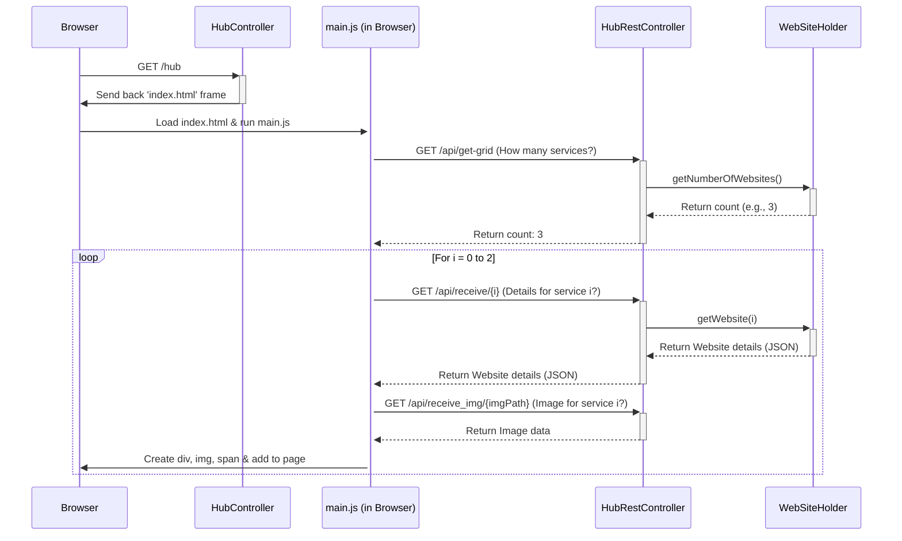

# Chapter 1: Hub Service Representation

Welcome to the first chapter of our microservices tutorial! We're going to start by looking at the "front door" of our system – the `hub` service.

## What's the Big Idea?

Imagine you have a big company with many different departments, each in its own office room: Sales, Support, Engineering, etc. If you're a visitor, how do you know where to go? You'd probably look for a **directory** or **reception desk** near the entrance. This directory lists all the departments and tells you which room number they are in.

In the world of software, especially when we build applications as a collection of smaller, independent parts (called **microservices**), we need something similar. We might have separate services for handling user accounts, processing data (`fqw`), generating documents (`protocol`), providing help (`support`), and so on.

The **Hub Service** acts like that building directory or reception desk.

**Use Case:** A user wants a single place to see all the available tools (microservices) in our system and easily navigate to the one they need.

The `hub` service solves this! It provides a simple web page that:

1.  **Lists** the other available microservices.
2.  Provides **links** to easily access each one.

It *doesn't* do the heavy lifting or complex tasks of the other services itself. Its main job is to be a **central starting point** or **dashboard**.

## Key Parts of the Hub

1.  **The Dashboard Page:** This is what the user sees in their web browser. It's usually a simple page with icons, names, and links for each microservice.
2.  **Configuration:** How does the hub know *which* services exist and where they are located (their web addresses or URLs)? This information is stored in configuration files. In our project, this configuration involves:
    *   `applicationContext.xml`: An older style Spring configuration file often used to define "beans" (objects managed by the Spring framework). In our case, it likely defines the list of websites/services the hub should know about.
    *   `WebSiteHolder`: A Java class specifically designed to hold the list of website/service details loaded from the configuration.

## Seeing the Hub in Action

When you run the `hub` service and open it in your browser (usually at an address like `http://localhost:8080` or similar), you'll interact with it like this:

1.  **Request:** Your browser asks for the main page (e.g., `/hub`).
2.  **Response:** The `HubController` (a piece of code running on the server) handles this request and tells the system to display the main dashboard page (likely `index.html`).
3.  **Dynamic Loading:** The `index.html` page contains JavaScript code (`main.js`). This code immediately runs in your browser and makes further requests back to the server:
    *   "How many services should I display?" (asks `/api/get-grid`)
    *   "Give me the details (name, URL, image) for service #1." (asks `/api/receive/0`)
    *   "Give me the image file for service #1." (asks `/api/receive_img/some_image.png`)
    *   ... and so on for all services.
4.  **Display:** As the JavaScript code receives the details and images for each service, it dynamically builds the dashboard on the fly, adding icons and links to the page you see.

Clicking on an icon for a service (like `fqw` or `protocol`) will then navigate your browser to the URL defined for that service in the hub's configuration.

## Under the Hood: How it's Built

Let's peek at some key code pieces that make this happen.

**1. Defining a Service Entry (`Website.java`)**

First, we need a way to represent the information for *each* service the hub knows about. This simple Java class does the job:

```java
// File: hub/src/main/java/ru/emiren/hub/Model/Website.java
package ru.emiren.hub.Model;

// Lombok annotations to auto-generate boilerplate code
import lombok.AllArgsConstructor;
import lombok.Getter;
import lombok.Setter;

@AllArgsConstructor // Creates a constructor with all fields
@Getter // Creates getter methods (like getName(), getUrl())
@Setter // Creates setter methods (like setName(...), setUrl(...))
public class Website {
    private String name;    // Name displayed on the dashboard (e.g., "FQW Tool")
    private String url;     // Web address of the service (e.g., "http://localhost:8081")
    private String imgPath; // Filename of the icon (e.g., "fqw_icon.png")
    private String dimension; // Potentially layout info (not always used)
}
```

*   **Explanation:** This is a plain data holder. `@Getter`, `@Setter`, `@AllArgsConstructor` are shortcuts (from the Lombok library) to avoid writing basic methods manually. Each `Website` object stores the display name, link (URL), and icon filename for one microservice.

**2. Holding the List of Services (`WebSiteHolder.java`)**

Next, we need something to hold the *entire list* of these `Website` objects.

```java
// File: hub/src/main/java/ru/emiren/hub/Model/WebSiteHolder.java
package ru.emiren.hub.Model;

import lombok.Getter;
import lombok.Setter;
import org.springframework.stereotype.Component; // Marks as Spring-managed

import java.util.List;

@Getter
@Setter
@Component // Tells Spring to manage this class
public class WebSiteHolder {
    private List<Website> websites; // A list to hold multiple Website objects

    // Constructor: Spring uses this to create the WebSiteHolder,
    // injecting the list of websites defined elsewhere (like applicationContext.xml)
    public WebSiteHolder(List<Website> websites) {
        this.websites = websites;
    }

    // Method to get a specific website by its position in the list
    public Website getWebsite(int index){
        return websites.get(index);
    }

    // Method to find out how many websites are in the list
    public int getNumberOfWebsites(){
        return websites.size();
    }
}
```

*   **Explanation:** `WebSiteHolder` simply holds a `List` of `Website` objects. The `@Component` annotation tells the Spring framework (which manages our application) to create and manage an instance of this class. Crucially, Spring *injects* the actual list of websites (defined in `applicationContext.xml`) into this holder when the application starts.

**3. Configuration (`AppConfig.java` and `applicationContext.xml`)**

How does Spring know *how* to create `WebSiteHolder` and where to get the list of websites?

```java
// File: hub/src/main/java/ru/emiren/hub/Config/AppConfig.java
package ru.emiren.hub.Config;

// ... other imports ...
import org.springframework.context.ApplicationContext;
import org.springframework.context.annotation.Bean;
import org.springframework.context.annotation.Configuration;
import org.springframework.context.annotation.ImportResource;
import ru.emiren.hub.Model.WebSiteHolder;

@Configuration // Marks this as a Java configuration class for Spring
// Tells Spring to also load configuration from the XML file
@ImportResource("classpath:applicationContext.xml")
public class AppConfig {

    // Defines how to create the WebSiteHolder bean
    @Bean()
    public WebSiteHolder webSiteHolder(ApplicationContext applicationContext) {
        // Gets the bean named "websites" (defined in applicationContext.xml)
        // and uses it to create the WebSiteHolder
        return (WebSiteHolder) applicationContext.getBean("websites");
    }
}
```

*   **Explanation:** This Java configuration class tells Spring:
    *   To also look at `applicationContext.xml` for configuration (`@ImportResource`). This XML file is where the actual list of `Website` entries (name, URL, image path) is likely defined.
    *   How to provide the `WebSiteHolder` to other parts of the application (`@Bean`). It retrieves the pre-configured list named `"websites"` from Spring's context (which was loaded from the XML) and uses it to construct the `WebSiteHolder`.

**4. Serving the Page and Data (`HubController.java`, `HubRestController.java`)**

We need controllers to handle requests from the user's browser.

*   **`HubController`:** Serves the main HTML page.

```java
// File: hub/src/main/java/ru/emiren/hub/Controller/HubController.java
package ru.emiren.hub.Controller;

// ... other imports ...
import org.springframework.stereotype.Controller;
import org.springframework.ui.Model;
import org.springframework.web.bind.annotation.GetMapping;
import org.springframework.web.bind.annotation.RequestMapping;

@Controller // Standard controller for serving web pages
@RequestMapping("") // Handles requests to the root path
public class HubController {
    // ... (Constructor injects WebSiteHolder, not shown for brevity) ...

    // Handles requests to the root URL ("/")
    @GetMapping("")
    public String home(Model model) {
        // Redirects the user immediately to "/hub"
        return "redirect:/hub";
    }

    // Handles requests to "/hub"
    @GetMapping("/hub")
    public String createHubPage(Model model){
        // Tells Spring MVC to render the template named "index"
        // (usually corresponds to src/main/resources/templates/index.html)
        return "index";
    }
}
```

*   **`HubRestController`:** Provides data (like the list of services and images) to the JavaScript running on the page. We'll look more closely at REST controllers in [Chapter 2: REST API Controllers](02_rest_api_controllers_.md).

```java
// File: hub/src/main/java/ru/emiren/hub/Controller/HubRestController.java
package ru.emiren.hub.Controller;

// ... other imports ...
import org.springframework.beans.factory.annotation.Autowired;
import org.springframework.http.*;
import org.springframework.web.bind.annotation.*;
import ru.emiren.hub.Model.WebSiteHolder;
import com.google.gson.Gson; // Library for JSON conversion

@RestController // Special controller for returning data, not HTML views
@RequestMapping("/api") // Handles requests starting with "/api"
public class HubRestController {

    private final WebSiteHolder webSiteHolder; // Holds the list of websites
    // ... (ResourceLoader for images, Constructor injection - not shown) ...

    // Handles GET requests to "/api/get-grid"
    @GetMapping("/get-grid")
    public ResponseEntity<Integer> getNumber() {
        // Gets the number of websites from the holder
        int size = webSiteHolder.getNumberOfWebsites();
        // Returns the size as the response body with an OK status
        return ResponseEntity.status(HttpStatus.OK).body(size);
    }

    // Handles GET requests like "/api/receive/0", "/api/receive/1", etc.
    @GetMapping("/receive/{id}")
    public ResponseEntity<String> receive(@PathVariable Integer id) {
        // Gets the specific Website object using the id (index)
        Website website = webSiteHolder.getWebsite(id);
        // Converts the Website object to JSON format and returns it
        return ResponseEntity.status(HttpStatus.OK).body(new Gson().toJson(website));
    }

    // Handles GET requests like "/api/receive_img/some_icon.png"
    @GetMapping("/receive_img/{id}")
    public ResponseEntity<?> receiveImg(@PathVariable String id) {
        // ... (Code to load the image file based on the 'id' (filename)) ...
        // Loads the image bytes from "classpath:static/img/" + id
        // Sets the correct Content-Type header (e.g., "image/png")
        // Returns the image bytes as the response body
        // ... (Error handling omitted for brevity) ...
    }
}
```

*   **Explanation:**
    *   `HubController` maps URL paths (`/`, `/hub`) to actions, ultimately returning the name of the HTML template (`index`) to display.
    *   `HubRestController` maps URL paths under `/api` (like `/api/get-grid`) to actions that return data (number of services, service details as JSON, image data). The frontend JavaScript calls these endpoints.

**5. Frontend Display (`main.js`)**

Finally, the JavaScript code on the `index.html` page fetches the data from the `HubRestController` and builds the dashboard.

```javascript
// File: hub/src/main/resources/static/js/main.js

// Get the HTML element where we'll add the service icons
let appContainer = document.getElementById("application-container");

// Use an immediately-invoked async function to load data
(async function main() {

    // --- 1. Get the number of services ---
    async function getGridData() {
        // Ask the backend API how many services there are
        let response = await fetch('/api/get-grid');
        return response.json(); // Get the number from the response
    }
    let gridCells = await getGridData(); // e.g., gridCells = 3

    // --- 2. Loop for each service ---
    for (let i = 0; i < gridCells; i++) {
        // --- 3. Get details for one service ---
        let imageDataResponse = await fetch('/api/receive/' + i); // Ask for details of service 'i'
        let serviceDetails = await imageDataResponse.json(); // Get JSON like {name: "FQW", url: "...", imgPath: "fqw.png"}

        // --- 4. Get the image for that service ---
        let imgBlobResponse = await fetch('/api/receive_img/' + serviceDetails.imgPath); // Ask for the image file
        let imageBlob = await imgBlobResponse.blob(); // Get the image data

        // --- 5. Create HTML elements ---
        let applicationContainer = document.createElement("div"); // Create a <div>
        applicationContainer.classList.add('hub__application__space');

        let image = document.createElement('img'); // Create an 
        image.classList.add('hub__application__icon');
        image.src = URL.createObjectURL(imageBlob); // Set image source from fetched data

        let applicationName = document.createElement('span'); // Create a <span>
        applicationName.textContent = serviceDetails.name; // Set the text to the service name

        // --- 6. Make the div clickable ---
        applicationContainer.addEventListener("click", function (e) {
            window.open(serviceDetails.url, '_blank'); // Open service URL in new tab
        });

        // --- 7. Add elements to the page ---
        applicationContainer.append(image);
        applicationContainer.append(applicationName);
        appContainer.append(applicationContainer); // Add the new div to the main container
    }
})(); // Run the main function immediately
```

*   **Explanation:** This script first asks the backend (`/api/get-grid`) how many service icons to create. Then, it loops that many times. Inside the loop, for each service, it:
    1.  Fetches the service details (name, URL, image filename) from `/api/receive/{id}`.
    2.  Fetches the actual image data from `/api/receive_img/{filename}`.
    3.  Creates the necessary HTML elements (`div`, `img`, `span`).
    4.  Sets the image source and text content.
    5.  Adds an event listener so clicking the `div` opens the service's URL.
    6.  Appends the newly created elements to the main `appContainer` on the page.

## The Flow: A Summary Diagram

Here's a simplified view of how a request for the hub page flows:



## Conclusion

We've seen that the `hub` service acts as a vital entry point and dashboard for our microservices project. It doesn't perform complex business logic itself, but it uses configuration (like `applicationContext.xml` feeding into `WebSiteHolder`) to know about other services. It presents these services to the user via a web page, using controllers (`HubController`, `HubRestController`) and frontend JavaScript (`main.js`) to dynamically build the user interface. It's the friendly "building directory" for our application suite.

Now that we understand how the hub presents links to other services, let's start looking at how those *other* services actually expose their own functionalities so they can be called, not just by users clicking links, but also by other programs.

Next up: [Chapter 2: REST API Controllers](02_rest_api_controllers_.md)

---

Generated by [AI Codebase Knowledge Builder](https://github.com/The-Pocket/Tutorial-Codebase-Knowledge)