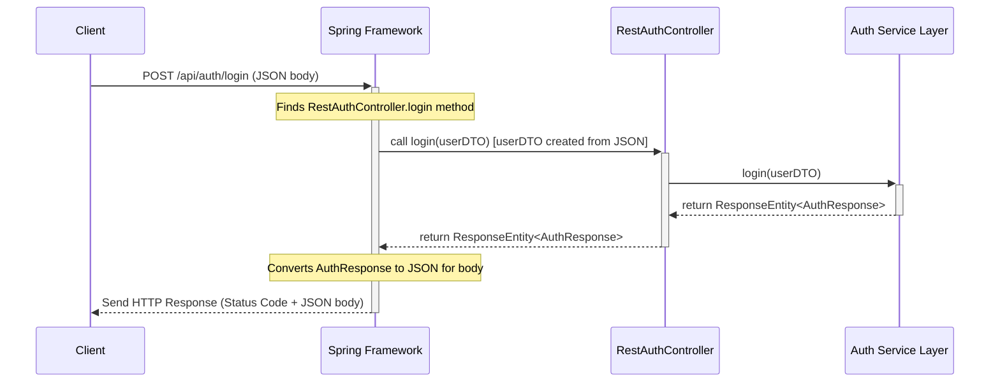

# Chapter 2: REST API Controllers

In [Chapter 1: Hub Service Representation](01_hub_service_representation_.md), we saw how the `hub` service acts like a friendly directory, showing users links to all the other available microservices (`auth`, `fqw`, `protocol`, etc.). But how do those other services actually *receive* requests and *do* things when someone (or something) interacts with them? Simply clicking a link isn't enough if you need to send data (like a username/password) or ask for specific information back in a structured way.

This is where **REST API Controllers** come in. They are the official "front doors" or "reception desks" for each microservice, designed specifically for handling programmatic requests over the web.

## What Problem Do Controllers Solve?

Imagine you're not just visiting a building (like in our Chapter 1 analogy) but you actually need to *interact* with a specific department. You don't just want to know *where* the Sales department is; you want to *place an order* or *ask for a product price*. You need a structured way to communicate your request and get a specific response.

**Use Case:** Let's say a user tries to log in through a web form. The web form (running in the browser) needs to send the entered username and password to the `auth` (authentication) microservice and ask: "Are these credentials valid?". The `auth` service needs a way to receive this username/password, check them, and send back a clear "Yes" or "No" answer, perhaps along with a security token if the login is successful.

A simple web page link can't do this. We need a more formal way for software components to talk to each other over the network. This is what APIs (Application Programming Interfaces) are for, and REST is a very common style for building web APIs.

## Key Concepts: What is a REST API Controller?

Let's break down the term:

1.  **API (Application Programming Interface):** Think of it like a menu at a restaurant. It lists the specific dishes (operations) you can order, what ingredients (data) you need to provide, and what you'll get back. An API defines *how* different software components can interact with each other.
2.  **REST (REpresentational State Transfer):** This is a popular *style* or set of rules for designing APIs that use the web's standard HTTP protocol. It's like a common way of ordering from the menu:
    *   You use standard web addresses (**URLs** or **Endpoints**) to identify *what* you want to interact with (e.g., `/api/auth/login`, `/api/fqw/students/123`).
    *   You use standard **HTTP Methods** (like `GET`, `POST`, `PUT`, `DELETE`) to specify *what kind* of action you want to perform.
        *   `GET`: Retrieve data (e.g., get user details).
        *   `POST`: Send data to create something new or trigger an action (e.g., log in, submit a form).
        *   `PUT`: Send data to update an existing item.
        *   `DELETE`: Remove an item.
    *   Data is often exchanged in standard formats like **JSON** (JavaScript Object Notation), which is easy for both humans and machines to read.
3.  **Controller:** This is the actual code within our microservice that *implements* the API. It acts like the receptionist or waiter:
    *   It **listens** at specific URL endpoints (e.g., `/api/auth/login`).
    *   It understands **HTTP methods** (`POST` for login).
    *   It **receives** incoming requests and any data they carry (like the username/password).
    *   It **delegates** the actual work (checking the password, fetching data) to other parts of the microservice, often the [Service Layer](06_service_layer_.md).
    *   It takes the result from the Service Layer and **formats** it into a response (e.g., a success message with a token, or an error message).
    *   It **sends** this response back to whoever made the request (the client).

So, a **REST API Controller** is the code in each microservice that exposes its functionality over the web using standard HTTP methods and URLs, acting as the public entry point for other programs or services.

## How Controllers Solve the Login Use Case

Let's revisit our login example:

1.  **Request:** The user's browser (or another application) sends an **HTTP POST** request to the URL `http://<auth-service-address>/api/auth/login`.
2.  **Data:** The request includes the username and password, usually formatted as JSON in the request body:
    ```json
    {
      "username": "testuser",
      "password": "password123"
    }
    ```
3.  **Routing:** The web server inside the `auth` microservice receives this request and sees it's a `POST` to `/api/auth/login`. It knows (based on annotations in the code) that the `RestAuthController` class is responsible for this path.
4.  **Controller Method:** It calls the specific method within `RestAuthController` that is marked to handle `POST /api/auth/login`.
5.  **Data Extraction:** The controller method automatically extracts the JSON data from the request body into a Java object (we'll see this as `UserDTO` later in [Chapter 5: Data Transfer Objects (DTOs) & Mappers](05_data_transfer_objects__dtos____mappers_.md)).
6.  **Delegation:** The controller method *doesn't* check the password itself. It calls a method in the `UserService` (part of the [Service Layer](06_service_layer_.md)), passing the `UserDTO` object.
    ```java
    // Inside RestAuthController's login method:
    return userService.login(userDTO); // Ask the service layer to handle it
    ```
7.  **Processing:** The `UserService` performs the logic: looks up the user, checks the password hash, maybe generates a security token (related to [Chapter 3: User Authentication & Authorization](03_user_authentication___authorization_.md)).
8.  **Result:** The `UserService` returns the result to the controller (e.g., an `AuthResponse` object containing success status and a token, or an error).
9.  **Response Formatting:** The controller takes this result and wraps it in an HTTP response object (`ResponseEntity`). This sets the HTTP status code (e.g., `200 OK` for success, `401 Unauthorized` for failure) and puts the `AuthResponse` object (converted back to JSON) in the response body.
10. **Sending Response:** The web server sends this HTTP response back to the browser/client.

The client receives the response and knows whether the login was successful and what the security token is (if any).

## Example: The `auth` Service Controller

Let's look at a simplified version of the `RestAuthController` from our `auth` service.

```java
// File: auth/src/main/java/ru/emiren/auth/Controller/RestAuthController.java
package ru.emiren.auth.Controller;

// Imports for Spring web annotations, etc.
import org.springframework.beans.factory.annotation.Autowired;
import org.springframework.http.ResponseEntity;
import org.springframework.web.bind.annotation.*;
import ru.emiren.auth.DTO.AuthResponse; // Data structure for login response
import ru.emiren.auth.DTO.UserDTO;       // Data structure for login request
import ru.emiren.auth.Service.UserService; // The service layer dependency

@RestController // Tells Spring this class handles REST requests and returns data
@RequestMapping("/api/auth") // Base URL path for all methods in this class
public class RestAuthController {

    private final UserService userService; // Reference to the Service Layer

    // Constructor: Spring injects the UserService instance here
    @Autowired
    public RestAuthController(UserService userService) {
        this.userService = userService;
    }

    // Handles POST requests specifically to /api/auth/login
    @PostMapping("/login")
    public ResponseEntity<AuthResponse> login(@RequestBody UserDTO userDTO) {
        // @RequestBody tells Spring to take the JSON from the request body
        // and convert it into a UserDTO object.

        // Delegate the actual login logic to the UserService
        return userService.login(userDTO);
        // The userService.login method will return a ResponseEntity
        // which Spring sends back to the client.
    }

    // Example: Handles GET requests to /api/auth/user
    @GetMapping("/user")
    public ResponseEntity<?> getUser(@RequestHeader("Authorization") String token) {
        // @RequestHeader gets data from an HTTP header (like the auth token)
        // Clean up the token (remove "Bearer ")
        if (token != null && token.startsWith("Bearer ")) {
            token = token.substring(7);
        }
        // Delegate to the UserService to fetch user details based on the token
        return userService.getUser(token);
    }

    // Other methods like registerUser, checkUserToken would go here...
}
```

**Explanation:**

*   `@RestController`: This crucial annotation marks the class as a request handler. It also tells Spring that methods in this class will return data directly (like JSON) rather than names of HTML templates.
*   `@RequestMapping("/api/auth")`: This sets the base URL path for all methods defined within this class. So, the `login` method's path is actually `/api/auth` + `/login`.
*   `@Autowired`: This is used for *Dependency Injection*. It tells the Spring framework to automatically create an instance of `UserService` and provide it to the `RestAuthController` when the controller is created. This lets the controller use the service layer without needing to create it manually.
*   `@PostMapping("/login")`: Maps HTTP POST requests ending in `/login` to this specific `login` method.
*   `@GetMapping("/user")`: Maps HTTP GET requests ending in `/user` to the `getUser` method.
*   `@RequestBody`: Tells Spring to take the body of the incoming request (expected to be JSON) and convert it into a Java object of the specified type (`UserDTO`).
*   `@RequestHeader("Authorization")`: Tells Spring to extract the value of the `Authorization` HTTP header from the request and pass it as the `token` argument.
*   `ResponseEntity<T>`: A Spring class used to build the entire HTTP response, including the status code (like 200 OK, 404 Not Found), headers, and the response body (which will be converted to JSON). The `userService` methods conveniently return this directly.

## Under the Hood: How a Request is Handled

When a request like `POST /api/auth/login` arrives:

1.  **Web Server:** The underlying web server (e.g., Tomcat, embedded in Spring Boot) receives the raw HTTP request.
2.  **Spring DispatcherServlet:** Spring's central request handler (the `DispatcherServlet`) receives the request.
3.  **Handler Mapping:** It consults its mapping information (built from annotations like `@RestController`, `@RequestMapping`, `@PostMapping`) to find which controller method should handle this specific path (`/api/auth/login`) and HTTP method (`POST`). It finds our `RestAuthController.login` method.
4.  **Argument Resolution:** Spring figures out how to provide the arguments needed by the method. It sees `@RequestBody UserDTO userDTO` and uses a message converter to parse the JSON request body into a `UserDTO` object.
5.  **Method Invocation:** Spring calls the `login(userDTO)` method on the `RestAuthController` instance.
6.  **Service Call:** The controller method calls `userService.login(userDTO)`.
7.  **Service Logic:** The `UserService` does its work (database lookup, password check).
8.  **Response Generation:** The `UserService` returns a `ResponseEntity<AuthResponse>`.
9.  **Response Handling:** Spring takes the `ResponseEntity` returned by the controller method.
10. **Message Conversion:** It uses a message converter again, this time to turn the `AuthResponse` object inside the `ResponseEntity` into JSON format for the response body.
11. **Sending Response:** The `DispatcherServlet` sends the complete HTTP response (status code, headers, JSON body) back through the web server to the client.

Here's a simplified diagram of that flow:



You can see this pattern repeated across our microservices:

*   `fqw/ApplicationProgrammingInterfaceController`: Handles requests like getting lists of lecturers (`/api/v1/receive_lecturers`) or FQW data (`/api/sql/receive_fqw`).
*   `protocol/RestProtocolController`: Handles uploading files (`/api/protocol/upload_file`) and downloading generated documents (`/api/protocol/download_file/{id}`).
*   `support/SupportRestController`: Handles submitting support tickets (`/api/support/message`) and retrieving ticket lists (`/api/support/receive-messages`).

They all use `@RestController` and specific mapping annotations (`@GetMapping`, `@PostMapping`, etc.) to define their public API endpoints.

## Conclusion

REST API Controllers are the designated entry points for our microservices, allowing them to be called programmatically over the web. They listen at specific URLs (endpoints), handle standard HTTP methods (GET, POST), receive incoming data, delegate the actual processing to the [Service Layer](06_service_layer_.md), and format/send back structured responses, often using JSON. They define the "contract" or "menu" for what each microservice can do.

We saw how the `auth` service uses `RestAuthController` to handle login requests. Now that we understand how services expose functionality and how login requests arrive, let's dive deeper into what actually happens *inside* the `auth` service when it needs to verify a user and manage permissions.

Next up: [Chapter 3: User Authentication & Authorization](03_user_authentication___authorization_.md)

---

Generated by [AI Codebase Knowledge Builder](https://github.com/The-Pocket/Tutorial-Codebase-Knowledge)