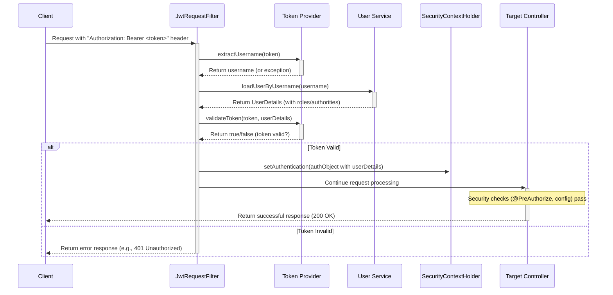

# Chapter 3: User Authentication & Authorization

In [Chapter 2: REST API Controllers](02_rest_api_controllers_.md), we saw how microservices like `auth` expose endpoints (like `/api/auth/login`) so other parts of the system can interact with them. But how do we make sure only the *right* users can access certain data or perform specific actions? We wouldn't want just anyone to be able to view sensitive information or perform administrative tasks!

This chapter dives into how our `auth` service handles **Authentication** (proving who you are) and **Authorization** (checking what you're allowed to do).

## What Problem Does This Solve? The Security Guard Analogy

Imagine our entire system of microservices is like a large, secure building with different rooms and departments.

*   **Authentication (AuthN):** When you first arrive at the building, a security guard at the main entrance asks for your ID to verify **who you are**. This is like logging in with a username and password. Our `auth` service acts like this main entrance guard.
*   **Authorization (AuthZ):** Once inside, you might try to enter a restricted area, like the server room. The guard at *that* door checks your ID card again, but this time they're looking for specific permission or a security clearance level to see **what you're allowed to do** (or access). Can you enter this room, or just the main lobby?

**Use Case:**

1.  A user ("Alice", who is a regular USER) logs in using her username and password via the `/api/auth/login` endpoint.
2.  The system verifies her credentials are correct (**Authentication**).
3.  The system gives Alice a temporary digital ID card (a **JWT Token**) that says "Name: Alice, Role: USER".
4.  Alice tries to access a list of all users (an admin-only function) using her digital ID card.
5.  The system checks her card and sees she only has the "USER" role, not "ADMIN" (**Authorization**).
6.  The system denies Alice access to the user list.
7.  Later, an administrator ("Bob", with the ADMIN role) logs in, gets his own JWT Token ("Name: Bob, Role: ADMIN"), and tries to access the same user list.
8.  The system checks Bob's card, sees the "ADMIN" role (**Authorization**), and grants him access.

Our `auth` service, combined with security checks in other services, makes this possible.

## Key Concepts

1.  **Authentication (AuthN):** The process of verifying a user's identity. Usually done by checking credentials like a username and password against a stored record (e.g., in a database).
2.  **Authorization (AuthZ):** The process of determining if an *authenticated* user has the necessary permissions to access a specific resource or perform a particular action. This often involves checking user roles (like `ADMIN`, `USER`, `SPECTATOR`).
3.  **`auth` Service:** The dedicated microservice in our project responsible for handling the initial authentication (login) and issuing the digital ID cards (JWTs).
4.  **JWT (JSON Web Token):** This is our "digital ID card". It's a compact, secure string of text exchanged between the client (like the user's browser) and the servers.
    *   It contains information (**claims**) like the user's ID, their roles, and when the token expires.
    *   It's **digitally signed** by the `auth` service using a secret key. This signature allows other services to verify that the token is authentic and hasn't been tampered with.
    *   It enables **stateless authentication**. This is a key benefit! It means our servers *don't* need to keep track of who is logged in session by session. All the necessary info is in the token itself, which the client sends with each request. This makes scaling our system much easier.

## How It Works: The Login and Access Flow

Let's walk through the process step-by-step:

1.  **Login Request:** The user enters their username and password into a login form (or uses an application that does). This client sends these credentials to the `auth` service's `/api/auth/login` endpoint (as discussed in [Chapter 2: REST API Controllers](02_rest_api_controllers_.md)).
2.  **Authentication:** The `auth` service receives the credentials.
    *   It looks up the user in its database.
    *   It compares the provided password (after hashing it) with the stored hashed password.
    *   If they match, the user is **authenticated**.
3.  **Token Generation:** If authentication is successful, the `auth` service generates a JWT.
    *   It includes essential user information (like username or ID) and their assigned roles (e.g., `["USER"]` or `["ADMIN", "USER"]`) inside the token's payload.
    *   It sets an expiration time for the token (e.g., 1 hour).
    *   It signs the token using its secret key.
4.  **Token Response:** The `auth` service sends the generated JWT back to the client as part of the login response.
5.  **Client Stores Token:** The client (e.g., the browser's JavaScript) securely stores this JWT (often in memory or local storage).
6.  **Subsequent Requests:** Now, whenever the client needs to access a protected resource on *any* microservice (e.g., getting data from the `fqw` service):
    *   It includes the stored JWT in the `Authorization` HTTP header of the request, typically like this: `Authorization: Bearer <the_long_jwt_string>`.
7.  **Token Verification & Authorization:** The microservice receiving the request (or a gateway in front of it) performs these checks, usually using Spring Security features:
    *   It extracts the JWT from the `Authorization` header.
    *   It verifies the token's signature using the *same* secret key (or a corresponding public key) shared with the `auth` service. This confirms the token is authentic and wasn't modified.
    *   It checks if the token has expired.
    *   If the token is valid, it extracts the user's identity and roles from the token's payload.
    *   It checks if the user's roles grant them permission to access the requested resource or perform the action (**Authorization**).
8.  **Access Granted/Denied:** Based on the authorization check, the service either processes the request and sends back the desired data/result or returns an error (like `401 Unauthorized` or `403 Forbidden`).

## The Login Flow: A Closer Look

Let's use a diagram to visualize the login process specifically within the `auth` service:

```mermaid
sequenceDiagram
    participant Client
    participant AuthController as RestAuthController
    participant UserService as User Service
    participant UserRepo as UserRepository
    participant PwdEncoder as Password Encoder
    participant TokenProv as Token Provider

    Client->>+AuthController: POST /api/auth/login (UserDTO: {login, password})
    AuthController->>+UserService: login(userDTO)
    UserService->>+UserRepo: findByLogin(userDTO.getLogin())
    UserRepo-->>-UserService: Return User object (or null)
    alt User found
        UserService->>+PwdEncoder: matches(userDTO.getPassword(), user.getPasswordHash())
        PwdEncoder-->>-UserService: Return true/false (password matches?)
        alt Password matches
            UserService->>+TokenProv: generateAccessToken(user.getLogin())
            TokenProv-->>-UserService: Return accessToken (JWT)
            UserService->>+TokenProv: generateRefreshToken(user.getLogin())
            TokenProv-->>-UserService: Return refreshToken (JWT)
            Note over UserService: Save refresh token to User object
            UserService->>+UserRepo: save(user)
            UserRepo-->>-UserService: Confirm save
            UserService->>-AuthController: Return ResponseEntity OK with AuthResponse {accessToken, refreshToken}
        else Password does NOT match
            UserService->>-AuthController: Return ResponseEntity Unauthorized (401)
        end
    else User NOT found
        UserService->>-AuthController: Return ResponseEntity Unauthorized (401)
    end
    AuthController-->>-Client: Send HTTP Response (200 OK + Tokens or 401 Error)
```

**Code Snippets Involved in Login:**

1.  **Controller (`RestAuthController.java`):** Receives the request and delegates to the service.

    ```java
    // File: auth/src/main/java/ru/emiren/auth/Controller/RestAuthController.java

    @RestController
    @RequestMapping("/api/auth")
    public class RestAuthController {
        // ... constructor injection for userService ...

        @PostMapping("/login")
        public ResponseEntity<AuthResponse> login(@RequestBody UserDTO userDTO) {
            // Delegates the actual logic to the UserService
            // The UserDTO contains the username and password from the request JSON
            return userService.login(userDTO);
        }
        // ... other methods
    }
    ```

    *   **Explanation:** As seen in Chapter 2, this controller method listens for POST requests at `/api/auth/login`. It takes the JSON request body (`@RequestBody`) containing login details (`UserDTO`) and passes it to the `userService.login` method. It then returns whatever `ResponseEntity` the service layer provides.

2.  **Service Implementation (`UserServiceImpl.java`):** Handles the core login logic.

    ```java
    // File: auth/src/main/java/ru/emiren/auth/Service/Impl/UserServiceImpl.java

    @Service
    public class UserServiceImpl implements UserService {
        // ... constructor injection for userRepository, passwordEncoder, tokenProvider ...
        BCryptPasswordEncoder encoder = new BCryptPasswordEncoder(); // Usually injected

        @Override
        public ResponseEntity<AuthResponse> login(UserDTO userDTO) {
            // 1. Find the user by login name
            User user = userRepository.findByLogin(userDTO.getLogin());
            if (user == null) {
                return ResponseEntity.status(HttpStatus.UNAUTHORIZED).build(); // User not found
            }

            // 2. Check if the provided password matches the stored hash
            if (!encoder.matches(userDTO.getPassword(), user.getPassword())) {
                 return ResponseEntity.status(HttpStatus.UNAUTHORIZED).build(); // Wrong password
            }

            // 3. Generate JWTs (Access and Refresh tokens)
            String accessToken = tokenProvider.generateAccessToken(user.getLogin());
            String refreshToken = tokenProvider.generateRefreshToken(user.getLogin());

            // 4. Store refresh token details (optional, for longer sessions)
            user.setRefreshToken(refreshToken);
            user.setRefreshTokenExpiry(new Date(System.currentTimeMillis() + tokenProvider.getRefreshTokenValidity()));
            userRepository.save(user);

            // 5. Return tokens in the response
            return ResponseEntity.ok(new AuthResponse(accessToken, refreshToken));
        }
        // ... other methods like registerUser, loadUserByUsername ...
    }
    ```

    *   **Explanation:** This method orchestrates the login:
        *   Finds the user via the [Repository Layer](08_repository_layer_.md) (`userRepository`).
        *   Uses a `PasswordEncoder` (like `BCryptPasswordEncoder`) to safely compare the submitted password with the stored hash. **Never store plain text passwords!**
        *   If credentials are valid, it calls the `TokenProvider` to create the access and refresh JWTs.
        *   It updates the user record with the new refresh token and its expiry date.
        *   Finally, it builds a successful `ResponseEntity` containing the tokens in an `AuthResponse` object.

3.  **Token Generation (`TokenProvider.java`):** Creates the actual JWT strings.

    ```java
    // File: auth/src/main/java/ru/emiren/auth/Utils/TokenProvider.java
    import io.jsonwebtoken.Jwts;
    import io.jsonwebtoken.security.Keys;
    import javax.crypto.SecretKey;
    // ... other imports ...

    @Component // Marks this class to be managed by Spring
    public class TokenProvider {
        // IMPORTANT: Keep this key secret and secure! Often loaded from config.
        private final String SECRET_KEY = "your-very-long-and-secure-secret-key-here";
        private final SecretKey SIGNING_KEY = Keys.hmacShaKeyFor(SECRET_KEY.getBytes());
        private final long accessTokenValidity = 60 * 60 * 1000; // 1 hour in ms

        public String generateAccessToken(String username) {
            return Jwts.builder()
                    .subject(username) // 'sub' claim: identifies the user
                    .issuedAt(new Date()) // 'iat' claim: when token was issued
                    .expiration(new Date(System.currentTimeMillis() + accessTokenValidity)) // 'exp' claim
                    // Add roles claim (example, needs fetching roles from user)
                    // .claim("roles", List.of("USER"))
                    .signWith(SIGNING_KEY) // Sign using the secret key
                    .compact(); // Build the string
        }
        // ... generateRefreshToken, extractUsername, validateToken etc. ...
    }
    ```

    *   **Explanation:** This class uses the `jjwt` library to build the JWT.
        *   It defines a `SECRET_KEY` which is crucial for signing and verifying the token. **This must be kept secure and should not be hardcoded directly like this in production.**
        *   The `generateAccessToken` method builds the token with standard claims like subject (`sub`), issued-at time (`iat`), and expiration time (`exp`). You can add custom claims like roles here.
        *   `.signWith(SIGNING_KEY)` creates the digital signature.
        *   `.compact()` produces the final JWT string (like `eyJhbGciOiJIUzI1NiJ9.eyJzdWIiOiJhbGljZSIsImlhdCI6...`).

## Handling Subsequent Requests: The Security Filter

Okay, the user is logged in and has a JWT. How do other services check it? This is where Spring Security and a special filter come into play.

1.  **Request Arrives:** The client sends a request to another service (e.g., `GET /api/fqw/students`) with the header `Authorization: Bearer <jwt_string>`.
2.  **`JwtRequestFilter` Intercepts:** Before the request even reaches the intended controller (like `ApplicationProgrammingInterfaceController` in the `fqw` service), a configured Spring Security filter (`JwtRequestFilter` in our `auth` service, but similar logic would exist or be called by other services/gateways) intercepts it.
3.  **Token Extraction & Validation:** The filter extracts the token from the header. It uses the `TokenProvider` to:
    *   Parse the token.
    *   Validate the signature using the `SECRET_KEY`.
    *   Check if the token is expired.
    *   Extract the username (subject claim).
4.  **Load User Details:** If the token is valid, the filter uses the extracted username to load the full user details (including roles) from the database via the `UserService`.
5.  **Set Security Context:** The filter creates an `Authentication` object representing the now-authenticated user (including their roles/authorities) and places it in Spring Security's `SecurityContextHolder`. This makes the user's identity and permissions available for the duration of the request processing.
6.  **Request Continues:** The filter chain proceeds, and the request eventually reaches the target controller.
7.  **Authorization Check:** Now, Spring Security can perform authorization checks based on the information stored in the `SecurityContextHolder`. This can happen in two main ways:
    *   **Configuration:** Rules defined in `SecurityConfig` (e.g., `requestMatchers("/api/admin/**").hasRole("ADMIN")`).
    *   **Annotations:** Annotations on controller methods (e.g., `@PreAuthorize("hasRole('ADMIN')")`).
8.  **Access Control:** If the user has the required role/permission, the controller method executes. If not, Spring Security denies access, typically returning a `403 Forbidden` status.

**Diagram: Authenticated Request Flow**



**Code Snippets for Request Handling:**

1.  **JWT Filter (`JwtRequestFilter.java`):** Intercepts requests, validates tokens, sets security context.

    ```java
    // File: auth/src/main/java/ru/emiren/auth/Utils/JwtRequestFilter.java

    @Component // Managed by Spring
    // Ensures filter runs once per request
    public class JwtRequestFilter extends OncePerRequestFilter {

        @Autowired private TokenProvider tokenProvider;
        @Autowired private UserService userService; // For loading UserDetails

        @Override
        protected void doFilterInternal(HttpServletRequest request,
                                        HttpServletResponse response, FilterChain chain)
                throws ServletException, IOException {

            final String authHeader = request.getHeader("Authorization");
            String username = null;
            String jwt = null;

            // 1. Extract Token if present
            if (authHeader != null && authHeader.startsWith("Bearer ")) {
                jwt = authHeader.substring(7);
                try {
                    username = tokenProvider.extractUsername(jwt);
                } catch (Exception e) { /* Handle invalid token */ }
            }

            // 2. Validate Token & Set Context if not already authenticated
            if (username != null && SecurityContextHolder.getContext().getAuthentication() == null) {
                // Load user details (implement UserDetailsService in UserService)
                User userDetails = this.userService.loadUserByUsername(username);

                // Validate token (checks signature, expiry, username match)
                if (tokenProvider.validateToken(jwt, userDetails)) {
                    // Create authentication token (using userDetails with roles/authorities)
                    UsernamePasswordAuthenticationToken authToken = new UsernamePasswordAuthenticationToken(
                            userDetails, null, /* userDetails.getAuthorities() */ null); // Need authorities here!
                    // Set authentication in the security context
                    SecurityContextHolder.getContext().setAuthentication(authToken);
                }
            }
            // Continue the filter chain (pass request to next filter or controller)
            chain.doFilter(request, response);
        }
    }
    ```

    *   **Explanation:** This filter runs for every incoming request. It checks for the `Authorization: Bearer` header, extracts the token, uses the `TokenProvider` to validate it and get the username. If valid, it loads the `UserDetails` (which includes roles) using the `UserService` and tells Spring Security who the user is by setting the `Authentication` in the `SecurityContextHolder`. **Note:** Getting authorities/roles correctly linked here is vital for authorization.

2.  **Security Configuration (`SecurityConfig.java`):** Plugs in the filter and defines access rules.

    ```java
    // File: auth/src/main/java/ru/emiren/auth/Config/SecurityConfig.java

    @Configuration
    @EnableWebSecurity // Enable Spring Security features
    public class SecurityConfig {
        // ... constructor injection for jwtRequestFilter, entryPoint ...

        @Bean
        public SecurityFilterChain filterChain(HttpSecurity http) throws Exception {
            http
                // Disable CSRF (common for stateless APIs)
                .csrf(AbstractHttpConfigurer::disable)
                // Configure CORS (Cross-Origin Resource Sharing)
                .cors(cors -> cors.configurationSource(corsConfigurationSource()))
                // Define authorization rules
                .authorizeHttpRequests(auth -> auth
                    // Allow anyone to access login/register endpoints
                    .requestMatchers("/api/auth/login", "/api/auth/register").permitAll()
                    // Example: Require ADMIN role for paths under /api/admin/**
                    .requestMatchers("/api/admin/**").hasRole("ADMIN")
                    // Example: Allow any *authenticated* user for other /api/** paths
                    .requestMatchers("/api/**").authenticated()
                    // Allow access to static resources (CSS, JS)
                    .requestMatchers("/css/**", "/js/**", "/img/**").permitAll()
                    // Secure everything else by default (might need adjustment)
                    .anyRequest().authenticated()
                )
                // Configure session management to be STATELESS (important for JWT)
                .sessionManagement(sess -> sess.sessionCreationPolicy(SessionCreationPolicy.STATELESS))
                // Set custom entry point for authentication errors
                .exceptionHandling(exc -> exc.authenticationEntryPoint(jwtAuthenticationEntryPoint))
                // Add our custom JWT filter BEFORE the standard username/password filter
                .addFilterBefore(jwtRequestFilter, UsernamePasswordAuthenticationFilter.class);

            return http.build();
        }
        // ... beans for PasswordEncoder, CorsConfigurationSource, etc. ...
    }
    ```

    *   **Explanation:** This configuration tells Spring Security:
        *   To disable CSRF protection (less critical for stateless APIs if tokens are handled correctly).
        *   How to handle requests from different origins (CORS).
        *   Which URL paths require authentication and which specific roles (`.hasRole("ADMIN")`).
        *   Which paths are public (`.permitAll()`).
        *   To use `STATELESS` sessions (no server-side session tracking).
        *   To add our `jwtRequestFilter` into the security filter chain so it processes requests.

## Conclusion

We've seen how the `auth` service and Spring Security work together to protect our microservices.

*   **Authentication** (verifying "who you are") happens during login, where the `auth` service checks credentials and issues a **JWT**.
*   **Authorization** (checking "what you can do") happens on subsequent requests. A **Security Filter** intercepts requests, validates the JWT, identifies the user and their roles, and then Spring Security enforces access rules based on configuration or annotations.
*   **JWTs** are the key to enabling **stateless** authentication, making our system more scalable and resilient. The token itself carries the necessary user information securely.

Understanding this foundation is crucial as we move into services that manage specific application data, ensuring only authorized users can interact with it appropriately.

Next up, we'll explore how the `fqw` service manages its specific data: [Chapter 4: FQW Data Model & Management](04_fqw_data_model___management_.md)

---

Generated by [AI Codebase Knowledge Builder](https://github.com/The-Pocket/Tutorial-Codebase-Knowledge)