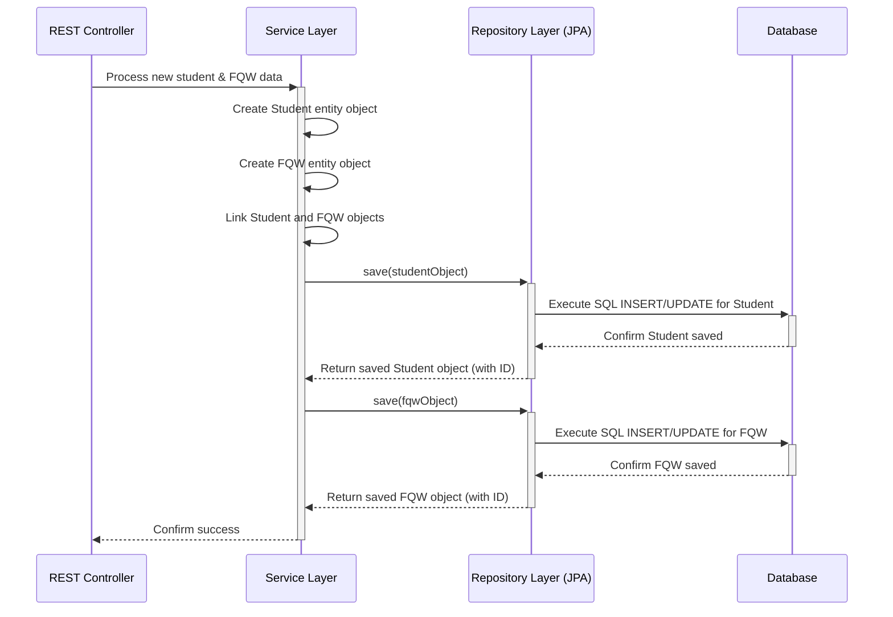

# Chapter 4: FQW Data Model & Management

Welcome to Chapter 4! In [Chapter 3: User Authentication & Authorization](03_user_authentication___authorization_.md), we learned how our system verifies users and controls access using JWTs. Now that we know *who* is using the system, let's dive into *what* data they are interacting with, specifically within the `fqw` (Final Qualifying Work) service.

This chapter focuses on the **FQW Data Model & Management**. This is the heart of the `fqw` service, defining how we structure and handle all the crucial information about students, their theses (FQWs), supervisors, departments, and everything related to the academic process.

## What Problem Does This Solve? Organizing Academic Chaos!

Imagine a university's administrative office trying to manage thesis information using scattered paper files, sticky notes, and maybe a few disconnected spreadsheets. It would be chaotic! How would you easily find:

*   Which student is supervised by Professor Smith?
*   What's the title of Jane Doe's thesis?
*   Who reviewed John Public's FQW?
*   What questions were asked during Sarah Lee's defense protocol?

Keeping track of all these interconnected details is complex. The **FQW Data Model** solves this by providing a structured, digital blueprint for organizing this information. **Data Management** refers to how we actually *use* this blueprint to store, retrieve, and update the information.

**Use Case:** Let's say an administrator needs to view the complete record for a student named "Alex". They need to see Alex's department, their FQW title, the supervisor's name, the reviewer's details, and the grade received during the defense. Our FQW Data Model and Management system needs to store all this information in a connected way so it can be easily retrieved together.

## Key Concepts: Building Blocks of Academic Data

Think of the FQW Data Model like the design for a library database. It defines the different types of records we need to keep and how they relate to each other. In our `fqw` service, these records are represented as Java classes called **Entities**. Here are some of the most important ones:

1.  **`Student`**: Holds information about a student (name, student number, department, etc.).
2.  **`Lecturer`**: Stores details about academic staff (name, position, department), who can act as supervisors or consultants.
3.  **`FQW` (Final Qualifying Work)**: Represents the thesis or final project itself (title, uniqueness score, reviewer details, associated decree).
4.  **`Department`**: Information about university departments (code, name).
5.  **`Orientation`**: Represents the student's academic program or specialization.
6.  **`Decree`**: Details about the official order assigning the FQW topic to the student.
7.  **`Reviewer`**: Information about the person who reviewed the FQW.
8.  **`Protection`**: Represents the defense event (year, committee members, linked to an Orientation).
9.  **`Commissioner`**: Details about a member of the defense committee.
10. **`Protocol`**: Records the details of the defense meeting (grade, questions asked, linked to the student).
11. **`Question`**: A specific question asked during the defense, linked to a Commissioner and a Protocol.

**The Magic is in the Connections:**

These entities aren't isolated islands! They are connected:
*   A `Student` belongs to a `Department`.
*   A `Student` is associated with an `FQW`.
*   An `FQW` has a `Reviewer`.
*   A `Student` has one or more `Lecturer`s (supervisors/consultants) – this link is represented by a special entity called `StudentLecturers`.
*   A `Protection` event involves multiple `Commissioner`s – linked via `ProtectionCommissioner`.
*   A `Protocol` contains multiple `Question`s – linked via `ProtocolQuestion`.

These connections allow us to navigate the data. If we have a `Student`, we can easily find their `FQW`, their `Lecturer`s, and their `Protocol`.

## How It Solves the Use Case: Following the Links

To get the complete record for our student "Alex":

1.  We start by finding the `Student` entity for Alex (perhaps using their student number).
2.  From the `Student` entity, we follow the link to their associated `FQW` entity to get the thesis title and reviewer.
3.  We follow the link from the `Student` entity to the `Department` entity.
4.  We follow the link from the `Student` entity to the `StudentLecturers` entity (or entities) to find their `Lecturer` (supervisor).
5.  We follow the link from the `Student` entity to their `Protocol` entity to find the grade.

Because the data model defines these relationships, the system can gather all this related information efficiently.

## Data Management: Java Classes Meet the Database (JPA Entities)

How do we represent this model in our Java code? We use **JPA (Java Persistence API)**. JPA allows us to map our Java classes directly to tables in a database. These special Java classes are called **Entities**.

Let's look at a *simplified* `Student` entity:

```java
// File: fqw/src/main/java/ru/emiren/infosystemdepartment/Model/SQL/Student.java
package ru.emiren.infosystemdepartment.Model.SQL;

import jakarta.persistence.*; // Import JPA annotations
import lombok.*; // For cleaner code (auto-generates getters, setters, etc.)

@Entity // 1. Tells JPA this class maps to a database table (likely named "student")
@Getter @Setter // Lombok annotations
@Builder @NoArgsConstructor @AllArgsConstructor // Lombok annotations
public class Student {

    @Id // 2. Marks this field as the primary key for the table
    @GeneratedValue(strategy = GenerationType.IDENTITY) // 3. Lets the database auto-generate the ID
    private Long id;

    private Long stud_num; // Student number
    private String name;   // Student's full name

    // 4. Defines a relationship: Many Students can belong to one Department
    @ManyToOne
    @JoinColumn(name = "department_code") // 5. Specifies the column in the Student table that links to the Department table
    private Department department;

    // ... other fields like FQW, Orientation, Lecturers (via StudentLecturers) would also be here ...
}
```

**Explanation:**

1.  `@Entity`: This is the most important annotation. It signals to JPA that this `Student` class corresponds to a table in our database.
2.  `@Id`: Marks the `id` field as the unique identifier (primary key) for each student record in the table.
3.  `@GeneratedValue`: Tells JPA how the `id` is generated (here, we let the database handle it).
4.  `@ManyToOne`: This annotation defines a relationship. It means many `Student` entities can be linked to one `Department` entity.
5.  `@JoinColumn`: Specifies the name of the column in the `student` table (`department_code`) that stores the foreign key linking to the `department` table.

**Other Key Entities (Simplified Examples):**

*   **Lecturer:**

    ```java
    // File: fqw/src/main/java/ru/emiren/infosystemdepartment/Model/SQL/Lecturer.java
    @Entity
    @Getter @Setter // ... other Lombok annotations
    public class Lecturer {
        @Id @GeneratedValue(strategy = GenerationType.IDENTITY)
        private Long id;
        private String name;
        private String position;

        @ManyToOne // Many Lecturers can belong to one Department
        @JoinColumn(name="department")
        private Department department;

        // 1. Defines a relationship: One Lecturer can have many StudentLecturers links
        @OneToMany(mappedBy = "lecturer") // 2. "mappedBy" points to the field in StudentLecturers that owns the relationship
        private List<StudentLecturers> students;
    }
    ```

    **Explanation:**
    1.  `@OneToMany`: Defines a one-to-many relationship (one Lecturer, many student links).
    2.  `mappedBy = "lecturer"`: This tells JPA that the relationship details (the foreign key column) are defined in the `lecturer` field of the `StudentLecturers` entity.

*   **FQW (Final Qualifying Work):**

    ```java
    // File: fqw/src/main/java/ru/emiren/infosystemdepartment/Model/SQL/FQW.java
    @Entity
    @Getter @Setter // ... other Lombok annotations
    public class FQW {
        @Id @GeneratedValue(strategy = GenerationType.IDENTITY)
        private Long id;

        private String classifier;
        private Float uniqueness;

        @ManyToOne // Many FQWs can relate to one Decree
        @JoinColumn(name = "decree_id")
        private Decree decree; // Contains the theme/title

        @OneToOne // One FQW has one Reviewer
        @JoinColumn(name = "reviewer_id")
        private Reviewer reviewer;

        // A Student would typically have a @OneToOne or @ManyToOne link TO this FQW
    }
    ```

    **Explanation:**
    *   `@OneToOne`: Defines a relationship where one `FQW` entity is linked to exactly one `Reviewer` entity.

These entity classes, with their fields and relationship annotations (`@ManyToOne`, `@OneToMany`, `@OneToOne`, `@JoinColumn`), form the complete data model blueprint used by JPA.

## Under the Hood: How Data Gets Managed

So we have these blueprint classes (Entities). How do we actually save a new student's FQW data or fetch Alex's record? This involves several layers we've touched upon before:

1.  **Request:** An HTTP request arrives at a [REST API Controller](02_rest_api_controllers_.md) (e.g., `POST /api/add-data` handled by `UploadDataController`). The request contains the new data.
2.  **Controller:** The controller extracts the data from the request.
3.  **Service Layer:** The controller calls a method in the [Service Layer](06_service_layer_.md) (e.g., `UploadDataFormService.createStudent(...)`, `UploadDataFormService.createFQW(...)`).
4.  **Entity Creation:** The Service Layer creates instances of our Entity classes (`Student`, `FQW`, `Lecturer`, etc.) and populates them with the data received. It also sets up the links between them (e.g., `student.setFqw(newlyCreatedFQW)`).
5.  **Repository Call:** The Service Layer calls methods on the **Repository Layer** (e.g., `studentRepository.save(studentObject)`, `fqwRepository.save(fqwObject)`).
6.  **Repository (JPA Magic):** The Repository Layer interfaces (like `StudentRepository`, `FQWRepository`) use JPA. When `save()` is called:
    *   JPA analyzes the Entity object (`studentObject`).
    *   It automatically generates the correct SQL `INSERT` or `UPDATE` statement.
    *   It executes the SQL statement against the database.
7.  **Database:** The data is now stored persistently in the database tables.

Fetching data follows a similar path, but the Repository uses JPA to generate SQL `SELECT` statements.

**Simplified Diagram: Adding a Student and their FQW**



## The Repository Layer: Our Data Access Toolkit

The **Repository Layer** acts as the intermediary between our Service Layer logic and the database operations managed by JPA. We define interfaces for each entity, and Spring Data JPA magically provides implementations for us!

Look at the `StudentRepository`:

```java
// File: fqw/src/main/java/ru/emiren/infosystemdepartment/Repository/SQL/StudentRepository.java
package ru.emiren.infosystemdepartment.Repository.SQL;

import org.springframework.data.jpa.repository.JpaRepository; // Import base repository
import org.springframework.data.jpa.repository.Query; // For custom queries
import ru.emiren.infosystemdepartment.Model.SQL.Student; // The entity it manages
import java.util.Optional; // To handle cases where a student might not be found

// 1. Interface extending JpaRepository for the Student entity with Long as ID type
public interface StudentRepository extends JpaRepository<Student, Long> {

    // 2. Magic methods provided by JpaRepository:
    //    - save(Student student) -> Saves or updates a student
    //    - findById(Long id) -> Finds a student by ID
    //    - findAll() -> Finds all students
    //    - deleteById(Long id) -> Deletes a student
    //    - ... and many more!

    // 3. Custom query method using JPQL (Java Persistence Query Language)
    @Query("SELECT s FROM Student s WHERE s.stud_num = :studNum")
    Optional<Student> findByStudNum(Long studNum); // Finds a student by their student number

    // Spring Data JPA can also automatically create queries from method names!
    // E.g., defining `Optional<Student> findByName(String name);` would work too.
}
```

**Explanation:**

1.  We define an interface `StudentRepository` that extends `JpaRepository<Student, Long>`. This tells Spring Data JPA that this repository is for managing `Student` entities, and their ID is of type `Long`.
2.  Just by extending `JpaRepository`, we automatically get a whole set of useful methods for common database operations (Create, Read, Update, Delete - CRUD). We don't need to write the SQL for these!
3.  We can add custom methods like `findByStudNum`. The `@Query` annotation lets us specify the query using JPQL (similar to SQL but uses entity and field names). Spring Data JPA implements this method for us based on the query.

We have similar repositories for other entities like `FQWRepository`, `LecturerRepository`, `ProtocolRepository`, etc., each providing the tools to interact with the database for that specific entity type. You can explore these in the `fqw/src/main/java/ru/emiren/infosystemdepartment/Repository/SQL/` directory.

## Conclusion

We've explored the core of the `fqw` service: its **Data Model** and **Management**.

*   The **Data Model** uses **JPA Entities** (Java classes like `Student`, `Lecturer`, `FQW`) with annotations (`@Entity`, `@ManyToOne`, etc.) to define the structure of our academic information and its relationships.
*   **Data Management** relies on the **Repository Layer** (interfaces like `StudentRepository` extending `JpaRepository`) which uses JPA to automatically handle database interactions (saving, finding, updating data).
*   This structured approach allows us to manage complex academic data effectively, solving our use case of retrieving interconnected information like a student's FQW details, supervisor, and protocol grade.

Understanding this data model is fundamental to grasping how the `fqw` service stores and processes information. However, when data moves between layers (Controller, Service, Repository) or between different microservices, we often don't want to pass the complex Entity objects directly. We need simpler containers for data transfer.

Next up, we'll look at how we create these simpler data containers: [Chapter 5: Data Transfer Objects (DTOs) & Mappers](05_data_transfer_objects__dtos____mappers_.md).

---

Generated by [AI Codebase Knowledge Builder](https://github.com/The-Pocket/Tutorial-Codebase-Knowledge)