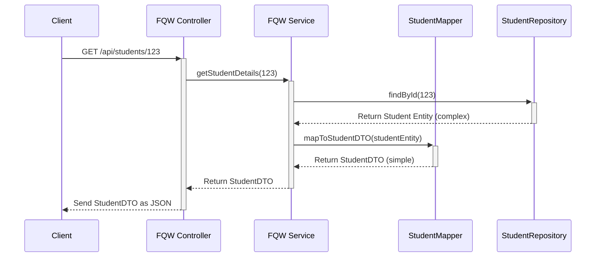

# Chapter 5: Data Transfer Objects (DTOs) & Mappers

Welcome back! In [Chapter 4: FQW Data Model & Management](04_fqw_data_model___management_.md), we saw how the `fqw` service uses complex **JPA Entities** (like `Student`, `FQW`) to represent and manage data in the database. These Entities are great for internal use, especially when talking to the database, because they accurately model our data structure and relationships.

However, Entities often contain *more* information than we want to show to the outside world (like internal IDs or sensitive data) or are just too complicated for simple communication. Sending the entire Entity object between different parts of our application (like from the Service Layer to the Controller) or between different microservices can be messy and inefficient.

## What Problem Do DTOs Solve? Standardized Shipping Containers!

Imagine you need to send a specific set of items (like a book and a pen) to someone. You wouldn't just hand over your entire bookshelf! You'd pick out *only* the book and pen, put them in a standard-sized **shipping box**, and send that box. The box clearly defines what's being sent and is easy to handle.

**Data Transfer Objects (DTOs)** are like those standardized shipping containers for our application data. **Mappers** are the workers who carefully pack the required items (data) from our internal storage (Entities) into these boxes (DTOs) before sending, and unpack them when receiving.

**Use Case:** Let's revisit the login process from [Chapter 2: REST API Controllers](02_rest_api_controllers_.md) and [Chapter 3: User Authentication & Authorization](03_user_authentication___authorization_.md).

1.  When a user tries to log in, the web browser sends the username and password to the `/api/auth/login` endpoint.
2.  The `auth` service needs to receive *only* the username and password. It doesn't need the user's internal ID, their list of roles, or their refresh token expiry date at this point.
3.  The `RestAuthController` receives this information neatly packaged in a `UserDTO` (our shipping box).
4.  Later, if the service needs to work with the full user details from the database, a **Mapper** might be used to "unpack" the data from the `UserDTO` or to convert a full `User` Entity fetched from the database *into* a `UserDTO` (perhaps removing the password hash) before sending user profile information back to the browser.

Using DTOs and Mappers keeps our internal data structures (Entities) separate from the data structures used for communication. This makes our system cleaner, more secure, and easier to change.

## Key Concepts: The Box and The Packer

1.  **Data Transfer Object (DTO):**
    *   A simple Java class designed specifically to carry data between different parts of the system (e.g., Controller <-> Service, Service <-> Client, Microservice <-> Microservice).
    *   It contains only the fields necessary for that specific transfer.
    *   It typically has no complex logic, just fields, constructors, getters, and setters (often generated using Lombok like `@Data` or `@Getter`/`@Setter`).
    *   It does **not** have database-specific annotations like `@Entity` or `@Id`. It's just a plain data holder.
    *   **Analogy:** The standardized shipping container.

2.  **Mapper:**
    *   Code responsible for converting data between different object types, primarily between Entities and DTOs.
    *   It copies data from Entity fields to corresponding DTO fields (and vice-versa).
    *   It can also perform simple transformations, like combining fields or formatting data.
    *   We can write mappers manually (simple classes with static methods) or use libraries like MapStruct to generate them automatically.
    *   **Analogy:** The worker who packs items into the shipping container and unpacks them.

## How DTOs & Mappers Solve the Use Case

Let's see how this works in practice, using examples from our `auth` and `fqw` services.

**1. The Login Scenario (`auth` service):**

*   **Receiving Data:** When the client sends a `POST` request to `/api/auth/login` with JSON like `{"login": "testuser", "password": "password123"}`, Spring automatically converts this JSON into a `UserDTO` object before passing it to the `RestAuthController`.

    ```java
    // File: auth/src/main/java/ru/emiren/auth/DTO/UserDTO.java

    // Lombok annotations create getters, setters, builder, etc.
    @Data  // Includes @Getter, @Setter, @ToString, @EqualsAndHashCode
    @Builder // Provides a builder pattern for object creation
    public class UserDTO {
        // Fields needed for login or sometimes for user display
        private Long id; // Might be null for login request
        private String login;
        private String password; // Needed for login/registration, but NOT sent back!
        private String refreshToken; // Often sent back, not received
        private Date refreshTokenExpiry; // Often sent back, not received
        private List<RoleDTO> roles = new ArrayList<>(); // Usually sent back, not received
    }
    ```

    *   **Explanation:** This `UserDTO` class holds fields related to a user. Notice it's simpler than a full `User` Entity might be (e.g., no direct links to other complex entities). Crucially, it doesn't have `@Entity` annotations.

*   **Mapping (if needed):** Inside the `UserService`, if we need the full `User` Entity to interact with the database, we use a Mapper.

    ```java
    // File: auth/src/main/java/ru/emiren/auth/Mapper/UserMapper.java

    public class UserMapper {

        // Converts UserDTO -> User Entity
        public static User mapToUser(UserDTO userDTO){
            return User.builder() // Using Lombok's builder
                    .id(userDTO.getId())
                    .login(userDTO.getLogin())
                    .password(userDTO.getPassword()) // Be careful with passwords!
                    .refreshToken(userDTO.getRefreshToken())
                    // Roles need mapping too (using RoleMapper, not shown fully)
                    .roles(userDTO.getRoles().stream().map(RoleMapper::mapToRole).toList())
                    .refreshTokenExpiry(userDTO.getRefreshTokenExpiry())
                    .build();
        }

        // Converts User Entity -> UserDTO
        public static UserDTO mapToUserDTO(User user){
            return UserDTO.builder()
                    .id(user.getId())
                    .login(user.getLogin())
                    // *** NOTICE: Password is NOT mapped back to the DTO ***
                    // .password(user.getPassword()) // SECURITY: Don't expose password hash!
                    .refreshToken(user.getRefreshToken())
                    .refreshTokenExpiry(user.getRefreshTokenExpiry())
                    // Roles need mapping too
                    .roles(user.getRoles().stream().map(RoleMapper::mapToRoleDTO).toList())
                    .build();
        }
    }
    ```

    *   **Explanation:** The `UserMapper` class has static methods to translate between `UserDTO` and the (hypothetical) `User` Entity. `mapToUser` creates an Entity from a DTO. `mapToUserDTO` creates a DTO from an Entity, carefully *omitting* sensitive data like the password hash.

**2. Fetching Student Data (`fqw` service):**

*   **Internal Representation:** The `StudentRepository` fetches a `Student` Entity from the database (as seen in [Chapter 4: FQW Data Model & Management](04_fqw_data_model___management_.md)). This Entity might look like this (simplified):

    ```java
    // Remider from Chapter 4: Entity Class
    // File: fqw/src/main/java/ru/emiren/infosystemdepartment/Model/SQL/Student.java
    @Entity
    public class Student {
        @Id private Long id;
        private Long stud_num;
        private String name;
        private String citizenship;

        @ManyToOne private Department department; // Holds the *entire* Department object
        @OneToOne private FQW fqw;             // Holds the *entire* FQW object
        // ... other fields and relationships ...
    }
    ```

*   **The DTO:** We define a simpler `StudentDTO` for sending data back to the client. We only include the fields the client needs, maybe flattening some relationships.

    ```java
    // File: fqw/src/main/java/ru/emiren/infosystemdepartment/DTO/SQL/StudentDTO.java

    @Data    // Lombok creates getters, setters, etc.
    @Builder // Lombok creates a builder
    public class StudentDTO {
        private Long id;
        private Long stud_num;
        private String name;
        private String citizenship;
        private String loe; // Level of Education

        // Maybe include just the Department *name* or *code*, not the whole object
        private DepartmentDTO department; // Reference another DTO

        // Maybe include just the FQW *theme*, not the whole object
        private FQWDTO fqw; // Reference another DTO

        // Notice: No direct reference to complex internal structures like StudentLecturers
    }
    ```

    *   **Explanation:** The `StudentDTO` is much simpler. It might reference *other DTOs* (`DepartmentDTO`, `FQWDTO`) instead of the full Entities, providing a tailored view of the data.

*   **The Mapper:** A `StudentMapper` translates the `Student` Entity into the `StudentDTO`.

    ```java
    // File: fqw/src/main/java/ru/emiren/infosystemdepartment/Mapper/StudentMapper.java

    public class StudentMapper {

        // Converts Student Entity -> StudentDTO
        public static StudentDTO mapToStudentDTO(Student student) {
            return StudentDTO.builder()
                    .id(student.getId())
                    .stud_num(student.getStud_num())
                    .name(student.getName())
                    .loe(student.getLoe())
                    .citizenship(student.getCitizenship())
                    // Use other mappers to convert nested entities to DTOs
                    .orientation(OrientationMapper.mapToOrientationDTO(student.getOrientation()))
                    .department(DepartmentMapper.mapToDepartmentDTO(student.getDepartment()))
                    .fqw(FQWMapper.mapToFQWDTO(student.getFqw()))
                    // Skip complex internal fields not needed in the DTO
                    .build();
        }

        // Converts StudentDTO -> Student Entity (Needed for saving data)
        public static Student mapToStudent(StudentDTO studentDTO){
            // ... implementation would copy fields from DTO to a new Entity ...
            // ... using other mappers for nested DTOs ...
            return Student.builder()
                    .id(studentDTO.getId())
                    .stud_num(studentDTO.getStud_num())
                    .name(studentDTO.getName())
                    // ... map other fields and nested DTOs using Mappers ...
                    .build();
        }
    }
    ```

    *   **Explanation:** The `mapToStudentDTO` method takes a `Student` Entity object and builds a `StudentDTO`. It copies simple fields directly (like `id`, `name`). For related objects (like `Department`, `FQW`), it calls *other mappers* (`DepartmentMapper`, `FQWMapper`) to convert those Entities into their respective DTOs (`DepartmentDTO`, `FQWDTO`). This ensures the entire structure returned is composed of simple DTOs.

## Under the Hood: The Data Transformation Flow

Let's visualize how data flows when a client requests student details from the `fqw` service:

1.  **Request:** Client sends `GET /api/students/123`.
2.  **Controller:** The `ApplicationProgrammingInterfaceController` (or similar) receives the request and calls the `StudentService`.
3.  **Service Layer:** The `StudentService` needs to fetch the student data.
4.  **Repository:** The `StudentService` calls `studentRepository.findById(123)`.
5.  **JPA/Database:** The repository uses JPA to fetch the full `Student` Entity (including related `Department`, `FQW` entities) from the database.
6.  **Mapping:** The `StudentService` receives the complex `Student` Entity. Before returning it to the controller, it calls `StudentMapper.mapToStudentDTO(studentEntity)`.
7.  **Mapper Logic:** The `StudentMapper` creates a new `StudentDTO`, copying relevant data and using other mappers (`DepartmentMapper`, `FQWMapper`) to convert nested Entities into nested DTOs.
8.  **Service Returns DTO:** The `StudentService` returns the simple `StudentDTO` to the Controller.
9.  **Controller Response:** The Controller puts the `StudentDTO` into a `ResponseEntity`.
10. **Serialization:** Spring uses a library (like Jackson) to convert the `StudentDTO` object into a JSON string.
11. **Response:** The JSON string is sent back to the client.

**Sequence Diagram: Fetching Student Data**



This flow clearly separates concerns:
*   **Repository/Entities:** Deal with database interaction and the full data structure.
*   **DTOs:** Define the data contract for communication.
*   **Mappers:** Bridge the gap between Entities and DTOs.
*   **Service:** Orchestrates the process, using the Repository to get data and the Mapper to prepare it for sending.
*   **Controller:** Handles HTTP requests/responses, dealing primarily with DTOs.

## Conclusion

We've learned about **Data Transfer Objects (DTOs)** and **Mappers**.

*   **DTOs** act as simple, standardized containers ("shipping boxes") carrying only the necessary data for communication between layers or services. They decouple our internal data models (Entities) from our external contracts (APIs).
*   **Mappers** act as the translators or "packers," converting data between the complex internal `Entity` format and the simple communication `DTO` format.
*   This pattern enhances **security** (by not exposing sensitive internal data), improves **flexibility** (changing the internal model doesn't automatically break the API), and keeps our code **cleaner** and easier to understand.

Now that we understand how data is structured internally with Entities ([Chapter 4: FQW Data Model & Management](04_fqw_data_model___management_.md)) and how it's packaged for communication using DTOs and Mappers (this chapter), we are ready to look at the layer that orchestrates most of the application's work: the Service Layer.

Next up: [Chapter 6: Service Layer](06_service_layer_.md)

---

Generated by [AI Codebase Knowledge Builder](https://github.com/The-Pocket/Tutorial-Codebase-Knowledge)