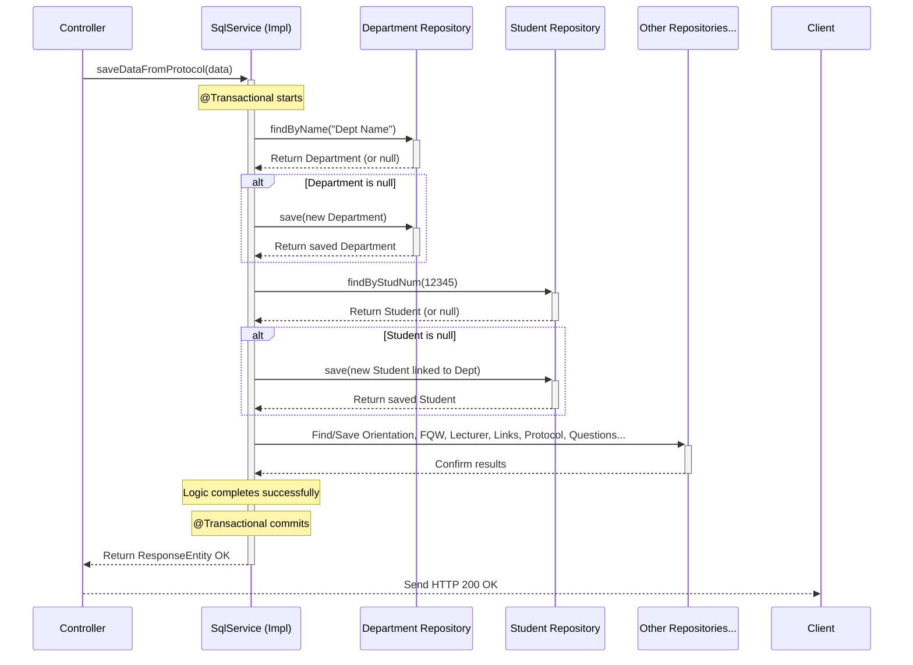

# Chapter 6: Service Layer

Welcome to Chapter 6! In [Chapter 5: Data Transfer Objects (DTOs) & Mappers](05_data_transfer_objects__dtos____mappers_.md), we learned how to package data neatly using DTOs for transferring it between different parts of our application, like between the Controller and the user. We also saw how Mappers help convert between these simple DTOs and our more complex internal data structures (Entities).

Now, where does the *real* work happen? When a request comes into a [REST API Controller](02_rest_api_controllers_.md), it usually carries some data (often in a DTO). The Controller itself shouldn't contain complex application rules. Its job is mainly to handle the web request and response. The [Repository Layer](08_repository_layer_.md) is responsible for basic data storage and retrieval (like saving or finding a user). But what sits in between, orchestrating the process, applying rules, and coordinating actions?

That's the job of the **Service Layer**.

## What Problem Does the Service Layer Solve? The Brains of the Operation!

Imagine building a complex machine, like a car. You have:
*   The dashboard controls (like the Controller) where the driver interacts.
*   The engine parts and storage tanks (like the Repository) that hold fuel and perform basic mechanical actions.

But you need something to connect them – the car's computer (ECU) and wiring. When the driver presses the accelerator (Controller), the ECU (Service Layer) receives this signal, calculates how much fuel is needed based on various conditions (the business logic), tells the fuel injector (Repository) to supply the right amount of fuel, and maybe interacts with the transmission system (another Repository or Service).

The Service Layer is the "brains" of each microservice. It contains the core **business logic** – the rules, calculations, and coordination steps that define what the application actually *does*.

**Use Case:** Let's revisit the `fqw` service. Imagine a user wants to add a new student record, including their FQW (thesis) theme and assigning a specific lecturer as their supervisor.

1.  A request comes into the `fqw` service's Controller (e.g., `/api/add-student-fqw`) with data packaged in DTOs (like `StudentDTO`, `FqwDTO`, `LecturerDTO`).
2.  The Controller receives this data. But who checks if the student number is valid? Who finds the right `Lecturer` entity in the database? Who creates the `Student` entity, the `FQW` entity, *and* links them correctly with the `Lecturer` through the `StudentLecturers` table?
3.  This isn't just one simple database save. It involves multiple steps, potential lookups, and data manipulation according to the university's rules. This complex coordination is handled by the **Service Layer**.

The Controller calls a single method in the Service Layer (like `fqwDataService.createStudentWithFqwAndSupervisor(...)`), and the Service Layer takes care of all the internal steps.

## Key Concepts: Inside the Brain

1.  **Business Logic:** This is the heart of the Service Layer. It's the code that implements the specific rules and procedures of your application domain.
    *   Examples: Calculating a grade based on scores, checking if a username meets complexity requirements, determining if a student is eligible for a specific program, orchestrating the steps to generate a protocol document.
    *   **Analogy:** The specialized department in a company (like Finance or Logistics) that knows the rules and procedures for its specific tasks.

2.  **Coordination / Orchestration:** Service methods often need to interact with multiple Repositories or even call other services to complete a task.
    *   Example: The `login` method in the `auth` service needs to call the `UserRepository` to find the user, the `PasswordEncoder` to check the password, and the `TokenProvider` to generate JWTs.
    *   **Analogy:** A project manager coordinating different team members (Repositories) to complete a project.

3.  **Interface (The "What"):** Defines the contract for the service. It's a Java `interface` that lists the public methods available, specifying *what* operations the service can perform, without saying *how*.
    *   **Analogy:** A restaurant menu lists the available dishes (operations) but doesn't detail the exact recipe.

    ```java
    // File: fqw/src/main/java/ru/emiren/infosystemdepartment/Service/SQL/SqlService.java
    package ru.emiren.infosystemdepartment.Service.SQL;
    // ... other imports ...

    // Interface defining WHAT the SQL-related service can do
    public interface SqlService {

        // Method to get data for selector dropdowns
        SelectorSqlPayload receiveSelectors();

        // Method to get all data for the main table display
        ResponseEntity<String> getAllDataAsPayload();

        // Method to save data received from a protocol document
        ResponseEntity<String> saveDataFromProtocol(Map<String, Object> dataMap);

        // Method to find department/orientation by student number
        ResponseEntity<Map<String, String>> findDepartmentAndOrientationByStudNumber(String studNumber);

        // ... other method signatures ...
    }
    ```
    *   **Explanation:** This interface lists methods like `receiveSelectors` and `saveDataFromProtocol`. Other parts of the application (like Controllers) will interact with the service *through this interface*.

4.  **Implementation (The "How"):** A regular Java class that `implements` the service interface. This class contains the actual code (the business logic and coordination) that performs the tasks defined in the interface.
    *   **Analogy:** The kitchen staff following the recipes (implementation) to prepare the dishes listed on the menu (interface).

    ```java
    // File: fqw/src/main/java/ru/emiren/infosystemdepartment/Service/SQL/Impl/SqlServiceImpl.java
    package ru.emiren.infosystemdepartment.Service.SQL.Impl;
    // ... imports for DTOs, Mappers, Models, Repositories, other Services ...
    import ru.emiren.infosystemdepartment.Service.SQL.*; // Import other needed services

    @Service // 1. Tells Spring this is a Service component
    @Slf4j   // For logging
    public class SqlServiceImpl implements SqlService { // 2. Implements the interface

        // 3. Dependencies injected by Spring (Repositories, other Services)
        private final ProtocolService protocolService;
        private final StudentService studentService;
        private final DepartmentService departmentService;
        private final LecturerService lecturerService;
        // ... many other dependencies (FQWService, QuestionService, etc.) ...
        private final Gson gson; // For JSON conversion

        // Constructor where Spring injects the dependencies
        @Autowired
        public SqlServiceImpl(StudentService studentService, /*...,*/ Gson gson) {
            this.studentService = studentService;
            // ... assign other injected dependencies ...
            this.gson = gson;
            updateSqlDataPayload(); // Initialize some data on startup
        }

        // 4. Implementation of the 'saveDataFromProtocol' method
        @Override
        @Transactional // 5. Ensures database operations are atomic (all or nothing)
        public ResponseEntity<String> saveDataFromProtocol(Map<String, Object> data) {
            try {
                log.info("Received data from protocol: {}", data.keySet());

                // --- Coordination Example ---
                // a. Find or create Department
                Department department = departmentService.findDepartmentByName((String) data.get("Department"));
                if (department == null) { /* ... create and save new department ... */ }

                // b. Find or create Orientation
                Orientation orientation = orientationService.getOrientation(/* code from data */);
                if (orientation == null) { /* ... create and save new orientation ... */ }

                // c. Find or create Decree (thesis assignment)
                Decree decree = decreeService.findDecreeByThemeAndNumberOfDecreeAndStudNum(/*...*/);
                 if (decree == null) { /* ... create and save new decree ... */ }

                // d. Find or create FQW (thesis)
                FQW fqw = fqwService.getFqwByName((String) data.get("Theme"));
                 if (fqw == null) { fqw = createAndSaveFqw(decree, data); } // Calls another private method

                // e. Find or create Student
                Student student = studentService.findStudentByStudNum(/*...*/);
                if (student == null) { student = createAndSaveStudent(data, fqw, department, orientation); }

                // f. Find or create Lecturers and link to Student
                processAndLinkLecturers(data, student, department); // Handles multiple lecturers

                // g. Find or create Protocol record
                Protocol protocol = protocolService.findByStudentNum(student.getStud_num());
                if (protocol == null) { protocol = createAndSaveProtocol(student, fqw, data); }

                // h. Find or create Questions and link to Protocol
                processAndLinkQuestions(data, protocol); // Handles multiple questions

                // --- End Coordination ---

                log.info("Saving protocol data has ended successfully.");
                return ResponseEntity.status(HttpStatus.OK).body("OK");

            } catch (Exception e) {
                log.error("Error saving data from protocol: {}", e.getMessage());
                // Rollback happens automatically due to @Transactional
                return ResponseEntity.status(HttpStatus.INTERNAL_SERVER_ERROR).body(e.getMessage());
            }
        }

        // ... implementations for other methods from SqlService interface ...
        // ... private helper methods like createAndSaveFqw, createAndSaveStudent etc. ...
    }
    ```
    *   **Explanation:**
        1.  `@Service`: Marks this class as a Spring service bean, making it available for dependency injection.
        2.  `implements SqlService`: Indicates this class provides the logic for the `SqlService` contract.
        3.  Dependencies: The service declares fields for the Repositories (like `StudentRepository` via `StudentService`) and potentially other Services it needs to talk to. Spring uses `@Autowired` (often on the constructor) to automatically provide instances of these dependencies (Dependency Injection).
        4.  Method Implementation: The `saveDataFromProtocol` method contains the detailed steps (the business logic) to achieve the goal. It coordinates calls to various other services (`departmentService`, `orientationService`, `studentService`, `fqwService`, `protocolService`, `lecturerService`, `questionService`) which in turn interact with their respective repositories.
        5.  `@Transactional`: This important annotation tells Spring to manage database transactions for this method. If any step within the method fails (throws an exception), any database changes made *during this method call* will be automatically rolled back, ensuring data consistency. It's like saying "either all these database updates succeed, or none of them do."

5.  **Separation:** Using interfaces and implementations allows us to separate the "what" from the "how". The Controller only needs to know *about the interface* (`SqlService`) and doesn't care about the specific implementation details (`SqlServiceImpl`). This makes the code easier to test and maintain.

## How It Solves the Use Case: Orchestrating the Save

Let's trace the flow for saving data from a protocol:

1.  **Request:** A request (e.g., from the `protocol` service after processing a document) hits a Controller endpoint in the `fqw` service, like `POST /api/v1/save-data`. The request body contains the extracted data as a `Map<String, Object>`.
2.  **Controller:** The `ApplicationProgrammingInterfaceController` receives the request. It doesn't know how to save this complex data. It simply calls the service layer.

    ```java
    // File: fqw/src/main/java/ru/emiren/infosystemdepartment/Controller/ApplicationProgrammingInterfaceController.java
    @RestController
    @RequestMapping("/api/v1")
    public class ApplicationProgrammingInterfaceController {

        private final SqlService sqlService; // Injecting the INTERFACE

        @Autowired
        public ApplicationProgrammingInterfaceController(SqlService sqlService) {
            this.sqlService = sqlService;
        }

        @PostMapping("/save-data")
        public ResponseEntity<?> saveData(@RequestBody Map<String, Object> data){
            // Delegate the work entirely to the Service Layer
            return sqlService.saveDataFromProtocol(data);
        }
        // ... other controller methods ...
    }
    ```
    *   **Explanation:** The controller injects the `SqlService` *interface*. It calls the `saveDataFromProtocol` method on the injected service instance, passing the data along. It then returns whatever `ResponseEntity` the service method provides.

3.  **Service Layer (`SqlServiceImpl.saveDataFromProtocol`)**: This method (shown above) executes the detailed steps:
    *   Starts a transaction (`@Transactional`).
    *   Calls `departmentService` (which uses `DepartmentRepository`) to find/create the department.
    *   Calls `orientationService` (which uses `OrientationRepository`) to find/create the orientation.
    *   Calls `decreeService` ...
    *   Calls `fqwService` ...
    *   Calls `studentService` ...
    *   Calls `lecturerService` and `studentLecturersService` ...
    *   Calls `protocolService` ...
    *   Calls `questionService` and `protocolQuestionService` ...
    *   If all steps succeed, the transaction is committed, and an "OK" response is returned.
    *   If any step fails, the transaction is rolled back, and an error response is returned.
4.  **Controller Response:** The controller receives the `ResponseEntity` from the service and sends it back to the original caller.

## Under the Hood: The Coordination Flow

Here’s a simplified view of what happens when the Controller calls the Service to save protocol data:



This diagram shows the Service Layer acting as the central coordinator, interacting with various Repositories to fulfill the request, all within a database transaction.

## Conclusion

The **Service Layer** is a critical part of our microservice architecture. It acts as the "brains" by:

*   Containing the core **business logic** and application rules.
*   **Orchestrating** complex operations that may involve multiple steps and data sources.
*   Coordinating calls to the [Repository Layer](08_repository_layer_.md) to fetch or save data.
*   Often managing **transactions** to ensure data consistency.
*   Using **interfaces** to define a clear contract (`What`) and **implementations** to provide the logic (`How`).

It sits between the [REST API Controllers](02_rest_api_controllers_.md) (which handle web interactions) and the [Repository Layer](08_repository_layer_.md) (which handles data persistence), taking data (often as [DTOs](05_data_transfer_objects__dtos____mappers_.md)) and applying the necessary logic before returning a result.

Now that we understand how general business logic is structured in the Service Layer, let's look at a very specific and important piece of business logic within our system: generating official documents.

Next up: [Chapter 7: Protocol Generation & Processing](07_protocol_generation___processing_.md)

---

Generated by [AI Codebase Knowledge Builder](https://github.com/The-Pocket/Tutorial-Codebase-Knowledge)