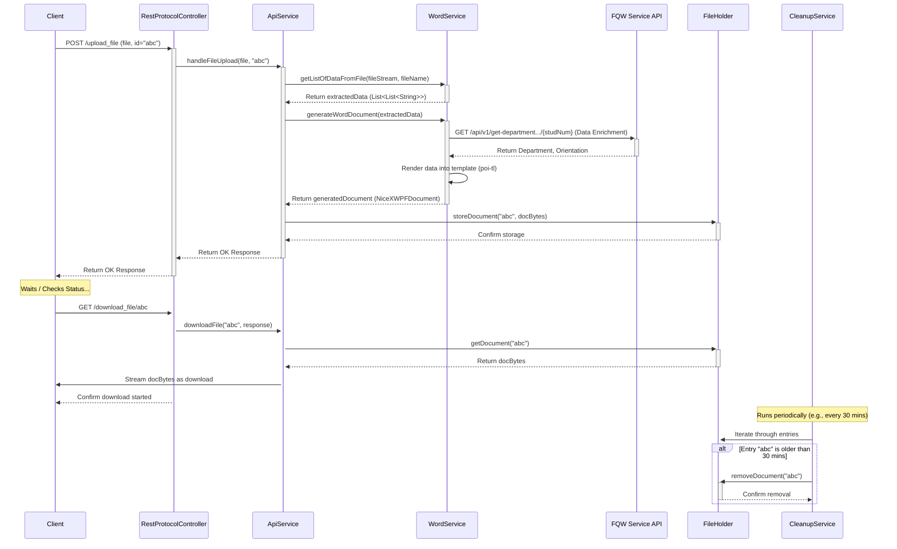

# Chapter 7: Protocol Generation & Processing

Welcome to Chapter 7! In [Chapter 6: Service Layer](06_service_layer_.md), we explored how the Service Layer acts as the "brain" of our microservices, containing the core business logic and coordinating tasks. Now, we'll focus on a very important piece of business logic within the `protocol` service: turning raw input data into finished, standardized documents.

Think of the `protocol` service as an automated document factory. Its main job is to take information, often from uploaded files, and use templates to produce consistent, official-looking documents like defense protocols.

## What Problem Does This Solve? The Automated Document Factory

Imagine a busy university department handling dozens of student thesis defenses. After each defense, someone needs to create an official protocol document. This involves:

*   Gathering information (student name, thesis title, reviewer comments, questions asked, final grade).
*   Formatting it according to strict university standards (using a specific template).
*   Ensuring consistency across all protocols.

Doing this manually for every student is time-consuming, repetitive, and prone to errors or inconsistencies. What if we could automate this?

**Use Case:** An administrator has a Word document (or maybe an Excel spreadsheet) containing the raw details from a student's recent thesis defense. They need to quickly generate the official, standardized protocol document based on this input, ready for signatures and archiving.

The **Protocol Generation & Processing** functionality in our `protocol` service solves exactly this! It takes the uploaded file, extracts the necessary data, potentially fetches additional related information (like the student's department from the `fqw` service), merges it all into a predefined template, and makes the final document available for download.

## Key Concepts: Building Blocks of the Factory

1.  **Input Parsing:** The service needs to read and understand the data inside the uploaded files (like `.docx` or `.xlsx`). It uses libraries like Apache POI to look inside these files and extract relevant information, perhaps by reading text or specific tables.
    *   **Analogy:** The factory's intake station, where raw materials (uploaded files) are inspected and sorted.

2.  **Templating:** A master template file (like `template_copy.docx` in our project) acts as a blueprint. This template contains placeholders (like `{{FullName}}`, `{{Theme}}`, `{{Score}}`) where specific data should be inserted. We use libraries like `poi-tl` (a wrapper around Apache POI) to work with these templates.
    *   **Analogy:** The mold or blueprint used on the factory assembly line to ensure every product has the same basic shape and structure.

3.  **Data Enrichment (Optional):** Sometimes, the uploaded file doesn't contain *all* the required information. For example, it might have the student's ID number but not their official department name. The `protocol` service can talk to the [FQW Data Model & Management](04_fqw_data_model___management_.md) system in the `fqw` service (using REST API calls) to fetch this missing information.
    *   **Analogy:** Fetching additional parts from a warehouse (`fqw` service) needed to complete the product assembly.

4.  **Document Generation:** This is the core step where the extracted and enriched data is merged into the template. The placeholders are replaced with actual values, creating the final, complete document.
    *   **Analogy:** The main assembly line where the raw materials and fetched parts are put together using the blueprint.

5.  **Temporary Storage (`FileHolder`):** Generating a document can take a moment. Instead of making the user wait, the service generates the document and stores it temporarily in memory using a component called `FileHolder`. It associates the document with a unique ID.
    *   **Analogy:** A temporary holding area in the factory where finished products are kept before shipping, each with a unique tracking ID.

6.  **Cleanup:** Since we're storing generated files temporarily in memory, we need a process to clean out old files that were generated but never downloaded, preventing memory issues.
    *   **Analogy:** Regular cleanup of the factory's temporary holding area to remove old inventory.

## How It Solves the Use Case: From Upload to Download

Let's walk through the process for our administrator generating a protocol:

1.  **Upload:** The administrator uses a web interface to upload the Word document containing defense details. The interface also generates a unique ID (let's say `abc123xyz`) for this request and sends both the file and the ID to the `protocol` service's `/api/protocol/upload_file` endpoint.
2.  **Request Handling:** The `RestProtocolController` receives the file and the ID.
3.  **Delegation:** The Controller calls the `ApiService` (our [Service Layer](06_service_layer_.md) implementation) to handle the processing.
4.  **Processing in `ApiService`:**
    *   It takes the input `MultipartFile` (the uploaded Word document).
    *   It calls the `WordService` to parse the file and extract data into a structured format (like a `List<List<String>>`).
    *   The `WordService` might also perform *Data Enrichment* by calling the `fqw` service via `RestTemplate` to get the student's department based on their ID number found in the document.
    *   The `ApiService` then tells the `WordService` to generate the final document using the extracted/enriched data and the standard template (`template_copy.docx`).
    *   The `WordService` uses `poi-tl` to fill in the template placeholders and returns the generated document as raw bytes (`byte[]`).
    *   The `ApiService` takes these bytes and stores them in the `FileHolder` using the unique ID: `fileHolder.storeDocument("abc123xyz", generatedBytes)`.
    *   The `ApiService` sends a success response back to the administrator's browser, maybe indicating the file is being processed or is ready with ID `abc123xyz`.
5.  **Checking/Download:** The administrator's web interface might periodically check the status using the ID (`/api/protocol/check_file_availability/abc123xyz`). Once available, the administrator clicks a "Download" button.
6.  **Download Request:** The browser sends a request to `/api/protocol/download_file/abc123xyz`.
7.  **Retrieval & Sending:** The `RestProtocolController` again calls the `ApiService`. The `ApiService` retrieves the document bytes from the `FileHolder` (`fileHolder.getDocument("abc123xyz")`) and streams these bytes back to the browser, triggering a file download.
8.  **Cleanup (Later):** After some time (e.g., 30 minutes), the automated `DocumentCleanupService` runs, finds the entry for `abc123xyz` in the `FileHolder` is old, and removes it to free up memory.

## Under the Hood: Code Glimpses

Let's peek at some simplified code snippets involved in this process.

**1. Controller (`RestProtocolController.java`): Receiving the Upload**

```java
// File: protocol/src/main/java/ru/emiren/protocol/Controller/RestProtocolController.java
package ru.emiren.protocol.Controller;
// ... imports ...
import org.springframework.web.bind.annotation.*;
import org.springframework.web.multipart.MultipartFile;
import ru.emiren.protocol.Service.api.ApiService; // The Service Layer interface

@RestController
@RequestMapping("/api/protocol")
@Slf4j // For logging
public class RestProtocolController {

    private final ApiService apiService; // Inject the Service Layer

    public RestProtocolController(ApiService apiService) {
        this.apiService = apiService;
    }

    @PostMapping("/upload_file")
    public ResponseEntity<?> handleFileUpload(
            @RequestParam("file") MultipartFile file, // The uploaded file
            @RequestParam("id") String fileId) {      // The unique ID for this request
        log.info("File upload request received. ID: {}, Size: {}", fileId, file.getSize());
        // Delegate all the work to the ApiService
        return apiService.handleFileUpload(file, fileId);
    }

    // Endpoint for checking if the file is ready
    @PostMapping("/check_file_availability/{id}")
    public ResponseEntity<?> checkFileAvailability(@PathVariable("id") String id ) {
        return apiService.checkFileAvailability(id);
    }

    // Endpoint for downloading the generated file
    @GetMapping("/download_file/{id}")
    public ResponseEntity<String> downloadFile(@PathVariable("id") String id, HttpServletResponse response) {
        // Delegate download logic to ApiService, passing the response object
        return apiService.downloadFile(id, response);
    }
    // ... other endpoints (like for uploading with a custom template) ...
}
```

*   **Explanation:** This is a standard [REST API Controller](02_rest_api_controllers_.md). The `handleFileUpload` method takes the uploaded `MultipartFile` and the unique `fileId` provided by the client. It immediately passes these to the `apiService` (our [Service Layer](06_service_layer_.md)) to do the actual work. Similarly, the `checkFileAvailability` and `downloadFile` methods delegate their tasks to the service layer.

**2. Service Layer (`ApiServiceImpl.java`): Orchestrating the Process**

```java
// File: protocol/src/main/java/ru/emiren/protocol/Service/api/Impl/ApiServiceImpl.java
package ru.emiren.protocol.Service.api.Impl;
// ... imports ...
import ru.emiren.protocol.DTO.Temporal.FileHolder; // Temporary storage
import ru.emiren.protocol.Service.Word.WordService; // Handles Word processing
import ru.emiren.protocol.Service.api.ApiService;

@Service // Marks as a Service component
@Slf4j
public class ApiServiceImpl implements ApiService {

    private final WordService wordService;
    private final FileHolder fileHolder; // Inject the temporary storage

    // Constructor injection
    @Autowired
    ApiServiceImpl(WordService wordService, FileHolder fileHolder /*...other dependencies...*/) {
        this.wordService = wordService;
        this.fileHolder = fileHolder;
        // ...
    }

    // Simplified internal handling logic
    private ResponseEntity<String> handleFileUploadInternal(MultipartFile file, MultipartFile template, String fileId) {
        log.info("Processing file upload ID: {}", fileId);

        // Avoid re-processing if already done or in progress
        if (!fileHolder.containsDocument(fileId)) {
            try (InputStream inputStream = file.getInputStream()) {
                // 1. Parse input file (& potentially enrich data within WordService)
                List<List<String>> extractedData = wordService.getListOfDataFromFile(
                                                        inputStream,
                                                        file.getOriginalFilename());

                // 2. Generate the document using a template
                NiceXWPFDocument processedDocument;
                // Simplified: Assume default template if 'template' is null
                processedDocument = wordService.generateWordDocument(extractedData);

                if (processedDocument != null) {
                    // 3. Store generated document bytes in FileHolder
                    try (ByteArrayOutputStream baos = new ByteArrayOutputStream()) {
                        processedDocument.write(baos);
                        byte[] docBytes = baos.toByteArray();
                        fileHolder.storeDocument(fileId, docBytes); // Store with the ID
                        log.info("Document stored successfully for ID: {}", fileId);
                    }
                    // Close the generated document object
                    PoitlIOUtils.closeQuietly(processedDocument);
                    return ResponseEntity.ok("Processing started for ID: " + fileId); // Indicate success
                } else {
                    log.warn("Document generation failed for ID: {}", fileId);
                    return ResponseEntity.status(HttpStatus.INTERNAL_SERVER_ERROR).body("Generation failed");
                }
            } catch (IOException ex) {
                log.error("Error handling file upload ID: {}", fileId, ex);
                return ResponseEntity.status(HttpStatus.INTERNAL_SERVER_ERROR).body("Upload error");
            }
        } else {
             log.info("File ID {} already exists or is being processed.", fileId);
             return ResponseEntity.ok("Already processing ID: " + fileId); // Already exists
        }
    }

    @Override
    public ResponseEntity<?> checkFileAvailability(String id) {
        if (fileHolder.containsDocument(id)) {
            return ResponseEntity.ok("Ready"); // Found it!
        } else {
            return ResponseEntity.status(HttpStatus.NOT_FOUND).body("Not Ready"); // Not found yet
        }
    }

     @Override
    public ResponseEntity<String> downloadFile(String id, HttpServletResponse response) {
        if (fileHolder.containsDocument(id)) {
            byte[] documentBytes = fileHolder.getDocument(id);
            // ... (Code to set response headers like Content-Type, Content-Disposition) ...
            try (OutputStream os = response.getOutputStream()) {
                os.write(documentBytes); // Write bytes to the response
                // Optionally remove after download: fileHolder.removeDocument(id);
                return ResponseEntity.ok("Download started.");
            } catch (IOException e) {
                log.error("Error writing file to response for ID {}: {}", id, e.getMessage());
                return ResponseEntity.status(HttpStatus.INTERNAL_SERVER_ERROR).build();
            }
        } else {
            return ResponseEntity.status(HttpStatus.NOT_FOUND).body("File not found.");
        }
    }
    // ... Override other methods from ApiService interface ...
}
```

*   **Explanation:** The `handleFileUploadInternal` method orchestrates the core logic:
    1.  It gets the input stream from the uploaded file.
    2.  Calls `wordService.getListOfDataFromFile` to parse the input.
    3.  Calls `wordService.generateWordDocument` to create the output document using a template.
    4.  Converts the generated document to bytes (`byte[]`).
    5.  Stores these bytes in the `fileHolder` using the unique `fileId`.
    The `checkFileAvailability` and `downloadFile` methods simply interact with the `fileHolder` to check for or retrieve the stored document bytes.

**3. Word Processing (`WordServiceImpl.java`): Parsing & Templating**

```java
// File: protocol/src/main/java/ru/emiren/protocol/Service/Word/Impl/WordServiceImpl.java
package ru.emiren.protocol.Service.Word.Impl;
// ... imports for POI, poi-tl, RestTemplate, FQW data models ...
import com.deepoove.poi.XWPFTemplate;
import com.deepoove.poi.config.Configure;
import com.deepoove.poi.xwpf.NiceXWPFDocument;
import org.apache.poi.xwpf.usermodel.*;
import org.springframework.web.client.RestTemplate; // For calling FQW service

@Service
@Slf4j
public class WordServiceImpl implements WordService {

    private final RestTemplate restTemplate; // To call other services
    private final String sqlLocation; // URL of the FQW service
    private final File defaultTemplateFile; // Pre-loaded default template

    // Constructor loads default template and FQW service location
    public WordServiceImpl(RestTemplate restTemplate, String sqlLocation, /*... inject resourceLoader ...*/) {
        this.restTemplate = restTemplate;
        this.sqlLocation = sqlLocation;
        // Load template_copy.docx into defaultTemplateFile (simplified)
        this.defaultTemplateFile = loadDefaultTemplate("template_copy.docx");
    }

    // Simplified Parsing Logic
    @Override
    public List<List<String>> getListOfDataFromFile(InputStream file, String fileName) {
        List<List<String>> data = new ArrayList<>();
        try (NiceXWPFDocument document = new NiceXWPFDocument(file)) {
            // --- Simplified Example: Read data from the first table ---
            List<XWPFTable> tables = document.getTables();
            if (!tables.isEmpty()) {
                XWPFTable table = tables.getFirst();
                for (int i = 1; i < table.getNumberOfRows(); i++) { // Skip header row
                    List<String> rowData = new ArrayList<>();
                    for (XWPFTableCell cell : table.getRow(i).getTableCells()) {
                        rowData.add(cell.getText()); // Extract text from each cell
                    }
                    data.add(rowData);
                }
            }
             log.info("Extracted {} rows of data.", data.size());
        } catch (IOException e) {
            log.error("Error parsing Word file: {}", e.getMessage());
        }
        return data; // Return the extracted table data
    }

    // Simplified Templating Logic
    @Override
    public NiceXWPFDocument generateWordDocument(List<List<String>> data) {
        // For simplicity, let's process only the first row of data
        if (data.isEmpty()) return null;
        List<String> firstRow = data.getFirst();
        Map<String, Object> dataMap = prepareDataMap(firstRow); // Convert List to Map for poi-tl

        try {
            // Use poi-tl to compile the template and render data into it
            XWPFTemplate template = XWPFTemplate.compile(defaultTemplateFile, Configure.createDefault());
            template.render(dataMap);
            log.info("Rendered data into template.");
            return template.getXWPFDocument(); // Return the generated document object
        } catch (Exception e) {
            log.error("Error generating Word document from template: {}", e.getMessage());
            return null;
        }
    }

    // Helper to convert row data (List) into a Map suitable for poi-tl
    private Map<String, Object> prepareDataMap(List<String> rowData) {
        Map<String, Object> map = new HashMap<>();
        // --- Example mapping based on assumed column order ---
        if (rowData.size() > 0) map.put("ID", rowData.get(0)); // Placeholder {{ID}}
        if (rowData.size() > 1) map.put("FullName", rowData.get(1)); // {{FullName}}
        if (rowData.size() > 2) map.put("StudNum", rowData.get(2)); // {{StudNum}}
        if (rowData.size() > 3) map.put("Theme", rowData.get(3));   // {{Theme}}
        // ... map other relevant columns ...

        // --- Data Enrichment Example ---
        if (map.containsKey("StudNum")) {
            try {
                String studNum = (String) map.get("StudNum");
                // Call FQW service API endpoint
                String url = sqlLocation + "/api/v1/get-department-and-orientation/" + studNum;
                log.info("Calling FQW Service: {}", url);
                // Expected response: Map<String, String> {"Department": "...", "Orientation": "..."}
                Map<String, String> fqwData = restTemplate.getForObject(url, Map.class);
                if (fqwData != null) {
                    map.put("Department", fqwData.getOrDefault("Department", "?"));   // {{Department}}
                    map.put("Orientation", fqwData.getOrDefault("Orientation", "?")); // {{Orientation}}
                    log.info("Enriched data: Dept={}, Orient={}", map.get("Department"), map.get("Orientation"));
                }
            } catch (Exception e) {
                 log.warn("Failed to enrich data from FQW service for {}: {}", map.get("StudNum"), e.getMessage());
                 map.putIfAbsent("Department", "?");
                 map.putIfAbsent("Orientation", "?");
            }
        }
        return map;
    }
    // ... other methods like saveDataAsync, loadDefaultTemplate ...
}
```

*   **Explanation:**
    *   `getListOfDataFromFile`: This method (simplified here) uses Apache POI (`NiceXWPFDocument`) to open the Word file. It finds tables and extracts the text from cells, row by row, into a `List<List<String>>`.
    *   `prepareDataMap`: This crucial helper takes a row of extracted data (a `List<String>`) and converts it into a `Map<String, Object>`. The keys of the map (`"FullName"`, `"Theme"`, etc.) correspond to the placeholders in the `template_copy.docx` file (e.g., `{{FullName}}`, `{{Theme}}`). It also demonstrates *Data Enrichment* by using `RestTemplate` to call an API endpoint on the `fqw` service (`sqlLocation`) to fetch the Department and Orientation based on the `StudNum`, adding them to the map.
    *   `generateWordDocument`: This method takes the prepared `dataMap` and uses the `poi-tl` library (`XWPFTemplate.compile().render()`). This library reads the `defaultTemplateFile`, finds the placeholders, replaces them with the values from the `dataMap`, and returns the final generated `NiceXWPFDocument` object.

**4. Temporary Storage (`FileHolder.java`)**

```java
// File: protocol/src/main/java/ru/emiren/protocol/DTO/Temporal/FileHolder.java
package ru.emiren.protocol.DTO.Temporal;

import lombok.Getter;
import lombok.Setter;
import org.springframework.stereotype.Component; // Mark as Spring bean

import java.time.LocalDateTime; // To track creation time for cleanup
import java.util.concurrent.ConcurrentHashMap; // Thread-safe map

@Getter
@Setter
@Component // Managed by Spring
public class FileHolder {
    // A thread-safe map to store: Request ID -> DocumentHolder
    private ConcurrentHashMap<String, DocumentHolder> holder = new ConcurrentHashMap<>();

    // Store generated document bytes with an ID
    public void storeDocument(String id, byte[] document) {
        // Store the document bytes and record the current time
        holder.put(id, new DocumentHolder(document, null));
    }

    // Get the document bytes associated with an ID
    public byte[] getDocument(String id) {
        DocumentHolder docHolder = holder.get(id);
        return (docHolder != null) ? docHolder.getDocument() : null;
    }

    // Remove an entry by ID (e.g., after download or during cleanup)
    public DocumentHolder removeDocument(String id) {
        return holder.remove(id);
    }

    // Check if an ID exists in the holder
    public boolean containsDocument(String id) {
        return holder.containsKey(id);
    }
}

// Inner class to hold document and creation time
@Getter
class DocumentHolder {
    private final byte[] document;
    private final byte[] template; // Can also store the template used (optional)
    private final LocalDateTime creationTime;

    DocumentHolder(byte[] document, byte[] template) {
        this.document = document;
        this.template = template;
        this.creationTime = LocalDateTime.now(); // Record when it was created
    }
}
```

*   **Explanation:**
    *   `FileHolder` uses a `ConcurrentHashMap`. This is like a standard `HashMap` but is safe to use when multiple requests might try to add or remove files at the same time.
    *   `storeDocument` adds the generated document bytes (`byte[]`) to the map, using the unique request `id` as the key. It wraps the bytes in a `DocumentHolder` which also records the time of creation.
    *   `getDocument`, `removeDocument`, and `containsDocument` provide basic operations to retrieve, delete, or check for the existence of a document based on its ID.

**5. Cleanup Service (`DocumentCleanupServiceImpl.java`)**

```java
// File: protocol/src/main/java/ru/emiren/protocol/Service/Cleanup/Impl/DocumentCleanupServiceImpl.java
package ru.emiren.protocol.Service.Cleanup.Impl;
// ... imports ...
import org.springframework.scheduling.annotation.Scheduled; // For scheduled tasks
import org.springframework.stereotype.Service;
import ru.emiren.protocol.DTO.Temporal.FileHolder;
import ru.emiren.protocol.DTO.Temporal.DocumentHolder; // The inner class

@Service
@Slf4j
public class DocumentCleanupServiceImpl implements DocumentCleanupService {
    private final FileHolder fileHolder; // Inject the storage

    public DocumentCleanupServiceImpl(FileHolder fileHolder) {
        this.fileHolder = fileHolder;
    }

    // Run this method automatically every 30 minutes (1,800,000 milliseconds)
    @Scheduled(fixedRate = 1800000)
    public void cleanUpOldDocuments(){
        LocalDateTime thirtyMinutesAgo = LocalDateTime.now().minusMinutes(30);
        log.info("Running cleanup job. Removing documents older than {}", thirtyMinutesAgo);

        // Iterate safely through the map entries
        fileHolder.getHolder().forEach((id, documentHolder) -> {
            // Check if the document was created more than 30 minutes ago
            if (documentHolder.getCreationTime().isBefore(thirtyMinutesAgo)) {
                // Remove the old entry from the map
                fileHolder.removeDocument(id);
                log.info("Cleaned up old document with ID: {}", id);
            }
        });
         log.info("Cleanup job finished.");
    }
}
```

*   **Explanation:**
    *   `@Scheduled(fixedRate = 1800000)`: This annotation tells Spring to run the `cleanUpOldDocuments` method automatically every 1,800,000 milliseconds (30 minutes).
    *   The method calculates a time 30 minutes in the past.
    *   It then iterates through all the entries currently stored in the `FileHolder`.
    *   For each entry, it checks the `creationTime` stored in the `DocumentHolder`.
    *   If the creation time is before the calculated `thirtyMinutesAgo` time, it means the document is old, and it calls `fileHolder.removeDocument(id)` to delete it from the temporary storage.

**Flow Diagram**



## Conclusion

We've seen how the `protocol` service acts as an automated document factory. It solves the tedious problem of manually creating standardized documents by:

1.  **Parsing** input data from uploaded files (like Word or Excel).
2.  Using **Templates** (`.docx` files with placeholders) as blueprints.
3.  Optionally **Enriching** data by communicating with other services (like `fqw`).
4.  **Generating** the final document by merging data into the template.
5.  Using a **Temporary Storage** (`FileHolder`) to hold generated documents for download.
6.  Employing a **Cleanup** mechanism to manage temporary storage.

This core function automates a potentially complex workflow, ensuring consistency and saving significant effort.

Now that we understand how business logic (like document generation) is implemented in the Service Layer, let's dive deeper into how the services actually interact with the database at the lowest level.

Next up: [Chapter 8: Repository Layer](08_repository_layer_.md)

---

Generated by [AI Codebase Knowledge Builder](https://github.com/The-Pocket/Tutorial-Codebase-Knowledge)