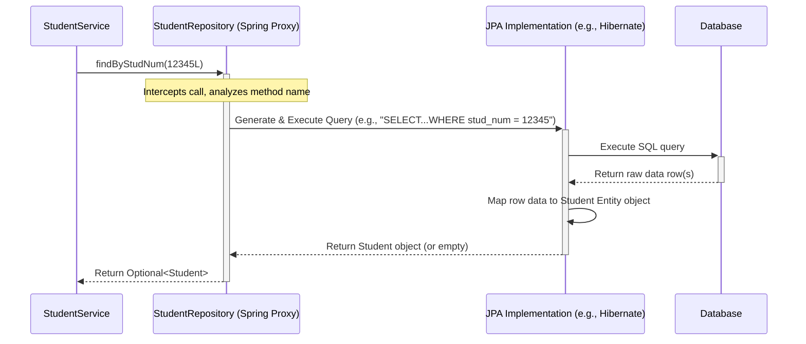

# Chapter 8: Repository Layer

Welcome to Chapter 8! In [Chapter 7: Protocol Generation & Processing](07_protocol_generation___processing_.md), we saw how the `protocol` service could generate documents, sometimes needing to fetch extra data or save results. Similarly, in [Chapter 6: Service Layer](06_service_layer_.md), we saw the Service Layer coordinating tasks like saving student data. But how does the Service Layer actually *talk* to the database to store and retrieve this information without getting bogged down in complex database commands?

That's where the **Repository Layer** comes in. It acts as a clean bridge between our application's logic (in the Service Layer) and the nitty-gritty details of the database.

## What Problem Does This Solve? The Expert Filing Clerks

Imagine our application's data is stored in a massive filing room (the database) with thousands of cabinets and folders. The [Service Layer](06_service_layer_.md) knows *what* information it needs (e.g., "find the record for student #123" or "store this new lecturer's details") but doesn't want to know the exact cabinet number, folder color, or how to physically operate the filing system.

The **Repository Layer** acts like a team of expert filing clerks. Each clerk specializes in a specific type of file (like `Student` files, `Lecturer` files, etc.). The Service Layer just gives a simple instruction to the right clerk (e.g., "Student Clerk, find me ID #123"), and the clerk handles all the details of locating or storing that specific file in the database cabinets.

**Use Case:** The `fqw` service's `StudentService` needs to find a student based on their student number (`stud_num`) to display their details. How does it ask the database for this specific student without writing complicated database query code (SQL)?

The `StudentService` will simply ask the `StudentRepository` (our "Student file clerk") to find the student by their number. The Repository handles the database communication behind the scenes.

## Key Concepts: Meet the Clerks and Their Tools

1.  **Repository Interface (The Clerk's Task List):**
    *   In our Java code, a Repository is defined as an `interface`. Think of this interface as the official list of tasks a specific filing clerk can perform.
    *   Example: `StudentRepository` interface lists tasks like `saveStudent`, `findStudentById`, `findAllStudents`.
    *   It defines *what* can be done, not *how* it's done.

2.  **Spring Data JPA (The Magic Toolkit):**
    *   Here's the really cool part: We usually *don't* have to write the code (the implementation) for *how* the clerk performs common tasks!
    *   We use a powerful Spring tool called **Spring Data JPA**. We just need to make our repository interface extend a base Spring Data JPA interface (like `JpaRepository`).
    *   Spring Data JPA then automatically provides the working code for standard methods like `save()`, `findById()`, `findAll()`, `deleteById()`, etc., based on the Entity type the repository manages.
    *   **Analogy:** Spring Data JPA gives our filing clerks a magic toolkit that already knows how to perform standard filing operations (find by ID, save, delete) without needing detailed instructions for each one.

3.  **Entities (The Files):**
    *   Repositories work directly with the **Entities** we defined in [Chapter 4: FQW Data Model & Management](04_fqw_data_model___management_.md).
    *   When you ask `StudentRepository` to `save`, you give it a `Student` Entity object. When you ask it to `findById`, it gives you back a `Student` Entity object (if found).
    *   **Analogy:** The filing clerks handle specific types of files (`Student` files, `Lecturer` files), which correspond to our Entity classes.

4.  **Standard Methods (Common Tasks):**
    *   By extending `JpaRepository<EntityType, IdType>`, our repository interface automatically inherits methods like:
        *   `save(Entity object)`: Saves a new entity or updates an existing one.
        *   `findById(Id id)`: Finds an entity by its unique ID. Returns an `Optional<Entity>`.
        *   `findAll()`: Returns a `List` of all entities of that type.
        *   `deleteById(Id id)`: Deletes an entity by its ID.
        *   `count()`: Returns the total number of entities.
    *   These cover most basic database interactions (Create, Read, Update, Delete - CRUD).

5.  **Custom Query Methods (Special Requests):**
    *   What if we need something specific, like finding a `Student` by their `stud_num` (not the primary `id`)? Spring Data JPA offers two main ways:
        *   **Method Name Conventions:** If you define a method in your interface like `findByStudNum(Long studNum)`, Spring Data JPA is smart enough to understand this naming pattern and automatically generate the correct database query to find a student by the `studNum` field.
        *   **`@Query` Annotation:** For more complex queries, you can write the query yourself using **JPQL (Java Persistence Query Language)** inside an `@Query` annotation on the method in your interface. JPQL looks similar to SQL but uses your Entity and field names (e.g., `SELECT s FROM Student s WHERE s.stud_num = :studNum`). Spring Data JPA will then execute this specific query.

## How It Solves the Use Case: Asking the Clerk

Let's see how the `StudentService` in the `fqw` service uses the `StudentRepository` to find a student by their student number.

1.  **Define the Repository Interface:** We create the `StudentRepository` interface.

    ```java
    // File: fqw/src/main/java/ru/emiren/infosystemdepartment/Repository/SQL/StudentRepository.java
    package ru.emiren.infosystemdepartment.Repository.SQL;

    import org.springframework.data.jpa.repository.JpaRepository;
    // Import Optional and the Student Entity
    import ru.emiren.infosystemdepartment.Model.SQL.Student;
    import java.util.Optional;

    // 1. Interface extending JpaRepository for Student entities (ID is Long)
    public interface StudentRepository extends JpaRepository<Student, Long> {

        // 2. Custom method: Find a student by their student number
        // Spring Data JPA generates the query based on the method name!
        Optional<Student> findByStudNum(Long studNum);

        // We automatically get methods like:
        // save(Student student);
        // findById(Long id);
        // findAll();
        // deleteById(Long id);
        // ... and many more from JpaRepository!
    }
    ```

    *   **Explanation:**
        1.  We declare an `interface` named `StudentRepository` that extends `JpaRepository<Student, Long>`. This tells Spring Data JPA it's a repository for `Student` entities, where the primary key (`@Id`) is of type `Long`.
        2.  We declare a method `findByStudNum(Long studNum)`. Because the name follows the convention `findBy<FieldName>`, Spring Data JPA automatically knows this method should query the `Student` table looking for a record where the `studNum` column matches the provided `studNum` parameter. It returns an `Optional<Student>` because the student might not exist.

2.  **Use it in the Service Layer:** The `StudentService` (or its implementation) gets the `StudentRepository` injected and simply calls the method.

    ```java
    // Example Snippet from StudentServiceImpl (Conceptual)
    import ru.emiren.infosystemdepartment.Repository.SQL.StudentRepository;
    import ru.emiren.infosystemdepartment.Model.SQL.Student;
    import org.springframework.stereotype.Service;
    import org.springframework.beans.factory.annotation.Autowired;
    import java.util.Optional;

    @Service
    public class StudentServiceImpl implements StudentService {

        private final StudentRepository studentRepository; // The dependency

        @Autowired // Spring injects the repository instance
        public StudentServiceImpl(StudentRepository studentRepository) {
            this.studentRepository = studentRepository;
        }

        // Method in the service to find a student by number
        public Optional<Student> getStudentByNumber(Long studentNumber) {
            System.out.println("Asking the StudentRepository to find student number: " + studentNumber);

            // Simply call the repository method! No SQL needed here.
            Optional<Student> studentOptional = studentRepository.findByStudNum(studentNumber);

            if (studentOptional.isPresent()) {
                System.out.println("Repository found student: " + studentOptional.get().getName());
            } else {
                System.out.println("Repository did not find student with number: " + studentNumber);
            }
            return studentOptional;
        }
        // ... other service methods using studentRepository.save(), .findById(), etc. ...
    }
    ```

    *   **Explanation:** The `StudentServiceImpl` has a `StudentRepository` field. Spring automatically provides the concrete implementation (the "magic toolkit" version) of this repository thanks to `@Autowired`. The `getStudentByNumber` method just calls `studentRepository.findByStudNum(studentNumber)`. All the complexity of database interaction is hidden behind this simple method call.

## Under the Hood: How the Magic Happens

You might be wondering: if we only write an `interface`, where does the actual database code come from? This is the magic of Spring Data JPA proxies.

**Simplified Walkthrough:**

1.  **Application Starts:** Spring detects your `StudentRepository` interface extending `JpaRepository`.
2.  **Proxy Creation:** Spring doesn't create a simple object from your interface (you can't instantiate an interface directly). Instead, it creates a **Proxy object** on the fly. This proxy *pretends* to be a `StudentRepository` but has extra hidden capabilities.
3.  **Service Calls Repository:** Your `StudentService` calls `studentRepository.findByStudNum(12345L)`. This call actually goes to the Spring Proxy object.
4.  **Proxy Intercepts:** The proxy intercepts the call. It analyzes the method name (`findByStudNum`).
5.  **Query Generation:** Based on the method name (or an `@Query` annotation if present) and the Entity type (`Student`), the proxy figures out the database query needed (e.g., SQL: `SELECT * FROM student WHERE stud_num = ?`).
6.  **JPA Execution:** The proxy uses the underlying JPA implementation (like Hibernate) to execute this SQL query against the database.
7.  **Result Mapping:** The database returns the raw result (e.g., a row of data). JPA maps this row back into a `Student` Entity object.
8.  **Return Value:** The proxy returns the `Student` object (wrapped in an `Optional`) back to your `StudentService`.

**Sequence Diagram: `findByStudNum` Flow**



This proxy mechanism means you get powerful database access capabilities just by defining simple interfaces and following conventions!

**Custom Queries with `@Query`**

Sometimes, method names aren't expressive enough, or the query is complex. You can use `@Query`.

```java
// File: fqw/src/main/java/ru/emiren/infosystemdepartment/Repository/SQL/DepartmentRepository.java
package ru.emiren.infosystemdepartment.Repository.SQL;

import org.springframework.data.jpa.repository.JpaRepository;
import org.springframework.data.jpa.repository.Query; // Import @Query
import ru.emiren.infosystemdepartment.Model.SQL.Department;
import java.util.Optional;

public interface DepartmentRepository extends JpaRepository<Department, String> {

    // Standard method from JpaRepository (implementation provided by Spring)
    Optional<Department> findById(String code);

    // Custom query using JPQL (Java Persistence Query Language)
    @Query("SELECT d FROM Student s JOIN Department d ON d.code = s.department.code WHERE s.stud_num = :studNumber")
    Optional<Department> findDepartmentNameByStudNumber(Long studNumber);

    // Find by name using naming convention (implementation provided by Spring)
    Optional<Department> findByName(String name);
}
```

*   **Explanation:**
    *   The `findDepartmentNameByStudNumber` method uses `@Query`.
    *   The string value `"SELECT d FROM Student s JOIN Department d ON d.code = s.department.code WHERE s.stud_num = :studNumber"` is JPQL. Notice it uses Entity names (`Student`, `Department`) and field names (`stud_num`, `department.code`) instead of raw table/column names.
    *   `:studNumber` is a named parameter that matches the `studNumber` argument of the method.
    *   Spring Data JPA takes this JPQL, translates it into the appropriate SQL for your specific database, executes it, and maps the result back to a `Department` object.

## Conclusion

The **Repository Layer**, powered by **Spring Data JPA**, provides a clean and efficient way to handle database interactions in our microservices.

*   It abstracts the underlying database complexity, allowing the [Service Layer](06_service_layer_.md) to work with simple Java interfaces.
*   It automatically provides implementations for common CRUD operations (`save`, `findById`, `findAll`, `deleteById`).
*   It allows defining custom queries easily through method naming conventions or the `@Query` annotation with JPQL.
*   Repositories work directly with our [JPA Entities](04_fqw_data_model___management_.md), acting as the gateway for persisting and retrieving them.

By using Repositories, we keep our data access code organized, maintainable, and largely free from boilerplate database logic. We have now seen all the major layers of a typical microservice in our project: Controllers, Services, DTOs/Mappers, Entities, and Repositories. The final piece is understanding how security configurations tie everything together, protecting our endpoints and controlling access.

Next up: [Chapter 9: Spring Security Configuration](09_spring_security_configuration_.md)

---

Generated by [AI Codebase Knowledge Builder](https://github.com/The-Pocket/Tutorial-Codebase-Knowledge)