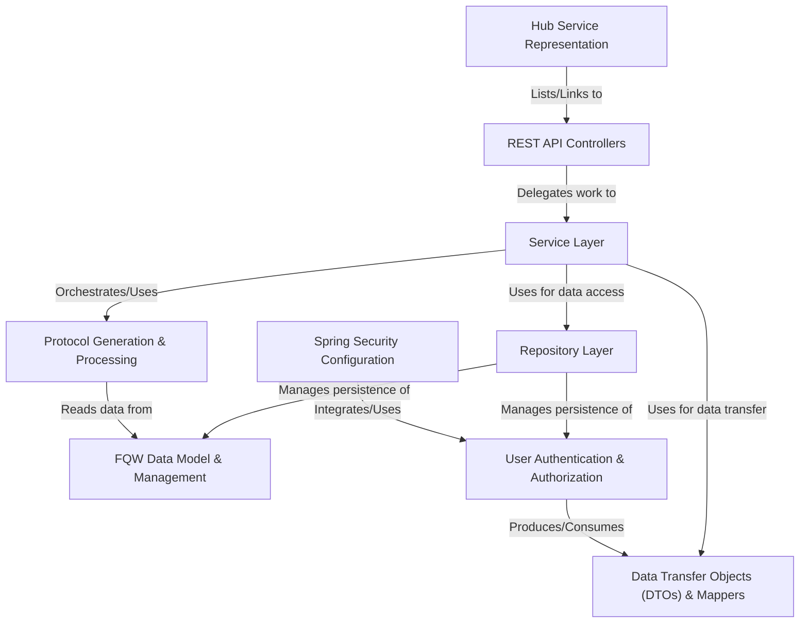

# Tutorial: microservices

This project is a collection of **microservices** designed to manage academic information, particularly focusing on *Final Qualifying Works (FQW)*.
It includes services for:
- Handling **FQW data** (students, lecturers, themes) in the `fqw` service.
- **User authentication** and authorization using JWT tokens in the `auth` service.
- **Generating protocol documents** based on templates and uploaded data in the `protocol` service.
- Providing a central **hub** to access other services.
- Supporting user **ticket requests** in the `support` service.
- Sending **emails** in the `email` service.

The services communicate via *REST APIs*, use databases for persistence, and employ *Spring Security* for access control.

**Source Repository:** [https://github.com/EmirenRU/FQWorkstation/tree/microservices](https://github.com/EmirenRU/FQWorkstation/tree/microservices)

## Chapters

1. [Hub Service Representation
](01_hub_service_representation_.md)
2. [REST API Controllers
](02_rest_api_controllers_.md)
3. [User Authentication & Authorization
](03_user_authentication___authorization_.md)
4. [FQW Data Model & Management
](04_fqw_data_model___management_.md)
5. [Data Transfer Objects (DTOs) & Mappers
](05_data_transfer_objects__dtos____mappers_.md)
6. [Service Layer
](06_service_layer_.md)
7. [Protocol Generation & Processing
](07_protocol_generation___processing_.md)
8. [Repository Layer
](08_repository_layer_.md)
9. [Spring Security Configuration
](09_spring_security_configuration_.md)

---

Generated by [AI Codebase Knowledge Builder](https://github.com/The-Pocket/Tutorial-Codebase-Knowledge)