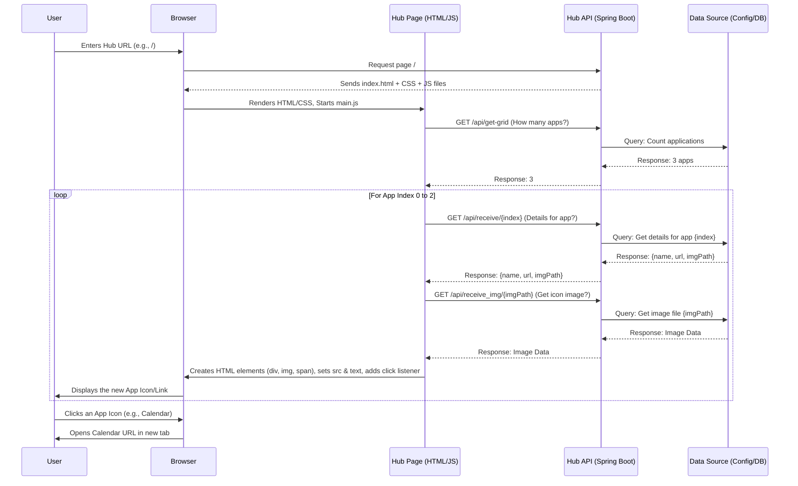

# Chapter 1: Application Hub Service

Welcome to the first chapter of our microservices tutorial! We're going to start by building a central piece of our system: the **Application Hub Service**.

## What Problem Are We Solving?

Imagine you work at a large organization, like a university or a big company. There are probably dozens of different web-based tools you might need to use: email, a calendar, a system for course registration, a portal for HR tasks, a tool for submitting support tickets, and so on.

How do you keep track of all these different websites? Bookmarking them all? Remembering complex URLs? That can get messy quickly!

Wouldn't it be nice to have a single, central webpage you could go to that lists all the important applications available to you, with easy-to-click links? That's exactly what the Application Hub Service does.

## What is the Application Hub Service?

Think of the Application Hub Service as a **central dashboard** or **portal**. It's a standalone web application whose main job is to display links to *other* applications or services within the organization.

**Analogy:** Imagine the home screen on your smartphone or computer. It shows icons for all your installed apps (Mail, Browser, Calendar, Games). Clicking an icon launches that specific app. Our Application Hub Service works similarly for web applications within an organization.

It provides a single, user-friendly starting point to discover and access various tools.

## How Does It Work? (The Big Picture)

1.  **It's Separate:** The Hub itself doesn't *contain* the other applications (like email or calendar). It's a completely separate service.
2.  **It Knows Things:** The Hub *knows about* the other applications – specifically, their names, maybe an icon to represent them, and most importantly, the URL (web address) where you can find them.
3.  **It Asks for Information:** When you open the Hub page in your browser, the page doesn't initially have the list of applications hardcoded. Instead, the webpage (using JavaScript) makes a request to its *own* backend API (Application Programming Interface). Think of this as the webpage asking the Hub's brain, "Hey, which applications should I show?"
4.  **It Gets Answers:** The Hub's backend API responds with the list of applications and their details (name, icon, URL).
5.  **It Displays Links:** The JavaScript on the webpage takes this information and dynamically creates the clickable icons or links you see on the page.

## Let's See It in Action (User's View)

1.  You type the Hub's address (e.g., `http://hub.mycompany.com`) into your browser and hit Enter.
2.  The main Hub page loads, showing a company logo, a title like "Application Hub", and maybe some navigation links.
3.  For a brief moment, the main area might be empty. Then, icons for different applications appear – maybe "Student Portal", "Faculty Directory", "Research Database", etc.
4.  You click the "Student Portal" icon.
5.  A new browser tab opens, taking you directly to the Student Portal website (e.g., `http://studentportal.mycompany.com`).

The Hub itself stays open in the original tab, ready for you to launch another application if needed.

## A Peek at the Code

Let's look at simplified versions of the key files involved.

### The Webpage Structure (HTML)

This is the basic skeleton of the page. Notice the `div` with the `id="application-container"`. This is where our JavaScript will later add the application links.

```html
<!-- hub/src/main/resources/templates/index.html -->
<!DOCTYPE html>
<html lang="en">
<head>
    <meta charset="UTF-8">
    <title>Home Page</title>
    <!-- Link to CSS for styling -->
    <link rel="stylesheet" href="/css/style.css">
    <!-- Link to JavaScript that makes the page dynamic -->
    <script defer src="/js/main.js"></script>
</head>
<body>
<div class="container">
    <header class="hub__header">
        <!-- Header content like logo and main navigation -->
        ...
    </header>

    <main>
        <div class="container-fluid hub__main__container">
            <h1 class="hub__main__container__header">Application Hub</h1>
            <!-- This is the placeholder where app icons will be inserted -->
            <div class="container-fluid hub__main__container-inside" id="application-container">
                <!-- Application icons/links will appear here dynamically -->
            </div>
        </div>
    </main>

    <footer class="footer">
        <!-- Footer content -->
        ...
    </footer>
</div>
</body>
</html>
```

This HTML file sets up the structure, includes styling (`style.css`), and importantly, includes our JavaScript file (`main.js`) which will handle fetching and displaying the application links.

### Making the Page Dynamic (JavaScript)

This script runs when the HTML page loads. It fetches the application data from the Hub's backend API and populates the `#application-container` div.

```javascript
// hub/src/main/resources/static/js/main.js

// Find the container element in the HTML where we'll add app icons
const appContainer = document.getElementById("application-container");

// This is an Immediately Invoked Async Function Expression (IIAFE).
// It basically means: define a function that can use 'await' and run it right away.
(async function loadApplications() {
    try {
        // 1. Ask the backend API how many application icons to expect.
        // 'fetch' sends a request to the URL '/api/get-grid'.
        const gridResponse = await fetch('/api/get-grid');
        // '.json()' reads the response body and parses it as JSON.
        const appCount = await gridResponse.json(); // Let's imagine this returns 3

        // 2. Loop 'appCount' times (once for each application)
        for (let i = 0; i < appCount; i++) {

            // 3. Ask the backend API for details about the current app (index 'i').
            const appDataResponse = await fetch('/api/receive/' + i);
            const appData = await appDataResponse.json();
            // appData might look like:
            // { name: "Calendar", url: "http://calendar.example.com", imgPath: "icon_id_123" }

            // 4. Create HTML elements dynamically
            const appDiv = document.createElement("div"); // A container for the icon+name
            appDiv.className = 'hub__application__space'; // Apply CSS style

            const appIcon = document.createElement('img'); // An image element for the icon
            appIcon.className = 'hub__application__icon'; // Apply CSS style
            // Ask another API endpoint for the actual image file, using the 'imgPath' ID
            appIcon.src = '/api/receive_img/' + appData.imgPath;

            const appName = document.createElement('span'); // A text element for the name
            appName.textContent = appData.name; // Set the text content

            // 5. Make the whole 'appDiv' clickable
            appDiv.addEventListener('click', () => {
                // When clicked, open the application's URL in a new browser tab
                window.open(appData.url, '_blank');
            });

            // 6. Add the icon and name inside the appDiv...
            appDiv.append(appIcon);
            appDiv.append(appName);
            // ...and then add the appDiv to the main container on the page
            appContainer.append(appDiv);
        }
    } catch (error) {
        // If anything goes wrong (e.g., network error, API down)
        console.error("Failed to load applications:", error);
        // Display a simple error message to the user
        appContainer.textContent = "Oops! Could not load the applications right now.";
    }
})(); // The final () makes the function run immediately
```

This JavaScript code does the heavy lifting on the frontend: it communicates with the backend API and manipulates the HTML page (the DOM) to display the application links.

### The Backend "Brain" (Conceptual - Spring Boot)

We won't dive deep into the backend code here, but conceptually, there's a server application running (likely built with something like Spring Boot in Java).

*   **It Listens:** It listens for incoming web requests at specific URLs, like `/api/get-grid` and `/api/receive/{index}`. These are called **API endpoints**.
*   **It Knows Data:** It has logic to retrieve the application data. This data might be stored in a configuration file, a database, or even fetched from another specialized service (a "service registry" - more on that much later!).
*   **It Responds:**
    *   When the frontend asks for `/api/get-grid`, the backend figures out how many apps there are and sends back that number (e.g., `3`).
    *   When the frontend asks for `/api/receive/0`, the backend gets the details for the first app (name, URL, image path) and sends them back as JSON data.
    *   When the frontend asks for `/api/receive_img/icon_id_123`, the backend fetches the actual image file associated with that ID and sends it back.

## How it Fits Together: The Request Flow

Here's a diagram showing the step-by-step interaction when you load the Hub page:



This flow highlights the dynamic nature: the Hub page asks the Hub API for information, and the API provides it, allowing the page to build itself.

## Conclusion

We've learned about the **Application Hub Service**, a central portal designed to make accessing various organizational web applications easier. It acts as a dashboard, dynamically fetching the names, icons, and URLs of other services from its own backend API and displaying them as clickable links. This separation keeps the Hub simple and focused on its core task: providing a starting point.

Now that we understand the concept of the Hub itself, let's dive deeper into how the frontend webpage is structured and how basic navigation within the Hub might work.

Next up: [Frontend Layout & Routing](02_frontend_layout___routing_.md)

---

Generated by [AI Codebase Knowledge Builder](https://github.com/The-Pocket/Tutorial-Codebase-Knowledge)