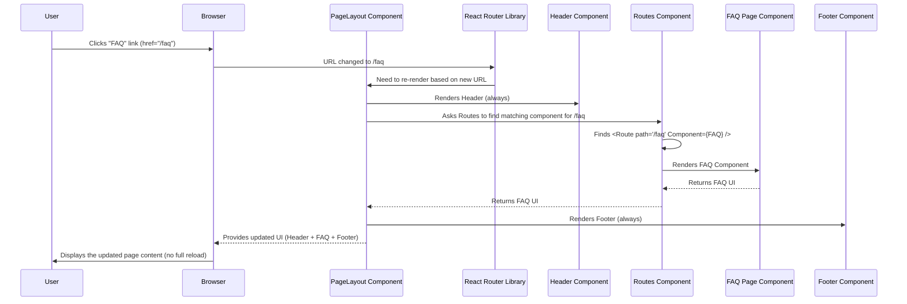

# Chapter 2: Frontend Layout & Routing

Welcome to Chapter 2! In the [Application Hub Service](01_application_hub_service_.md), we saw how a central page can provide links to *different* applications. Now, let's zoom *inside* one of those applications (or a similar web app) and see how its own user interface is structured and how you navigate between its different sections or "pages".

## What Problem Are We Solving?

Imagine you're using a website like an online store, a university portal, or our FQWorkstation project. You expect certain things to always be visible, like the main logo and navigation bar at the top (the **Header**) and copyright information or contact links at the bottom (the **Footer**).

When you click a link in the navigation, say from "Home" to "FAQ" or "Support", you don't want the *entire* page to disappear and reload from scratch. Ideally, the Header and Footer stay put, and only the main content area changes to show the FAQ information or the Support form.

How does the website manage this? How does it know which content to show based on the URL you visit (like `yoursite.com/faq`), while keeping the overall structure consistent? That's where **Frontend Layout** and **Routing** come in!

## Key Concepts: Layout and Routing

Think of building a website's frontend like constructing a house:

1.  **Layout (The House Structure):** This is the permanent structure – the foundation, walls, roof, and maybe the common hallways. In our web app, the **Header** and **Footer** are like the roof and foundation; they are almost always there, providing a consistent frame. The main content area is like the different rooms inside.
2.  **Routing (The Signs and Hallways):** How do you get from the entrance to a specific room, like the kitchen or the bedroom? You follow hallways and maybe look at signs. **Routing** is the system that reads the "address" (the URL in your browser, like `/faq`) and directs the application to show the correct "room" (the specific content or component, like the FAQ page) in the main content area.
3.  **Components (The Rooms):** Each specific piece of content, like the FAQ page, the Support form, or the Search page, is built as a separate, reusable block of code called a **Component**. Routing decides *which* component to display.

Together, Layout and Routing create a seamless experience where the application feels like a single, cohesive unit, even though you're navigating between different sections. This is often called a **Single Page Application (SPA)** because you load the main "shell" once, and then routing handles changing the content dynamically without full page reloads.

## How It Works: A User's Journey

Let's trace what happens when you click a navigation link:

1.  **You Are Here:** You're on the website, maybe on the `/lecturers` page. You can see the Header at the top, the Lecturers content in the middle, and the Footer at the bottom.
2.  **Click:** You click the "FAQ" link in the Header.
3.  **URL Change:** The URL in your browser's address bar changes to `http://yoursite.com/faq`.
4.  **Router Sees:** The Routing system (part of our frontend code) detects this URL change.
5.  **Router Decides:** It looks at its list of rules (called "routes") and finds one that matches `/faq`. This rule says, "For the `/faq` path, display the `FAQ` component."
6.  **Content Swap:** The Router swaps out the *current* main content (the Lecturers page) and puts the `FAQ` component in its place.
7.  **You See:** The Header and Footer *remain unchanged*, but the middle section now shows the Frequently Asked Questions. All of this happened quickly, likely without the browser doing a full white-screen reload.

## Let's Look at the Code

We're using a popular library called React with TypeScript for our frontend, and another library called `react-router-dom` to handle the routing.

### The Entry Point (`index.html`)

This is the basic HTML file the browser first loads. It's mostly empty because React will build the user interface dynamically. The key part is `<div id="root"></div>`.

```html
<!-- frontend/index.html -->
<!doctype html>
<html lang="en">
  <head>
    <meta charset="UTF-8" />
    <title>FQWorkstation</title>
    <!-- Links to CSS files for styling -->
    <link rel="stylesheet" href=".../bootstrap.min.css" />
    <!-- ... other links ... -->
  </head>
  <body>
    <!-- This div is where our React app will live -->
    <div id="root"></div>
    <!-- This script starts our React application -->
    <script type="module" src="/src/main.tsx"></script>
  </body>
</html>
```

*Explanation:* This HTML file sets up the very basic page structure and tells the browser to run our main JavaScript/React code (`/src/main.tsx`), which will take control of the `<div id="root"></div>` element.

### The Top-Level App Component (`App.tsx`)

This component is usually very simple. In our case, it just renders the `PageLayout` component, which handles the actual structure.

```typescript
// frontend/src/App.tsx
import './App.css' // Import styles
import { PageLayout } from './Layout/layout' // Import the layout component

function App() {
  // The main App component simply renders the PageLayout
  return (
    <>
      <PageLayout/>
    </>
  )
}
export default App
```

*Explanation:* This acts like the main entry point within our React code. It delegates all the structural work to the `PageLayout` component.

### The Layout Components (`Header.tsx` & `footer.tsx`)

These components define the visual structure of the Header and Footer.

```typescript
// frontend/src/Layout/Header.tsx
import './header.css'; // Styles for the header
import logo from "../assets/rudn_logo.png"; // The logo image

export const Header = () => {
    return (
        <header className="header">
            {/* Container for header elements */}
            <div className="header__container flex">
                {/* Logo linking to the home page */}
                <a href="/" className="header__logo">  </a>
                {/* Navigation section */}
                <nav className="nav flex col-lg-8">
                    <ul className="list-reset nav__list flex">
                        {/* Links to different sections */}
                        <li><a href="/lecturers">Преподавателям</a></li>
                        <li><a href="/faq">Вопросы</a></li>
                        <li><a href="/support">Поддержка</a></li>
                        {/* ... other links ... */}
                    </ul>
                </nav>
            </div>
        </header>
    );
}
```

*Explanation:* This creates the Header bar. It includes the logo and standard HTML links (`<a>` tags) to different parts of the site like `/faq` and `/support`.

```typescript
// frontend/src/Layout/footer.tsx
import './footer.css'; // Styles for the footer

export const Footer = () =>{
    return (
        <footer className="footer">
            {/* Container for footer content */}
            <div className="container-fluid footer__container">
                {/* Left section with links */}
                <div className="footer__left">
                    <ul className="footer__list">
                        <li><a className="footer__link" href="/faq">FAQ</a></li>
                        <li><a className="footer__link" href="/support">Сообщить о проблеме</a></li>
                        {/* ... other links ... */}
                    </ul>
                    {/* ... social icons ... */}
                </div>
                {/* Right section with text */}
                <div className="right">
                    <p className="right__text">...</p>
                </div>
            </div>
        </footer>
    )
}
```

*Explanation:* This creates the Footer area with its own set of links and information. Both `Header` and `Footer` are just regular components defining static parts of the UI.

### Tying it Together: The Layout & Router (`layout.tsx`)

This is the crucial piece that defines the *overall layout* and sets up the *routing rules*.

```typescript
// frontend/src/Layout/layout.tsx
import { BrowserRouter as Router, Route, Routes } from "react-router-dom";
import { Footer } from "./footer"; // Import Footer component
import { Header } from "./Header"; // Import Header component
import { FAQ } from "../FAQ/FAQ"; // Component for the FAQ page
import { Support } from "../Support/Support"; // Component for the Support page
import { Lecturers } from "../Lecturers/Lecturers"; // Component for Lecturers page
// ... other page component imports (like Protocol, SendFile) ...

export const PageLayout = () => {
    return (
        // 1. Enable Routing using BrowserRouter (aliased as Router)
        <Router>
            {/* 2. Render the Header - always visible */}
            <Header />

            {/* 3. Define the area where content changes based on URL */}
            <Routes>
                {/* Rule: If URL path is "/lecturers", show Lecturers component */}
                <Route path="/lecturers" Component={Lecturers} />
                {/* Rule: If URL path is "/faq", show FAQ component */}
                <Route path="/faq" Component={FAQ} />
                {/* Rule: If URL path is "/support", show Support component */}
                <Route path="/support" element={<Support/>} />
                {/* Rule: If URL path is "/protocol", show Protocol component */}
                <Route path="/protocol" Component={Protocol} />
                 {/* Rule: If URL path is "/sendFile", show SendFile component */}
                <Route path = "/sendFile" Component={SendFile}/>
                 {/* Rule: If URL path is "/" (homepage), show Lecturers component */}
                <Route path="/" Component={Lecturers} />
            </Routes>

            {/* 4. Render the Footer - always visible */}
            <Footer />
        </Router>
    );
};
```

*Explanation:* This `PageLayout` component does several important things:
1.  **`<Router>`:** It wraps everything in `<BrowserRouter>` (which we renamed to `Router` for brevity). This component activates the routing capabilities from the `react-router-dom` library.
2.  **`<Header />`:** It renders the `Header` component *outside* the `<Routes>` section. This means the Header will always be visible, no matter which route is active.
3.  **`<Routes>`:** This component acts as a container that will only render the *first* `<Route>` inside it whose `path` matches the current URL.
4.  **`<Route ... />`:** Each `Route` component defines a rule. For example, `<Route path="/faq" Component={FAQ} />` tells the router: "If the user visits the `/faq` URL, render the `FAQ` component inside the `<Routes>` area."
5.  **`<Footer />`:** Similar to the Header, the `Footer` is rendered *outside* the `<Routes>` section, ensuring it's always visible at the bottom.

This structure guarantees that the Header and Footer provide a consistent frame, while the content between them dynamically changes based on the URL, thanks to the routing rules.

## Under the Hood: How `react-router-dom` Works

When you click a link (like the `<a>` tags in our Header/Footer) or type a new URL, here's a simplified flow of what the `react-router-dom` library does:

1.  **Listens:** The `<Router>` component listens for changes in the browser's URL (using built-in browser features called the History API).
2.  **Matches:** When the URL changes (e.g., to `/support`), the `<Routes>` component compares the new path (`/support`) against all the `path` props of its child `<Route>` elements.
3.  **Selects:** It finds the matching `<Route>` (e.g., `<Route path="/support" element={<Support/>} />`).
4.  **Renders:** It then renders the specified component (`Support` in this case) within the space managed by `<Routes>`.
5.  **Updates UI:** React efficiently updates the web page to show the new component, *without* requesting a completely new page from the server.

Here's a diagram illustrating the process when a user clicks the "FAQ" link:



This efficient process makes the website feel fast and responsive, like a desktop application rather than a series of disconnected web pages.

## Conclusion

We've learned how **Frontend Layout** establishes the consistent visual structure of our application using components like Headers and Footers. We also saw how **Routing**, powered by libraries like `react-router-dom`, intercepts URL changes and dynamically renders the appropriate page component within that layout. This creates the smooth navigation experience typical of Single Page Applications (SPAs).

The `PageLayout` component acts as the central coordinator, rendering the static Header and Footer while using `<Routes>` and `<Route>` to manage the dynamic content area based on the current URL.

Now that we understand the basic structure and navigation, we can start looking at the specific content that gets displayed within this layout.

Next up: [FQW Search & Display Logic](03_fqw_search___display_logic_.md)

---

Generated by [AI Codebase Knowledge Builder](https://github.com/The-Pocket/Tutorial-Codebase-Knowledge)