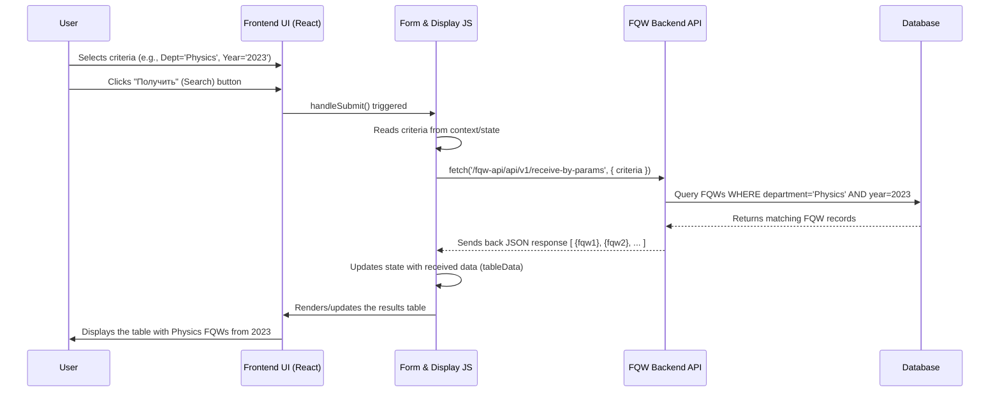

# Chapter 3: FQW Search & Display Logic

Welcome to Chapter 3! In the previous chapter, [Frontend Layout & Routing](02_frontend_layout___routing_.md), we learned how our application's overall structure (Header, Footer) stays consistent while the main content area changes based on the URL. Now, let's dive into one of the most important content sections: the system for finding and displaying Final Qualification Works (FQWs).

## What Problem Are We Solving?

Imagine our FQWorkstation holds information about hundreds or thousands of student final projects (FQWs) over many years, across different departments and supervisors. How would a lecturer or administrator find specific works? For example, how could they find all FQWs supervised by Professor Ivan Ivanov in the Computer Science department between 2022 and 2023?

Scrolling through a giant list would be impossible! We need a way to:

1.  **Specify Criteria:** Tell the system exactly what we're looking for (department, supervisor, year range, etc.).
2.  **Search:** Have the system look through its data and find only the FQWs that match our criteria.
3.  **Display Results:** Show the matching FQWs in an organized way, like a table.
4.  **Refine & Use:** Allow sorting the results or exporting them for use elsewhere (like in a report).

This is the core job of the **FQW Search & Display Logic**. Think of it like a library's online catalog. You enter search terms (author, title, subject), the system finds matching books, and displays them in a list.

## Key Concepts

Let's break down the main parts of this feature:

1.  **The Search Form:** This is the set of input fields and dropdown menus you see on the page. You use these to enter your search criteria (e.g., select "Computer Science" from the department dropdown, type "2022" in the 'from' year field).
2.  **Fetching Data:** When you click the "Search" (or "Получить") button, the information you entered in the form is packaged up and sent as a request to the backend server. This is like handing your search request slip to the librarian.
3.  **Displaying Data in a Table:** The backend server processes the request, finds the matching FQW data in its database, and sends it back to our frontend. The frontend code then takes this data and dynamically builds an HTML table to display it neatly below the search form.
4.  **Table Interactions (Sorting & Exporting):** Once the table is displayed, you can often interact with it. Clicking on a column header (like "Student Name") might sort the table alphabetically by that column. There's usually also a button to export the currently displayed data into an Excel file.

## How It Works: A User's Journey

Let's walk through a typical use case:

1.  **Navigate:** You go to the section of the website designed for searching FQWs (perhaps the `/lecturers` page, as seen in the `Lecturers.tsx` component which renders the `SearchForm`).
2.  **See the Form:** The page displays the search form with dropdowns for Department, Orientation, Theme, Supervisor (Науч рук), and input fields for Years (с/до).
3.  **Enter Criteria:** You select "Physics Department" from the department dropdown and enter "2023" in both the "from" and "to" year fields.
4.  **Click Search:** You click the "Получить" (Get) button.
5.  **Frontend Gathers Data:** The JavaScript code associated with the form reads the values you selected ("Physics Department", "2023", "2023", etc.).
6.  **Frontend Sends Request:** The JavaScript makes an API call (like asking a question) to the backend server, sending the criteria you selected. We'll cover this in more detail in [API Communication & Proxying](08_api_communication___proxying_.md).
7.  **Backend Searches:** The backend server receives the request, understands the criteria, searches its database for matching FQW records, and gathers the results.
8.  **Backend Responds:** The backend sends the list of found FQWs back to the frontend.
9.  **Frontend Displays Table:** The JavaScript code receives the data and dynamically generates an HTML table, filling it with the details of the FQWs found (Student Name, Supervisor, Theme, Year, etc.). This table appears below the search form.
10. **Interact:** You can now look at the results. If you want to see them sorted by student name, you click the "ФИО Студента" header. If you want to save this list, you click the "Скачать таблицу" (Download table) button to get an Excel file.

## Let's Look at the Code (Simplified)

We'll look at simplified snippets from the key files involved.

### 1. Setting up the Search Form Area (`Lecturers.tsx`)

This component simply renders the `SearchForm` within a `FormProvider`. The `FormProvider` is important for managing the form's data, which we'll explore in [Search Form State Management (Context)](04_search_form_state_management__context__.md).

```typescript
// frontend/src/Lecturers/Lecturers.tsx
import { FormProvider } from "../context"; // For managing form data
import { SearchForm } from "../SearchForm/Form"; // The actual form component

export const Lecturers = () => {
    return (
        // Wrap the form in a FormProvider
        <FormProvider>
            {/* Render the SearchForm component */}
            <SearchForm />
        </FormProvider>
    );
}
```

*Explanation:* This component acts as a container, ensuring the `SearchForm` has access to the shared form data management system (`FormProvider`).

### 2. Building the Form Inputs (`LoadSaved.tsx`)

This component (rendered *inside* `SearchForm`) is responsible for creating the dropdowns and year inputs. It also fetches the options for the dropdowns.

```typescript
// frontend/src/SearchForm/Load.tsx (Simplified)
import React, { useState, useEffect } from 'react';
import { useFormContext } from '../context';
// import { getFakeSelectorData } from "../api/getData.tsx"; // We might use this

// Simplified interface for dropdown options
interface Option { value: string; name: string; }

export const LoadSaved: React.FC<any> = () => {
    const [departments, setDepartments] = useState<Option[]>([]);
    const [selectedDepartment, setSelectedDepartment] = useState<string[]>([]);
    const [fromYear, setFromYear] = useState('');
    // ... other state variables for other fields ...
    const { setFormData } = useFormContext(); // Function to update shared form state

    // Fetch dropdown options when the component loads
    useEffect(() => {
        // In reality, this would call an API like getFakeSelectorData()
        const fetchedDepartments = [
            { value: "cs", name: "Computer Science" },
            { value: "phy", name: "Physics Department" }
        ];
        setDepartments(fetchedDepartments);
        // Initialize the dropdown library after fetching data
        // $('.selectpicker').selectpicker('refresh'); // External library call
    }, []);

    // Handle changes in dropdown selection
    const handleInputChange = (event: React.ChangeEvent<HTMLSelectElement>) => {
        const { name, selectedOptions } = event.target;
        const values = Array.from(selectedOptions).map(opt => opt.value);
        if (name === 'department') {
            setSelectedDepartment(values);
            // Update shared state (covered in next chapter)
        }
        // ... handle other inputs ...
    };

    // Handle changes in year input
    const handleYearsChange = (event: React.ChangeEvent<HTMLInputElement>) => {
       const { name, value } = event.target;
       if (name === 'from') {
           setFromYear(value);
           // Update shared state
       }
       // ... handle 'to' year ...
    };

    // Prepare data for submission (called by the parent form's button)
    const updateSharedFormData = () => {
        setFormData(prev => ({
            ...prev,
            department: selectedDepartment,
            from: fromYear,
            // ... other fields ...
        }));
    };
    // Note: The actual saving/updating happens in context (Chapter 4)
    // The submit button itself is in Form.tsx which calls this logic indirectly

    return (
        <>
            {/* Department Dropdown */}
            <div className="selector-patch">
                <label className="selection-param">Department
                    <select name="department" className="selectpicker"
                        multiple onChange={handleInputChange} value={selectedDepartment}>
                        {departments.map((opt) => (
                            <option key={opt.value} value={opt.value}>{opt.name}</option>
                        ))}
                    </select>
                </label>
            </div>

            {/* Year Inputs */}
            <div className="selector-patch-2">
                <label className="selection-param">Years
                    <div className="selection-param__years flex">
                        <span>from</span>
                        <input type="number" name="from" className="val" value={fromYear} onChange={handleYearsChange} />
                        <span>to</span>
                        <input type="number" name="to" className="val" /* ... */ />
                    </div>
                </label>
            </div>
            {/* ... Other selectors (Themes, Lecturer) ... */}

            {/* The submit button is actually in the parent Form.tsx */}
        </>
    );
}
```

*Explanation:* This simplified component shows:
*   Using `useState` to hold the available options (e.g., `departments`) and the user's current selections (e.g., `selectedDepartment`, `fromYear`).
*   Using `useEffect` to fetch the dropdown options when the component first loads (here, we just use hardcoded data for simplicity).
*   `handleInputChange` and `handleYearsChange` functions update the component's state when the user interacts with the form.
*   It uses `setFormData` (from `useFormContext`) to eventually update the shared state, which is the topic of [Chapter 4: Search Form State Management (Context)](04_search_form_state_management__context__.md).
*   It renders the HTML for the dropdowns and input fields. (Note: The `selectpicker` class suggests a JavaScript library like `bootstrap-select` is used for styling and features like multi-select and search).

### 3. Handling Form Submission (`SearchForm/Form.tsx`)

This component wraps the `LoadSaved` inputs and contains the actual submit button. It triggers the process of showing the results.

```typescript
// frontend/src/SearchForm/Form.tsx (Simplified)
import React, { FormEvent, useState } from "react";
import { useFormContext } from "../context";
import { ToggleDisplayAndSaveState } from "./display"; // The results table component
import { LoadSaved } from "./Load"; // The inputs component

export const SearchForm = () => {
    const { formData } = useFormContext(); // Get current form data (from context)
    // State to signal when to show results: "none", "display", "pending"
    const [signal, setReady] = useState("none");

    // This runs when the form's submit button is clicked
    function handleSubmit(event: FormEvent<HTMLFormElement>): void {
        event.preventDefault(); // Prevent default browser form submission
        console.log("Form submitted! Criteria:", formData);
        // Signal the display component to start fetching and showing data
        setReady("display");
    }

    return (
        <main>
            <section className="selector-form">
                {/* ... container divs ... */}
                <form method="post" className="form-body" onSubmit={handleSubmit}>
                    {/* Render the inputs */}
                    <LoadSaved signal={signal} setReady={setReady}/>

                    {/* The Submit Button (was part of LoadSaved originally, moved here conceptually) */}
                    <button className="btn-reset form-button" type='submit'>
                        Получить (Get)
                    </button>
                </form>
            </section>

            {/* Conditionally render the results table */}
            {(signal === "display" || signal === "pending") ?
                <ToggleDisplayAndSaveState signal={signal} setReady={setReady} /> :
                <span></span> // Render nothing if not searching/displaying
            }
        </main>
    );
}
```

*Explanation:*
*   It uses a state variable `signal` to control whether the results table (`ToggleDisplayAndSaveState`) should be shown.
*   The `handleSubmit` function is triggered when the form's submit button is clicked.
*   Crucially, `handleSubmit` calls `setReady("display")`. This state change causes the `ToggleDisplayAndSaveState` component to render and start its work.
*   The actual form inputs are rendered via the `<LoadSaved />` component.

### 4. Fetching and Displaying Results (`display.tsx`)

This component is activated when the `signal` becomes "display". It fetches data based on the criteria stored in the context and shows the table.

```typescript
// frontend/src/SearchForm/display.tsx (Simplified)
import React, { FC, useEffect, useState, useRef } from 'react';
import { useFormContext } from '../context';
// import { getTableInfo } from '../api/getData'; // API call helper
// import { downloadExcel } from "react-export-table-to-excel"; // Excel export helper
import "./display.css";

// Simplified data structure for an FQW
interface FQWData {
    fullStudentName: string;
    department: string;
    theme: string;
    studNum: number; // Added for sorting example
}

// Component props include the signal to start
interface DisplayProps { signal: string; setReady: Function; }

export const ToggleDisplayAndSaveState: FC<DisplayProps> = ({ signal, setReady }) => {
    const { formData } = useFormContext(); // Get search criteria
    const [tableData, setTableData] = useState<FQWData[]>([]);
    const [loading, setLoading] = useState(true);
    const [sortKey, setSortKey] = useState<keyof FQWData | null>(null);
    const [sortAsc, setSortAsc] = useState(true);
    const tableRef = useRef(null); // For export functionality

    // Fetch data when signal is "display"
    useEffect(() => {
        if (signal === "display") {
            setLoading(true);
            console.log("Fetching data with criteria:", formData);
            // Simulate API Call
            // const result = await getTableInfo(formData); // Real call
            const fakeResult: FQWData[] = [
                { fullStudentName: "Alice", department: "Physics", theme: "Quantum Dots", studNum: 101 },
                { fullStudentName: "Bob", department: "Physics", theme: "String Theory", studNum: 103 },
                { fullStudentName: "Charlie", department: "Physics", theme: "Astro Physics", studNum: 102 }
            ];
            setTimeout(() => { // Simulate network delay
                setTableData(fakeResult);
                setLoading(false);
                setReady("pending"); // Update signal state (e.g., data loaded)
            }, 500);
        }
    }, [signal, formData, setReady]); // Dependencies for the effect

    // Sorting logic
    const handleSort = (key: keyof FQWData) => {
        const newSortAsc = (key === sortKey) ? !sortAsc : true; // Toggle direction or set to ascending
        setSortKey(key);
        setSortAsc(newSortAsc);

        const sorted = [...tableData].sort((a, b) => {
             if (a[key] < b[key]) return newSortAsc ? -1 : 1;
             if (a[key] > b[key]) return newSortAsc ? 1 : -1;
             return 0;
        });
        setTableData(sorted);
    };

    // Export logic (simplified placeholder)
    function handleDownloadExcel() {
        console.log("Exporting data...", tableData);
        // downloadExcel({ /* config */ }); // Actual library call
        alert("Excel export clicked!");
    }

    if (loading && signal === "display") {
        return <div>Loading...</div>;
    }
    if (!loading && tableData.length === 0 && signal === "pending") {
        return <div>No results found.</div>;
    }
    if (!loading && tableData.length > 0 && signal === "pending") {
        return (
            <div className='container-fluid display-section'>
                {/* The Table */}
                <table className="table table-striped" ref={tableRef}>
                    <thead>
                        <tr>
                            <th onClick={() => handleSort('fullStudentName')}>Student Name</th>
                             <th onClick={() => handleSort('studNum')}>Student #</th>
                            <th onClick={() => handleSort('department')}>Department</th>
                            <th onClick={() => handleSort('theme')}>Theme</th>
                        </tr>
                    </thead>
                    <tbody>
                        {tableData.map((row, index) => (
                            <tr key={index}>
                                <td>{row.fullStudentName}</td>
                                <td>{row.studNum}</td>
                                <td>{row.department}</td>
                                <td>{row.theme}</td>
                            </tr>
                        ))}
                    </tbody>
                </table>
                {/* Export Button */}
                <button className="download-button btn btn-primary" onClick={handleDownloadExcel}>
                    Download Table
                </button>
            </div>
        );
    }
    return null; // Render nothing otherwise
};

```

*Explanation:*
*   It takes the `signal` prop. When `signal` becomes "display", the `useEffect` hook runs.
*   Inside `useEffect`, it sets `loading` to true, logs the criteria (`formData` from context), and simulates fetching data (using `setTimeout` and fake data here for simplicity). In a real scenario, it would call an API function like `getTableInfo`.
*   Once data is "fetched", it updates the `tableData` state, sets `loading` to false, and updates the `signal` via `setReady("pending")`.
*   The component conditionally renders: "Loading...", "No results found.", or the actual table based on the `loading` and `tableData` states.
*   The table headers (`<th>`) have `onClick` handlers that call `handleSort` with the corresponding data key (e.g., 'fullStudentName').
*   `handleSort` updates the sorting state (`sortKey`, `sortAsc`) and re-sorts the `tableData` array, causing React to re-render the table in the new order.
*   The "Download Table" button calls `handleDownloadExcel`, which would typically use a library like `react-export-table-to-excel`.

### 5. API Helper (`api/getData.tsx`)

This file contains functions to communicate with the backend API.

```typescript
// frontend/src/api/getData.tsx (Simplified)

// Function to get FQW data based on search criteria
export async function getTableInfo(data: object): Promise<any> {
    console.log("Sending search criteria to API:", data);
    const requestOptions = {
        method: 'POST', // Sending data
        headers: { 'Content-Type': 'application/json' },
        body: JSON.stringify(data) // Convert criteria object to JSON string
    };

    try {
        // The '/fqw-api/' part might be handled by a proxy (See Chapter 8)
        const response = await fetch('/fqw-api/api/v1/receive-by-params', requestOptions);
        if (!response.ok) {
            // Handle HTTP errors (e.g., 404 Not Found, 500 Internal Server Error)
            throw new Error(`HTTP error! status: ${response.status}`);
        }
        const result = await response.json(); // Parse the JSON response body
        console.log('Received data from API:', result);
        return result;
    } catch (error) {
        console.error("Failed to fetch table info:", error);
        // It's good practice to re-throw or handle the error appropriately
        throw error;
    }
}

// Function to get options for dropdown selectors
export async function getFakeSelectorData(): Promise<any> {
    console.log("Fetching selector options from API...");
    // In real life, this would be a GET request, e.g.:
    // const response = await fetch('/fqw-api/api/v2/receive-selectors');
    // const result = await response.json();
    // return result;

    // Simulate fetching
    return new Promise(resolve => setTimeout(() => resolve({
        department: [{ value: "cs", name: "Computer Science" }, /*...*/],
        orientation: [/*...*/],
        // ... other selectors
    }), 300));
}
```

*Explanation:*
*   `getTableInfo` takes the search criteria object, converts it to JSON, and sends it to the backend API endpoint (`/fqw-api/api/v1/receive-by-params`) using the HTTP POST method via the `fetch` API.
*   It waits for the response, checks if the request was successful (`response.ok`), parses the JSON data from the response body, and returns it.
*   Error handling is included to catch network issues or bad responses from the server.
*   `getFakeSelectorData` simulates fetching the options needed to populate the search form's dropdown menus (like departments, orientations). A real implementation would make a GET request to a different API endpoint.
*   How the browser knows that `/fqw-api/` should go to a specific backend service is handled by proxying, discussed in [API Communication & Proxying](08_api_communication___proxying_.md).

## Internal Implementation Walkthrough

Let's visualize the flow when a user clicks "Search":



This diagram shows the collaboration: the UI captures input, the JavaScript logic handles the submission and API call, the backend API queries the database, and the JavaScript logic displays the results received from the API.

## Conclusion

We've explored the heart of the FQWorkstation's functionality: the **FQW Search & Display Logic**. We saw how:

*   A **Search Form** allows users to specify criteria using dropdowns and input fields (`LoadSaved.tsx`).
*   Submitting the form triggers **Data Fetching**, where the criteria are sent to a backend API (`Form.tsx`, `api/getData.tsx`).
*   The frontend receives the results and **Displays** them in a dynamic HTML table (`display.tsx`).
*   The table allows for user interactions like **Sorting** by column and **Exporting** data to Excel (`display.tsx`).

This combination of components provides a powerful way for users to interact with and retrieve specific information from a large dataset.

However, how does the `display.tsx` component know *what* criteria the user selected in `LoadSaved.tsx`? They are separate components! They communicate through a shared state management system. Let's explore that next.

Next up: [Search Form State Management (Context)](04_search_form_state_management__context__.md)

---

Generated by [AI Codebase Knowledge Builder](https://github.com/The-Pocket/Tutorial-Codebase-Knowledge)