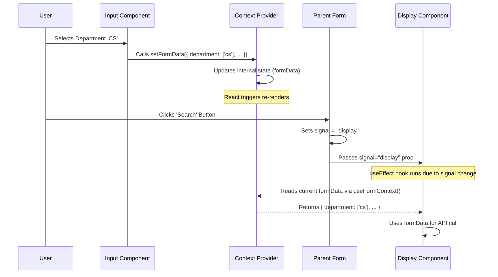

# Chapter 4: Search Form State Management (Context)

Welcome to Chapter 4! In [Chapter 3: FQW Search & Display Logic](03_fqw_search___display_logic_.md), we built the user interface for searching Final Qualification Works (FQWs). We created:

1.  The **input fields** (like dropdowns for department, year inputs) where the user enters their search criteria (in a component we can call `LoadSaved`).
2.  The **results table** that displays the FQWs matching those criteria (in a component we can call `ToggleDisplayAndSaveState`).

But wait... how does the `ToggleDisplayAndSaveState` component know *what* the user selected in the `LoadSaved` component? They are separate pieces of our code!

## What Problem Are We Solving? Passing Data Around

Imagine you have information in one part of your app (like the selected department in `LoadSaved`) that another, separate part needs (like the `ToggleDisplayAndSaveState` component, which needs the department to ask the server for the right data).

One way is to pass the information down like a message through a chain of command. If `LoadSaved` and `ToggleDisplayAndSaveState` are both children of `SearchForm`, maybe `LoadSaved` tells `SearchForm`, and then `SearchForm` tells `ToggleDisplayAndSaveState`. This is called **"prop drilling"**.

```
 grandparent (SearchForm)
   /       \
 child1 (LoadSaved)   child2 (ToggleDisplayAndSaveState)
```

If the components are nested deeply, passing props down through many levels can become messy and complicated.

Wouldn't it be easier if there was a central place, like a **shared noticeboard**, where `LoadSaved` could post the current search criteria, and `ToggleDisplayAndSaveState` could simply look at the board whenever it needed the information?

That's exactly what **React Context** allows us to do!

## Key Concepts: The Shared Noticeboard (Context)

React Context provides a way to share data (like our search form state) across many components without manually passing props down the tree. Let's use our noticeboard analogy:

1.  **Context (The Noticeboard Blueprint):** First, we define *what kind* of information our noticeboard will hold. For our search form, it will hold things like the selected `department`, `orientation`, `from` year, `till` year, etc. We create a "Context object" for this.
2.  **Provider (Putting Up the Noticeboard):** We need a special component called a **Provider**. Think of this as the component that actually *puts up* the noticeboard and is responsible for keeping the information on it up-to-date. Any component *inside* this Provider (its children, grandchildren, etc.) can potentially access the noticeboard.
3.  **Consumer (`useContext` Hook) (Reading/Writing on the Board):** Any component that needs the shared information (or needs to update it) can use a special tool called the `useContext` hook. This hook lets the component connect to the nearest noticeboard (Provider) of the right type and read the data or get the function to update it.

## How It Works: Sharing Search Criteria

Let's see how we use Context to manage our FQW search form state.

### 1. Creating the Context (The Noticeboard Blueprint)

We create a file (e.g., `context.tsx`) to define our noticeboard.

```typescript
// frontend/src/context.tsx (Simplified)
import React, { createContext, useContext, useState } from 'react';

// Define the structure of the data on our noticeboard
interface FormData {
    orientation: string[];
    department: string[];
    from: string;
    till: string;
    themes: string[];
    lecturer: string[];
}

// Define what the context will provide:
// - The current form data (formData)
// - A function to update the form data (setFormData)
interface FormContextType {
    formData: FormData;
    setFormData: React.Dispatch<React.SetStateAction<FormData>>;
}

// Default values when no provider is found (shouldn't happen in our app)
const defaultFormData: FormData = {
    orientation: [], department: [], from: '', till: '', themes: [], lecturer: []
};
const defaultFormContext: FormContextType = {
    formData: defaultFormData,
    setFormData: () => {} // An empty function
};

// Create the actual Context object (the blueprint)
const FormContext = createContext<FormContextType>(defaultFormContext);

// Create the Provider component (puts up the noticeboard)
export const FormProvider: React.FC<{ children: React.ReactNode }> = ({ children }) => {
    // Use React's state to hold the actual form data
    const [formData, setFormData] = useState<FormData>(defaultFormData);

    // Provide the current formData and the setFormData function to children
    return (
        <FormContext.Provider value={{ formData, setFormData }}>
            {children} {/* Render whatever components are inside */}
        </FormContext.Provider>
    );
};

// Create a handy hook for components to access the context
export const useFormContext = () => {
    return useContext(FormContext);
};
```

*Explanation:*
*   `FormData`: Defines the *shape* of our shared data (the search criteria).
*   `FormContextType`: Defines what the context will *provide* – the data itself (`formData`) and a way to change it (`setFormData`).
*   `createContext`: Creates the actual context object (`FormContext`). It's like designing the noticeboard.
*   `FormProvider`: This is the component that will wrap parts of our app. It uses `useState` to manage the actual `formData`. The crucial part is `<FormContext.Provider value={{ formData, setFormData }}>`. This makes the current `formData` and the `setFormData` function available to any component inside it.
*   `useFormContext`: This is a custom hook (a reusable function) that makes it easy for other components to access the context data without repeating `useContext(FormContext)`.

### 2. Providing the Context (Putting up the Noticeboard)

In our application structure, the `Lecturers` component contains the `SearchForm`. We want the `SearchForm` and all its children (`LoadSaved`, `ToggleDisplayAndSaveState`) to have access to the shared form state. So, we wrap `SearchForm` with our `FormProvider` in `Lecturers.tsx`.

```typescript
// frontend/src/Lecturers/Lecturers.tsx
import { FormProvider } from "../context"; // Import our Provider
import { SearchForm } from "../SearchForm/Form"; // Import the form component

export const Lecturers = () => {
    return (
        // Wrap the SearchForm with FormProvider
        // Now, SearchForm and its children can access the context
        <FormProvider>
            <SearchForm/>
        </FormProvider>
    );
}
```

*Explanation:* By wrapping `<SearchForm />` with `<FormProvider>`, we ensure that the "noticeboard" (our form context) is available to `SearchForm` and any component rendered inside it.

### 3. Updating State (Writing to the Noticeboard)

Inside the `LoadSaved` component (where the user selects departments, enters years, etc.), we need to update the shared state whenever an input changes.

```typescript
// frontend/src/SearchForm/Load.tsx (Simplified Snippet)
import React, { useState, useEffect } from 'react';
import { useFormContext } from '../context'; // Import the hook

export const LoadSaved: React.FC<any> = () => {
    // Get the function to update the shared state from the context
    const { setFormData } = useFormContext();

    // Example: Local state for the 'from' year input
    const [fromYear, setFromYear] = useState('');

    // Function to handle changes in the 'from' year input
    const handleYearsChange = (event: React.ChangeEvent<HTMLInputElement>) => {
        const { value } = event.target;
        setFromYear(value); // Update local state for the input field

        // Update the SHARED state in the context
        setFormData(prevSharedData => ({
            ...prevSharedData, // Keep existing shared data
            from: value       // Update the 'from' field
        }));
    };

    // ... other input handlers work similarly ...

    return (
        <>
            {/* ... other inputs ... */}
            <label>Years From:
                <input type="number" name="from" value={fromYear} onChange={handleYearsChange} />
            </label>
            {/* ... other inputs ... */}
        </>
    );
}
```

*Explanation:*
*   `useFormContext()`: We call our custom hook to get access to the context. We specifically need the `setFormData` function.
*   `handleYearsChange`: When the user types in the "from" year input:
    *   It updates the local `fromYear` state (so the input field shows the typed value).
    *   It calls `setFormData`, passing a function that takes the *previous* shared state (`prevSharedData`) and returns the *new* state. We use the spread operator (`...prevSharedData`) to copy all existing shared data and then specifically update the `from` property with the new `value`. This posts the updated information onto our shared noticeboard.

### 4. Reading State (Reading from the Noticeboard)

Now, in the `ToggleDisplayAndSaveState` component (which fetches and shows the results), we need to *read* the current search criteria from the shared state when it's time to fetch data.

```typescript
// frontend/src/SearchForm/display.tsx (Simplified Snippet)
import React, { FC, useEffect, useState } from 'react';
import { useFormContext } from '../context'; // Import the hook
// import { getTableInfo } from '../api/getData'; // API call function

interface DisplayProps { signal: string; /* ... other props ... */ }

export const ToggleDisplayAndSaveState: FC<DisplayProps> = ({ signal }) => {
    // Get the current form data from the context
    const { formData } = useFormContext();
    const [tableData, setTableData] = useState<any[]>([]);
    const [loading, setLoading] = useState(false);

    // Fetch data when the signal prop tells us to
    useEffect(() => {
        if (signal === "display") {
            setLoading(true);
            console.log("Fetching data using criteria from context:", formData);

            // Use formData (read from the noticeboard) to make the API call
            // getTableInfo(formData)
            //     .then(result => {
            //         setTableData(result);
            //         setLoading(false);
            //     })
            //     .catch(error => { /* handle error */ });

            // Simulating API call for now
            setTimeout(() => {
                 console.log("Simulated fetch complete with:", formData);
                 setTableData([ { /* fake data based on formData maybe */ } ]);
                 setLoading(false);
            }, 500);
        }
    }, [signal, formData]); // Re-run if signal or formData changes

    // ... rest of the component to display the table ...

    if (loading) return <div>Loading using criteria: {JSON.stringify(formData)}</div>;
    // ... render table using tableData ...
    return <div>{/* Table would go here */}</div>;
};
```

*Explanation:*
*   `useFormContext()`: We again use our hook, but this time we grab the `formData` object.
*   `useEffect`: This hook runs when the component mounts and whenever `signal` or `formData` changes.
*   Inside the effect, when `signal === "display"`, we log the `formData` we got from the context. This is the data that was put there by the `LoadSaved` component!
*   We then use this `formData` object when making the (simulated) API call to fetch the FQW data. The `display` component didn't need `SearchForm` or `LoadSaved` to pass it down directly; it just read it from the shared context (the noticeboard).

## Internal Implementation Walkthrough

Let's trace the flow when a user changes an input and then clicks search:

1.  **User Action:** The user selects "Computer Science" in the Department dropdown within the `LoadSaved` component.
2.  **Input Handler:** The `onChange` handler in `LoadSaved` fires.
3.  **Context Update:** The handler calls `setFormData`, updating the shared state managed by the `FormProvider` way up in the `Lecturers` component. Let's say `formData` now becomes `{ department: ['cs'], ... }`.
4.  **React Re-renders:** React detects the state change in `FormProvider` and re-renders components that depend on this context, including `LoadSaved` and `ToggleDisplayAndSaveState`.
5.  **User Clicks Search:** The user clicks the "Получить" (Get) button in the `SearchForm`.
6.  **Signal:** The `SearchForm`'s `handleSubmit` function sets a state variable (`signal`) to `"display"`. This signal is passed as a prop to `ToggleDisplayAndSaveState`.
7.  **Display Component Reacts:** The `ToggleDisplayAndSaveState` component re-renders because its `signal` prop changed. Its `useEffect` hook runs because `signal` is in its dependency array.
8.  **Read Context:** Inside the `useEffect`, `ToggleDisplayAndSaveState` calls `useFormContext()` and reads the *current* value of `formData`. It sees `{ department: ['cs'], ... }`.
9.  **API Call:** It uses this `formData` to make the API call to `/fqw-api/api/v1/receive-by-params`.

Here's a diagram showing the key interactions:



The Context acts as an invisible wire, connecting the component that *sets* the data (`LoadSaved`) with the component that *needs* the data (`ToggleDisplayAndSaveState`), without them needing to know directly about each other, only about the shared "noticeboard" (the `FormContext`).

## Conclusion

We've learned how React's **Context API** provides a powerful way to manage and share state between components without the headache of "prop drilling". By creating a **Context**, wrapping relevant parts of our app in a **Provider**, and using the **`useContext` hook**, we established a "shared noticeboard" for our FQW search form.

This allowed the `LoadSaved` component (where criteria are entered) to easily update the shared state, and the `ToggleDisplayAndSaveState` component (where results are fetched/displayed) to easily read that state when needed. This makes our code cleaner and easier to manage, especially as the application grows.

Now that we have a solid understanding of how to manage state for a search form, let's look at a different kind of form, one that might involve multiple steps.

Next up: [Multi-Step Protocol Data Entry Form](05_multi_step_protocol_data_entry_form_.md)

---

Generated by [AI Codebase Knowledge Builder](https://github.com/The-Pocket/Tutorial-Codebase-Knowledge)