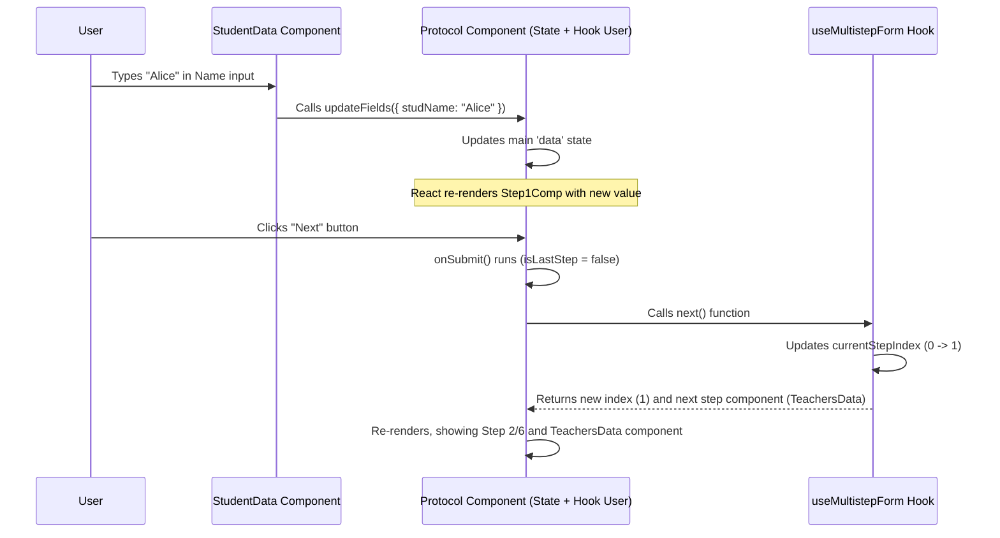

# Chapter 5: Multi-Step Protocol Data Entry Form

In the previous chapter, [Search Form State Management (Context)](04_search_form_state_management__context__.md), we saw how to manage the data for a single, relatively simple search form using React Context. But what happens when a form is much more complex, requiring lots of different pieces of information?

## What Problem Are We Solving? The Giant Form Headache

Imagine you need to fill out a very long and detailed form online – maybe applying for a university program, a visa, or submitting a complex research protocol. If the website presented *all* the fields on one massive, scrolling page, it would be incredibly overwhelming!

*   It's hard to see where you are in the process.
*   Filling it out feels like a huge task.
*   Making a mistake might mean losing a lot of entered data if the page reloads unexpectedly.
*   It's difficult to validate information section by section.

Our project needs a way to enter detailed information for a **Protocol**, which involves details about the student, their teachers, the Final Qualification Work (FQW) itself, the review process, and the commission members. Trying to put all these fields on one page would be a nightmare!

## Key Concepts: Breaking It Down

The solution is a **Multi-Step Form**, often called a "Wizard". Instead of one giant page, we break the form down into smaller, logical sections or steps, presented one after another.

1.  **Sequential Steps:** The user completes the form page by page. In our case: Student Info -> Teachers Info -> FQW Info -> Protocol Details -> Reviewer Info -> Commission Info.
2.  **Navigation:** The user can typically move forward ("Next") to the next step or backward ("Back") to review or correct previous steps.
3.  **State Management:** The application needs to remember the data entered in *all* the previous steps as the user moves forward. When the user clicks "Back", the previous step should show the data they already entered.
4.  **Custom Hook (`useMultistepForm`):** To manage the complexity of which step is current and handle navigation, we use a special piece of reusable code called a "custom hook". This hook keeps track of the steps and provides functions like `next`, `back`, and tells us which step component to display.
5.  **Step Components:** Each step (like Student details or Teacher details) is built as its own separate React component (e.g., `StudentData.tsx`, `TeachersData.tsx`).
6.  **Validation (Optional per Step):** We can add checks (validation) to ensure the user fills out required fields correctly before allowing them to proceed to the next step.
7.  **Final Submission:** Only when the user reaches the *last* step and clicks "Submit" is all the collected data sent to the server.

**Analogy:** Think of installing software using a setup wizard. It guides you through screens for License Agreement, Installation Location, Optional Components, etc. You click "Next" to proceed, "Back" to change something, and finally "Install" or "Finish" at the end. Our multi-step form works the same way for data entry.

## How It Works: A User's Journey

Let's walk through filling out the Protocol form:

1.  **Start:** The user navigates to the Protocol entry page (e.g., `/protocol`).
2.  **Step 1: Student:** The form displays only the fields for Student information (Name, ID, Citizenship, etc.). The top might show "Step 1/6". The user fills these in.
3.  **Click Next:** The user clicks the "Next" button.
4.  **Step 2: Teachers:** The form now displays only the fields for Teacher information (Supervisor Name, Department, etc.). The top shows "Step 2/6". The data entered in Step 1 is saved internally but hidden. The user fills in Teacher details.
5.  **Click Back:** The user realizes they made a typo in the Student ID. They click the "Back" button.
6.  **Return to Step 1:** The form displays Step 1 again, showing the Student information the user *already entered*. They correct the ID.
7.  **Click Next:** They click "Next" again, returning to Step 2 (which also remembers the Teacher data they entered before clicking "Back").
8.  **Continue:** The user proceeds through Steps 3 (FQW), 4 (Protocol), 5 (Reviewer), and 6 (Commission), clicking "Next" each time.
9.  **Step 6: Commission:** The user fills in the final details. The "Next" button might now say "Submit". The top shows "Step 6/6".
10. **Click Submit:** The user clicks "Submit".
11. **Data Sent:** The application gathers *all* the data collected from steps 1 through 6 and sends it to the backend server.

## Let's Look at the Code

We'll look at the key pieces involved in creating this multi-step experience.

### 1. The Main Container (`Protocol.tsx`)

This component is the heart of our multi-step form. It holds the overall state for *all* form data and uses our custom hook to manage the steps.

```typescript
// frontend/src/Functions/ProtocolForm/Protocol.tsx (Simplified)
import { FormEvent, useState } from "react";
import { StudentData } from "./FormPages/StudentData";
import { TeachersData } from "./FormPages/TeachersData";
import { FQWData } from "./FormPages/FQWdata";
import { ProtocolData } from "./FormPages/ProtocolData";
import { ReviewerData } from "./FormPages/ReviewerData";
import { ComissionData } from "./FormPages/ComissionData";
import { useMultistepForm } from "./MultiStepHook/MutltistepHook"; // Import the hook
import "./protocol.css"; // Styles

// Define the structure for ALL data in the form
type FormData = {
    studName: string;
    studNum: string;
    // ... many other fields for all steps ...
    question3: string;
};

// Initial empty state for the form data
const INITIALDATA: FormData = {
    studName: "", studNum: "", /* ... all fields initialized ... */ question3: "",
};

export function Protocol() {
    // State to hold ALL form data across all steps
    const [data, setData] = useState(INITIALDATA);

    // Function passed to step components to update the main state
    function updateFields(fields: Partial<FormData>) {
        setData((prev) => {
            // Merge the updated fields with the existing state
            return { ...prev, ...fields };
        });
    }

    // Use our custom hook to manage steps
    const { steps, currentStepIndex, step, isFirstStep, isLastStep, back, next } =
        useMultistepForm([
            // Pass an array of step components.
            // Each component receives the current data and the update function.
            <StudentData {...data} updateFields={updateFields} />,
            <TeachersData {...data} updateFields={updateFields} />,
            <FQWData {...data} updateFields={updateFields} />,
            <ProtocolData {...data} updateFields={updateFields} />,
            <ReviewerData {...data} updateFields={updateFields} />,
            <ComissionData {...data} updateFields={updateFields} />,
        ]);

    // Handle form submission
    function onSubmit(e: FormEvent) {
        e.preventDefault(); // Prevent default browser submit
        if (!isLastStep) {
            // If not the last step, just go to the next step
            next();
        } else {
            // If it IS the last step, submit the data
            console.log("Submitting ALL data:", data);
            // Actual fetch call to send 'data' to the backend API
            fetch('/fqw-api/api/add-data', { /* ... POST request config ... */ })
                .then(response => { /* handle success */ })
                .catch(error => { /* handle error */ });
            alert("Protocol Submitted!"); // Or show a success message
        }
    }

    return (
        <div className="container protocol-container">
            <form className="form-style" onSubmit={onSubmit}>
                {/* Display current step number */}
                <div className="steps-style">
                    {currentStepIndex + 1} / {steps.length}
                </div>

                {/* Render the CURRENT step component provided by the hook */}
                {step}

                {/* Navigation Buttons */}
                <div className="button-container">
                    {/* Show Back button only if not on the first step */}
                    {!isFirstStep && (
                        <button className="form-button" type="button" onClick={back}>
                            Back
                        </button>
                    )}
                    {/* Submit button text changes on the last step */}
                    <button type="submit" className="form-button">
                        {isLastStep ? "Submit" : "Next"}
                    </button>
                </div>
            </form>
        </div>
    );
}
```

*Explanation:*
*   `FormData` & `INITIALDATA`: Define the structure and initial empty values for *all* data across *all* steps.
*   `useState`: A single state variable `data` holds the entire form's information.
*   `updateFields`: This function is crucial. It takes a piece of new data (e.g., `{ studName: "Alice" }`) and merges it into the main `data` state. This function will be passed down to each step component.
*   `useMultistepForm`: We call our custom hook, passing it an array of the components for each step (e.g., `<StudentData />`, `<TeachersData />`). We pass the current `data` and the `updateFields` function as props to each step component. The hook gives us back everything needed for navigation and rendering.
*   `onSubmit`: This function handles clicks on the main button. If it's not the last step (`!isLastStep`), it calls `next()` from the hook. If it *is* the last step, it prevents navigation and instead sends the complete `data` object to the backend API.
*   Rendering:
    *   It displays the current step number (`currentStepIndex + 1`).
    *   It renders the `step` variable provided by the hook – this is the actual React component for the current step (e.g., `<StudentData ... />`).
    *   It conditionally shows the "Back" button (`!isFirstStep`).
    *   The main button says "Next" or "Submit" (`isLastStep`).

### 2. The Custom Hook (`MutltistepHook.tsx`)

This is the reusable logic for managing the steps.

```typescript
// frontend/src/Functions/ProtocolForm/MultiStepHook/MutltistepHook.tsx
import { ReactElement, useState } from "react";

// This hook takes an array of React components (the steps)
export function useMultistepForm(steps: ReactElement[]) {
    // State to keep track of the current step's index (starts at 0)
    const [currentStepIndex, setCurrentStepIndex] = useState(0);

    // Function to go to the previous step
    function back() {
        setCurrentStepIndex(i => {
            if (i <= 0) return i; // Don't go below the first step
            return i - 1;
        });
    }

    // Function to go to the next step
    function next() {
        setCurrentStepIndex(i => {
            // Don't go beyond the last step
            if (i >= steps.length - 1) return i;
            return i + 1;
        });
    }

    // Function to jump directly to a specific step (by index)
    function goTo(index: number) {
        setCurrentStepIndex(index);
    }

    // Return useful values and functions for the component using the hook
    return {
        currentStepIndex,              // The index of the current step (0, 1, 2...)
        step: steps[currentStepIndex], // The actual React component for the current step
        steps,                         // The original array of all step components
        isFirstStep: currentStepIndex === 0, // True if currently on the first step
        isLastStep: currentStepIndex === steps.length - 1, // True if on the last step
        goTo,                          // Function to jump to a specific step
        next,                          // Function to go to the next step
        back                           // Function to go to the previous step
    };
}
```

*Explanation:*
*   It takes `steps` (the array of components) as input.
*   It uses `useState` to store the `currentStepIndex`.
*   `back`, `next`, `goTo`: Simple functions that update the `currentStepIndex`, with checks to prevent going out of bounds.
*   It returns an object containing the current index, the component for that index (`step`), flags like `isFirstStep` and `isLastStep`, and the navigation functions. This makes it easy for `Protocol.tsx` to use.

### 3. A Step Component (`StudentData.tsx`)

Each step looks similar: it receives the relevant part of the total `data` and the `updateFields` function, and renders its specific input fields.

```typescript
// frontend/src/Functions/ProtocolForm/FormPages/StudentData.tsx (Simplified)
import { FormWrapper } from "../FormWrapper/FormWrapper"; // For consistent layout

// Define the data this SPECIFIC step needs
type StudentFieldsData = {
    studName: string,
    studNum: string,
    // ... other student fields
}

// Define the props this component receives
type StudentFormProps = StudentFieldsData & { // Includes studName, studNum etc.
    // Function to update the MAIN state in Protocol.tsx
    updateFields: (fields: Partial<StudentFieldsData>) => void
}

export function StudentData({ studName, studNum, updateFields }: StudentFormProps) {
    return (
        // Use FormWrapper for consistent title and styling
        <FormWrapper title="Student Information (Step 1)">
            <label className="form-label">Student Name</label>
            <input
                className="form-input"
                name="studName"
                type="text"
                required // Example of simple validation
                value={studName} // Display the value from the main state
                // When the input changes, call updateFields to update the main state
                onChange={e => updateFields({ studName: e.target.value })}
            />

            <label className="form-label">Student Number</label>
            <input
                className="form-input"
                name="studNum"
                type="text"
                required
                value={studNum} // Display value from main state
                onChange={e => updateFields({ studNum: e.target.value })}
            />
            {/* ... other input fields for student data ... */}
        </FormWrapper>
    );
}
```

*Explanation:*
*   It receives props like `studName`, `studNum` (which come from the main `data` state in `Protocol.tsx`) and the `updateFields` function.
*   `value={studName}`: The input field displays the current value stored in the main state. This ensures that if you go back and forth, the entered data is still there.
*   `onChange={e => updateFields({ studName: e.target.value })}`: When the user types in the input, the `onChange` handler calls the `updateFields` function (passed down from `Protocol.tsx`), sending the *new* value for just this field. This updates the central `data` state in `Protocol.tsx`.
*   `FormWrapper`: This is a simple helper component (shown below) to provide a consistent title and layout for each step's content.

### 4. The Form Wrapper (`FormWrapper.tsx`)

This component just provides a consistent structure (title and container div) for the content of each step.

```typescript
// frontend/src/Functions/ProtocolForm/FormWrapper/FormWrapper.tsx
import { ReactNode } from "react";

type FormWrapperProps = {
    title: string;      // Title for the step
    children: ReactNode; // The actual input fields for the step
};

export function FormWrapper({ title, children }: FormWrapperProps) {
    return (
        <>
            {/* Display the title for this step */}
            <h2 className="form__title__style">{title}</h2>
            {/* Render the input fields passed into it */}
            <div className="children__style">{children}</div>
        </>
    );
}
```

*Explanation:* It simply takes a `title` and `children` (the input fields defined in the specific step component like `StudentData`) and arranges them with some consistent styling.

## Internal Implementation Walkthrough

Let's trace the flow when a user fills the first step and clicks "Next":

1.  **Render Step 1:** `Protocol.tsx` uses `useMultistepForm`, which returns `currentStepIndex = 0` and `step = <StudentData ... />`. React renders `StudentData`.
2.  **User Input:** User types "Alice" into the `studName` input within `StudentData`.
3.  **onChange triggered:** The `onChange` handler in `StudentData` calls `updateFields({ studName: "Alice" })`.
4.  **State Update:** The `updateFields` function (defined in `Protocol.tsx`) is executed. It calls `setData`, updating the main `data` state to `{ studName: "Alice", studNum: "", ... }`.
5.  **Re-render:** React re-renders `StudentData` with the new `studName` prop ("Alice"). The input field now shows "Alice".
6.  **User Clicks Next:** User clicks the "Next" button in `Protocol.tsx`.
7.  **onSubmit triggered:** The `onSubmit` function in `Protocol.tsx` runs. `isLastStep` is false.
8.  **Call `next()`:** The `onSubmit` function calls the `next()` function provided by `useMultistepForm`.
9.  **Hook Updates Index:** Inside `useMultistepForm`, the `next()` function calls `setCurrentStepIndex` to change `currentStepIndex` from 0 to 1.
10. **Hook Returns New Values:** `useMultistepForm` now provides `currentStepIndex = 1` and `step = <TeachersData ... />` to `Protocol.tsx`.
11. **Render Step 2:** `Protocol.tsx` re-renders. It now displays "Step 2 / 6" and renders the `TeachersData` component (passing the *entire* current `data` state, including `studName: "Alice"`, and the `updateFields` function).

Here's a diagram illustrating this flow:



## Conclusion

We've learned how to tackle complex data entry by using a **Multi-Step Form**. This approach breaks down a large form into manageable, sequential steps, improving the user experience significantly.

Key takeaways:
*   Forms are divided into logical **Step Components** (e.g., `StudentData`, `TeachersData`).
*   A **main component** (`Protocol.tsx`) holds the state for *all* data across steps.
*   A **custom hook** (`useMultistepForm`) manages the current step index and provides navigation functions (`next`, `back`).
*   Each step component receives the necessary data and an `updateFields` function to modify the central state.
*   Data is only submitted to the backend API when the user completes the **final step**.

This pattern keeps our components focused and makes managing complex forms much cleaner. Now that we can collect protocol *data*, how do we handle associated *files*, like the protocol document itself?

Next up: [Protocol Document Handling](06_protocol_document_handling_.md)

---

Generated by [AI Codebase Knowledge Builder](https://github.com/The-Pocket/Tutorial-Codebase-Knowledge)