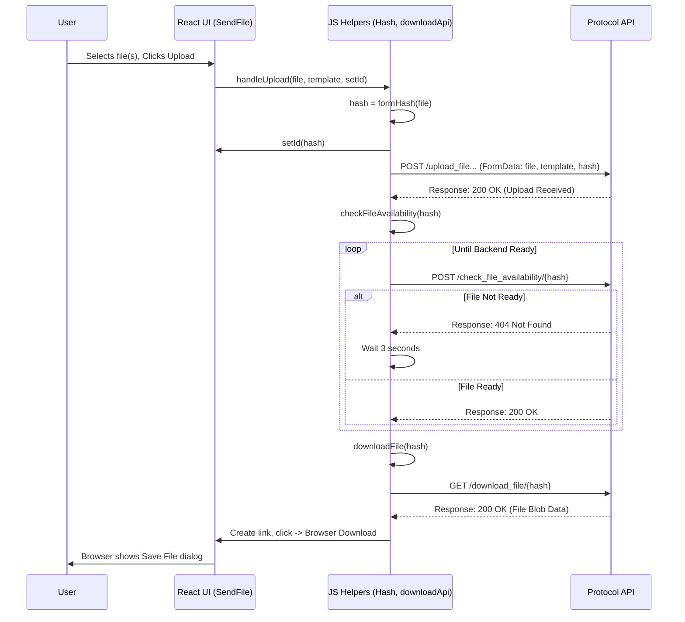

# Chapter 6: Protocol Document Handling

Welcome to Chapter 6! In the [Multi-Step Protocol Data Entry Form](05_multi_step_protocol_data_entry_form_.md), we learned how to break down a complex form into easy-to-manage steps, collecting all the necessary *data* for a protocol. But protocols often involve actual documents – maybe a Word file filled out by a student or lecturer, or an Excel sheet with specific data. How do we manage these *files*?

## What Problem Are We Solving? Managing Documents

Imagine you've just filled out all the details for a student's final project protocol using our multi-step form. Now, you need to upload the actual protocol document (maybe a `.docx` file) that corresponds to this data. Or perhaps the system needs to *generate* a formatted protocol document for you based on the data, possibly using a specific template. Maybe you just need to download a blank template to fill out later.

We need a system to handle these document-related tasks:

1.  **Uploading:** Sending your document files (like Word or Excel) to the server.
2.  **Processing:** The server might do something with the uploaded file, like filling in a template or storing it.
3.  **Downloading:** Getting processed files *back* from the server, or downloading standard templates.

This chapter focuses on the part of our application that acts like a **document processing station**: you submit your raw documents, the system works on them (maybe using templates), and then gives you back the finished version or lets you download necessary templates.

## Key Concepts

Let's break down the main ideas involved in handling these protocol documents:

1.  **File Selection:** The user needs a way to choose a document (like a Word or Excel file) from their computer's hard drive using a file input button.
2.  **Template Selection (Optional):** Sometimes, the processing on the server requires a specific Word template (`.docx`) file to structure the output. The user might need to select and upload this template alongside the main file.
3.  **Hashing (Unique ID):** Before uploading, our application calculates a unique "fingerprint" (called a **SHA-256 hash**) for the file being uploaded. This hash acts as a reliable ID for the file, ensuring we can track it even if the filename isn't unique. Think of it like giving each submitted document a unique tracking number.
4.  **Uploading to Backend:** The selected file(s) and the calculated hash ID are sent to a specific backend service (called `protocol-api`) designed to handle these documents.
5.  **Checking Processing Status (Polling):** Some processing on the backend might take time (e.g., filling a complex template). The frontend needs a way to periodically ask the backend, "Is the document with ID [hash] ready yet?". This repeated checking is called **polling**.
6.  **Downloading Results/Templates:** Once the backend confirms processing is done (via polling), or if the user simply wants a standard template, the frontend initiates a download. The backend (`protocol-api`) sends the requested file (the processed document or a template), and the browser saves it to the user's computer.

## How It Works: A User's Journey

Let's imagine a user wants to upload a filled-out Excel data sheet and have the system generate a formatted Word protocol using a specific template:

1.  **Navigate:** The user goes to the "Protocol Documents" page (let's say `/sendFile`).
2.  **Select Data File:** They click a button labeled "Choose File for Processing" and select their Excel file (`student_data.xlsx`). The filename appears on the screen.
3.  **Select Template File:** They click another button "Choose Template" and select a specific Word template (`official_template_v2.docx`). This filename also appears.
4.  **Click Upload:** They click the "Upload Files" button.
5.  **Hashing & Upload:** Behind the scenes, the frontend calculates the hash ID for `student_data.xlsx`. It then sends `student_data.xlsx`, `official_template_v2.docx`, and the hash ID to the `protocol-api` backend.
6.  **Waiting Game:** The UI might show a message like "Processing...". The frontend starts polling the backend, asking "Is file [hash ID] ready?".
7.  **Backend Processing:** The `protocol-api` receives the files, uses the template and data to generate the final protocol document, and saves it, associating it with the hash ID.
8.  **"Ready!" Signal:** Eventually, when the frontend polls, the backend responds "Yes, file [hash ID] is ready!".
9.  **Automatic Download:** The frontend immediately tells the browser to download the finished file from the `protocol-api`. The user sees a download prompt for `protocols.docx` (or similar).
10. **Downloading Templates:** Separately, the user might see buttons like "Download Protocol Template" or "Download Table Template". Clicking these directly fetches standard template files from the `protocol-api` without needing an upload first.

## Let's Look at the Code (Simplified)

We'll examine simplified parts of the key files involved.

### 1. The UI Component (`SendFile.tsx`)

This component provides the buttons and visual feedback for uploading and downloading files.

```typescript
// frontend/src/Functions/ProtocolDocs/SendFile.tsx (Simplified)
import React, { useState, useEffect } from "react";
import './sendFile.css'; // Styles
import uploadSvg from './upload.svg'; // Icons
import downloadSvg from './download.png';
// Import helper functions (we'll look at these next)
import { handleUpload, getDataFile } from "./Hash";
import { downloadTableTemplate } from "../../api/dowloadApi";

export const SendFile = () => {
    // State to hold the selected file for processing
    const [file, setFile] = useState<File | null>(null);
    // State to hold the selected template file (optional)
    const [template, setTemplate] = useState<File | null>(null);
    // State to store the hash ID generated after upload starts
    const [id, setId] = useState(""); // Will hold the hash

    // Function to handle when the user selects a file
    const handleFileChange = (e: React.ChangeEvent<HTMLInputElement>, type: 'file' | 'template') => {
        if (e.target.files && e.target.files[0]) {
            const selectedFile = e.target.files[0];
            if (type === 'file') {
                setFile(selectedFile); // Update state for the main file
            } else if (type === 'template') {
                setTemplate(selectedFile); // Update state for the template
            }
        }
    };

    // Function to trigger the upload process
    function uploadDocs() {
        console.log("Sending template:", template?.name, "and file:", file?.name);
        // Call the helper function to handle hashing, upload, and polling
        handleUpload(file, template, setId); // setId is passed to store the hash
    }

    // Function to download a standard table template
    const handleTableTemplateDownload = () => {
        downloadTableTemplate("table-templates"); // Example ID for table template
    }

    // Function to download a standard protocol template (Excel based on original code)
    const handleDataFileDownload = () => {
        getDataFile(); // Helper function for downloading standard data file
    }

    return (
        <main>
            {/* ... layout divs ... */}
            <h2>Protocol Document Handling</h2>
            <p>Upload files for processing or download standard templates.</p>

            {/* Button to select the main file */}
            <input id="file-input" type="file" style={{ display: 'none' }}
                   onChange={e => handleFileChange(e, 'file')}
                   accept=".docx,.xlsx" /* Limit file types */ />
            <label htmlFor="file-input" className="input__file-button">
                
                <span>File for Processing</span>
            </label>
            {file && <span>Selected: {file.name}</span>}

            {/* Button to select the template file */}
            <input id="template-input" type="file" style={{ display: 'none' }}
                   onChange={e => handleFileChange(e, 'template')} accept=".docx" />
            <label htmlFor="template-input" className="input__file-button">
                
                <span>Choose Template (Word)</span>
            </label>
            {template && <span>Selected: {template.name}</span>}

            {/* Button to trigger the upload */}
            {file && ( /* Only show if a file is selected */
                <button className="input__file-button" onClick={uploadDocs}>
                    Upload Files
                </button>
            )}

            {/* Buttons to download standard templates */}
            <button onClick={handleTableTemplateDownload} className="input__file-button">
                
                <span>Protocol Template (Word)</span>
            </button>
            <button onClick={handleDataFileDownload} className="input__file-button">
                
                <span>Table Template (Excel)</span>
            </button>
            {/* ... more layout ... */}
        </main>
    );
};
```

*Explanation:*
*   `useState`: We use state variables (`file`, `template`, `id`) to keep track of the user's selections and the generated hash ID.
*   `handleFileChange`: This function updates the `file` or `template` state when the user chooses a file using the hidden `<input type="file">` elements (which are triggered by clicking the styled `<label>` buttons).
*   `uploadDocs`: This function is called when the user clicks "Upload Files". It simply calls the `handleUpload` helper function, passing the selected files and the `setId` function so `handleUpload` can store the hash ID back in this component's state.
*   Download Buttons: Buttons call specific helper functions (`downloadTableTemplate`, `getDataFile`) to fetch standard templates from the backend.
*   UI Feedback: The component shows the names of selected files and only shows the "Upload Files" button if a main file is actually selected.

### 2. Hashing Logic (`Hash.tsx`)

This file contains the logic for calculating the file's unique fingerprint.

```typescript
// frontend/src/Functions/ProtocolDocs/Hash.tsx (Simplified formHash)
import { sha256 } from 'js-sha256'; // Library for SHA-256 hashing

// Function to calculate SHA-256 hash of a file
export function formHash(file: Blob): Promise<string> {
    return new Promise((resolve, reject) => {
        const reader = new FileReader(); // Standard browser API to read files

        // Define what happens when the file is successfully read
        reader.onload = () => {
            try {
                // Get the file content as an ArrayBuffer
                const arrayBuffer = reader.result as ArrayBuffer;
                // Convert it to a format the sha256 library understands
                const uint8Array = new Uint8Array(arrayBuffer);
                // Calculate the hash
                const hash = sha256(uint8Array);
                // Resolve the promise with the calculated hash string
                resolve(hash);
            } catch (error) {
                reject(error); // Handle errors during hashing
            }
        };

        // Define what happens if there's an error reading the file
        reader.onerror = (error) => reject(error);

        // Start reading the file content
        reader.readAsArrayBuffer(file);
    });
}
```

*Explanation:*
*   `formHash` takes a `File` object (which is a type of `Blob`).
*   It uses the browser's `FileReader` API to read the file's binary content (`readAsArrayBuffer`).
*   Once read (`onload`), it converts the content into a `Uint8Array`.
*   It passes this array to the `sha256` function (from the `js-sha256` library) to compute the hash.
*   It returns the hash as a string via a `Promise` (since file reading is asynchronous).

### 3. Upload and Polling Logic (`Hash.tsx`)

This file also contains the main logic for uploading the file and then checking its status.

```typescript
// frontend/src/Functions/ProtocolDocs/Hash.tsx (handleUpload & checkFileAvailability)
import { formHash } from './Hash'; // Import the hashing function
import { downloadFile } from '../../api/dowloadApi'; // Import download helper

// Function to handle the entire upload process
export const handleUpload = async (
    fileToUpload: File | null,
    template: File | null,
    // Function to update the ID state in the SendFile component
    setId: React.Dispatch<React.SetStateAction<string>>
) => {
    if (!fileToUpload) return null; // Don't proceed if no file selected

    console.log('Starting upload...');
    try {
        // 1. Calculate the hash ID for the main file
        const hashId = await formHash(fileToUpload);
        setId(hashId); // Update the state in SendFile component
        console.log("File Hash ID:", hashId);

        // 2. Prepare data for sending (like packing a box)
        const formData = new FormData(); // Special object for sending files
        formData.append('file', fileToUpload); // Add the main file
        formData.append('id', hashId); // Add the hash ID

        if (template) {
            formData.append('template', template); // Add template if selected
        }

        // 3. Configure the API request
        const settings = { method: 'POST', body: formData }; // Sending data, so POST
        // Note: No 'Content-Type' header needed, browser sets it for FormData

        // 4. Determine the correct API endpoint
        const uploadUrl = template
            ? '/protocol-api/api/protocol/upload_file_with_template'
            : '/protocol-api/api/protocol/upload_file';

        // 5. Send the data to the backend
        const response = await fetch(uploadUrl, settings);

        // 6. Check if upload was successful
        if (!response.ok) { // Use response.ok for checking status 200-299
            alert("Error uploading file: Server responded with status " + response.status);
            return null;
        }

        // 7. If upload OK, start checking for processing completion
        console.log("Upload successful, starting status check...");
        await checkFileAvailability(hashId); // Begin polling

        return hashId; // Return the hash ID

    } catch (error) {
        console.error("Upload process failed:", error);
        alert("Error during upload process.");
        return null;
    }
};

// Function to poll the backend until the file is ready
async function checkFileAvailability(id: string) {
    console.log("Checking processing status for ID:", id);
    let isAvailable = false;
    const settings = { method: "POST" }; // Or GET, depending on API design

    // Keep checking until the file is available
    while (!isAvailable) {
        try {
            // Ask the backend: "Is file 'id' ready?"
            const response = await fetch(`/protocol-api/api/protocol/check_file_availability/${id}`, settings);

            // Check the response status (original code checked text, status is better)
            if (response.ok) { // Assuming 200 OK means available
                console.log("File is available!");
                isAvailable = true;
                await downloadFile(id); // Trigger download immediately
            } else {
                console.log(`File not ready yet (Status: ${response.status}). Retrying in 3 seconds...`);
                // Wait for 3 seconds before checking again
                await new Promise(resolve => setTimeout(resolve, 3000));
            }
        } catch (error) {
            console.error("Error checking file availability:", error);
            // Stop polling on error or implement retry limit
            alert("Error checking file status. Please try again later.");
            break; // Exit the loop on error
        }
    }
}
```

*Explanation:*
*   `handleUpload`:
    *   Takes the `file`, optional `template`, and the `setId` function.
    *   Calls `formHash` to get the unique ID.
    *   Creates a `FormData` object, which is the standard way to send files via `fetch`. It appends the file(s) and the hash ID.
    *   Determines the correct API endpoint based on whether a template was provided.
    *   Uses `fetch` with `method: 'POST'` to send the `FormData`.
    *   Checks if the upload response was successful (`response.ok`).
    *   If successful, it calls `checkFileAvailability` to start polling.
*   `checkFileAvailability`:
    *   Enters a `while` loop that continues as long as `isAvailable` is false.
    *   Inside the loop, it makes a `fetch` request to the `/check_file_availability/{id}` endpoint.
    *   If the response is `ok` (status 200), it means the file is ready. It sets `isAvailable` to true (ending the loop) and immediately calls `downloadFile` (from `downloadApi.tsx`).
    *   If the response is *not* ok, it waits for 3 seconds (`setTimeout`) before the loop repeats and checks again.
    *   Includes error handling for the fetch call itself.

### 4. Download Logic (`downloadApi.tsx`)

This file contains helpers for triggering downloads from the backend.

```typescript
// frontend/src/api/dowloadApi.tsx (Simplified)

// Download the processed file using its hash ID
export async function downloadFile(id: string) {
    console.log("Requesting processed file with ID:", id);
    try {
        // Make GET request to the download endpoint
        const response = await fetch(`/protocol-api/api/protocol/download_file/${id}`);

        if (!response.ok) throw new Error(`Server error: ${response.status}`);

        // Get the file data as a Blob (Binary Large Object)
        const blob = await response.blob();

        // Create a temporary URL for the Blob
        const objectUrl = URL.createObjectURL(blob);

        // Create a hidden link element
        const link = document.createElement('a');
        link.href = objectUrl;
        link.download = 'protocols.docx'; // Default filename for download

        // Simulate a click on the link to trigger download
        document.body.appendChild(link);
        link.click();
        document.body.removeChild(link); // Clean up the link

        // Release the temporary URL
        URL.revokeObjectURL(objectUrl);

    } catch (error) {
        console.error('Download failed:', error);
        alert("Failed to download the processed file.");
    }
}

// Download a standard table template (e.g., Excel)
export async function downloadTableTemplate(templateId: string) {
    console.log("Requesting template:", templateId);
    // Similar download logic as above, potentially different endpoint/filename
    // Example endpoint: /protocol-api/api/protocol/download_template/{templateId}
    // ... fetch, create blob URL, create link, click, cleanup ...
    alert(`Download requested for template: ${templateId}`); // Placeholder
}

// Download a standard Excel file (based on original getDataFile)
export async function getDataFile() {
     console.log("Requesting standard Excel data file");
     // Example endpoint: /protocol-api/api/protocol/download_excel_with_data
     // ... fetch, create blob URL, create link, click, cleanup ...
     alert(`Download requested for standard Excel file`); // Placeholder
}

```

*Explanation:*
*   `downloadFile`: Takes the hash `id`. It makes a `GET` request to the download endpoint. If successful, it receives the file's binary data as a `Blob`.
*   Blob Handling: To make the browser download the Blob, a common technique is used:
    *   `URL.createObjectURL(blob)` creates a temporary, local URL for the blob data.
    *   A hidden link (`<a>`) is created in the HTML.
    *   The link's `href` is set to the object URL.
    *   The `download` attribute is set to the desired filename (e.g., `protocols.docx`).
    *   `link.click()` programmatically clicks the link, triggering the browser's download behavior.
    *   The temporary link and object URL are cleaned up afterwards.
*   `downloadTableTemplate` / `getDataFile`: These functions would work similarly but likely hit different API endpoints to download predefined template files.

## Internal Implementation Walkthrough

Let's visualize the upload and download flow:

1.  **User Selects & Clicks Upload:** User picks `my_data.xlsx` and `template.docx`, clicks "Upload".
2.  **Hashing:** `SendFile.tsx` calls `handleUpload`. `handleUpload` calls `formHash('my_data.xlsx')`, which returns `abcdef123...` (the hash). `handleUpload` updates the `id` state in `SendFile.tsx` via `setId`.
3.  **API Call (Upload):** `handleUpload` creates `FormData` with the files and hash. It sends a POST request to `/protocol-api/api/protocol/upload_file_with_template`.
4.  **Backend Stores:** The `protocol-api` receives the files, stores them temporarily, and maybe starts processing, associating them with `abcdef123...`. It responds with 200 OK.
5.  **Polling Starts:** `handleUpload` receives 200 OK and calls `checkFileAvailability('abcdef123...')`.
6.  **API Call (Check #1):** `checkFileAvailability` sends POST to `/protocol-api/api/protocol/check_file_availability/abcdef123...`.
7.  **Backend Not Ready:** The `protocol-api` checks, processing isn't done. It responds with 404 Not Found (or similar).
8.  **Wait:** `checkFileAvailability` sees the non-200 response, waits 3 seconds.
9.  **API Call (Check #2):** `checkFileAvailability` sends POST again.
10. **Backend Ready:** This time, processing is done. `protocol-api` responds 200 OK.
11. **Download Triggered:** `checkFileAvailability` sees 200 OK and calls `downloadFile('abcdef123...')`.
12. **API Call (Download):** `downloadFile` sends GET to `/protocol-api/api/protocol/download_file/abcdef123...`.
13. **Backend Sends File:** `protocol-api` retrieves the processed file associated with the hash and sends its binary data in the response.
14. **Browser Saves:** `downloadFile` receives the Blob, creates the temporary link, clicks it, and the browser prompts the user to save `protocols.docx`.



## Conclusion

We've explored how our application manages protocol-related documents (Word, Excel). We saw how users can **upload** files, potentially with **templates**, for backend processing. Key steps involve calculating a **hash** for identification, sending the file to the `protocol-api`, **polling** to check the processing status, and finally **downloading** the resulting file or standard templates.

This "document processing station" relies on frontend components like `SendFile.tsx` for the user interface, and helper functions (`Hash.tsx`, `downloadApi.tsx`) to handle the underlying logic of hashing, API communication, status checking, and triggering downloads.

With data entry and document handling covered, what about getting help when things go wrong?

Next up: [Support Form Handling](07_support_form_handling_.md)

---

Generated by [AI Codebase Knowledge Builder](https://github.com/The-Pocket/Tutorial-Codebase-Knowledge)