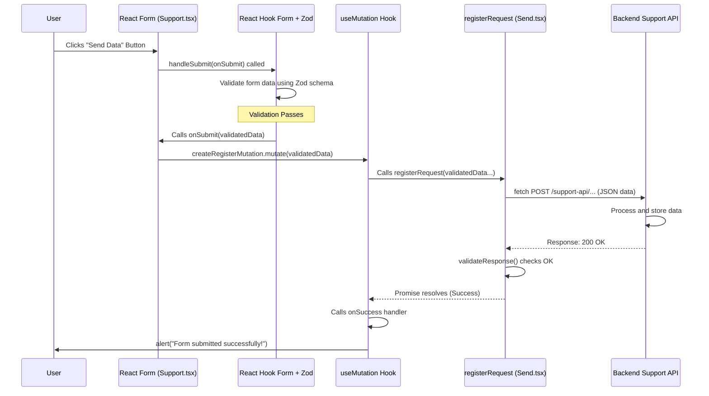

# Chapter 7: Support Form Handling

Welcome to Chapter 7! In the previous chapter, [Protocol Document Handling](06_protocol_document_handling_.md), we saw how users could upload and download documents related to their work. But what if a user encounters a problem, finds a bug, or just wants to send some feedback about the application? They need a way to contact us!

## What Problem Are We Solving? Getting User Feedback Reliably

Imagine you're using a website and something goes wrong, or you have a great idea for improvement. You look for a "Contact Us" or "Support" link. When you click it, you expect to find a simple form where you can explain your issue or suggestion.

Our project needs a way for users to easily submit support requests or feedback. However, just having a form isn't enough. We need to make sure the information users provide is useful and correctly formatted. For example:

*   Did they provide a valid email address so we can reply?
*   Did they actually write a message?
*   Is their phone number in a recognizable format?

This is where **Support Form Handling** comes in. We need to create a user-friendly form and add checks to ensure the data is good *before* it gets sent to our support team (or, in our case, the `support-api` backend).

**Analogy:** Think of it like a digital suggestion box or a customer support kiosk. You fill out a card (the form), but before you can drop it in the box (submit it), a helpful assistant (our validation logic) quickly checks if you've filled in the essential parts correctly (like your name and contact info).

## Key Concepts

Let's break down the important parts of our support form system:

1.  **The Form UI (User Interface):** These are the visible fields the user interacts with on the `/support` page:
    *   Username (Full Name)
    *   Phone Number
    *   Email Address
    *   Message Box
    *   An "Agree to process data" checkbox
    *   A "Submit" button
2.  **Form Management (`react-hook-form`):** Handling forms can be tricky. We need to keep track of what the user types in each field, manage what happens when they click "Submit", and handle potential errors. We use a library called `react-hook-form` to make this much easier. It helps us manage the form's state and submission process efficiently.
3.  **Validation (`zod`):** How do we ensure the email looks like an email, or that the username isn't empty? We use another library called `zod`. With `zod`, we define a "schema" – a set of rules describing what valid data looks like (e.g., "email must be a valid email string", "username must be at least 5 characters long", "agreement checkbox must be checked"). `react-hook-form` works together with `zod` to automatically check the user's input against these rules.
4.  **API Submission:** Once the form data passes validation, we need to send it somewhere. The validated data is packaged up and sent to our dedicated `support-api` backend service, which will handle storing it or notifying the support team. We use a helper (`useMutation` from `@tanstack/react-query`) to manage this background network request.

## How It Works: A User's Journey

Let's follow a user trying to submit a support request:

1.  **Navigate:** The user clicks the "Support" link in the header and arrives at the `/support` page.
2.  **See Form:** They see the form fields: Name, Phone, Email, Message, and the agreement checkbox.
3.  **Fill (with mistake):** They fill in their name and message, but accidentally type "user@domain" (missing the ".com") in the email field. They forget to check the agreement box.
4.  **Click Submit:** They click the "Отправить данные" (Send Data) button.
5.  **Validation Error:** The form doesn't submit! Instead, error messages appear next to the email field ("Invalid email") and the checkbox ("поставьте галочку" - check the box), thanks to `react-hook-form` and `zod`.
6.  **Correct:** The user corrects the email to "user@domain.com" and checks the agreement box.
7.  **Click Submit Again:** They click "Отправить данные" again.
8.  **Validation Passes:** This time, all the rules defined in our `zod` schema are met.
9.  **Data Sent:** The validated form data is sent in the background to the `support-api`.
10. **Success Message:** The user sees an alert box saying "Form submitted successfully!".

## Let's Look at the Code (Simplified)

We'll examine the key code snippets involved.

### 1. Defining the Rules (`zod` Schema in `Support.tsx`)

First, we define what valid data looks like using `zod`.

```typescript
// frontend/src/Support/Support.tsx (Schema Definition)
import { z } from "zod";

// Regular expression to check for a basic phone number format
const phoneRegex = new RegExp(
    /^([+]?[\s0-9]+)?(\d{3}|[(]?[0-9]+[)])?([-]?[\s]?[0-9])+$/
);

// Define the rules for our form data
const createRegisterScheme = z.object({
    // Username must be a string with at least 5 characters
    username: z.string().min(5, "Username is too short"),
    // Phone must be a string matching the phoneRegex pattern
    phone: z.string().regex(phoneRegex, 'Invalid Number!'),
    // Email must be a string in a valid email format
    email: z.string().email(),
    // Message must be a string with at least 4 characters
    message: z.string().min(4, "Message is too short"),
    // Agreement must be a boolean, and it must be true
    agreement: z.boolean().refine((val) => val === true, {
        message: "Please check the box",
    })
});

// Create a TypeScript type based on the schema for convenience
type createRegisterForm = z.infer<typeof createRegisterScheme>;
```

*Explanation:*
*   We import `zod`.
*   We define `phoneRegex` to help validate the phone number format.
*   `createRegisterScheme` uses `z.object({...})` to define the structure.
*   Inside, each field gets rules: `z.string()`, `.min(5)`, `.email()`, `.regex()`, `z.boolean()`.
*   The `.refine()` on `agreement` adds a custom rule that the value must be exactly `true`.
*   Each rule can have a custom error message (e.g., "Username is too short").
*   `z.infer` creates a TypeScript type `createRegisterForm` that matches this schema.

### 2. Setting Up the Form (`react-hook-form` in `Support.tsx`)

Now, we use `react-hook-form` and connect it to our `zod` schema.

```typescript
// frontend/src/Support/Support.tsx (useForm Setup)
import { useForm } from "react-hook-form";
import { zodResolver } from "@hookform/resolvers/zod";
// ... other imports like React, Button, FormField, z, etc. ...

export function Support() {
    // Initialize react-hook-form
    const {
        register,         // Function to connect inputs to the form state
        handleSubmit,     // Function to handle form submission
        formState: { errors }, // Object containing validation errors
    } = useForm<createRegisterForm>({
        // Tell react-hook-form to use our Zod schema for validation
        resolver: zodResolver(createRegisterScheme),
    });

    // ... rest of the component (state, mutation, onSubmit, JSX) ...
}
```

*Explanation:*
*   We import `useForm` from `react-hook-form` and `zodResolver` to link it with Zod.
*   `useForm<createRegisterForm>()` initializes the form, specifying the data structure using the type we inferred from Zod.
*   `resolver: zodResolver(createRegisterScheme)` is the key part connecting the form to our validation rules. `react-hook-form` will now automatically use `createRegisterScheme` to validate.
*   We get back helpful things from `useForm`:
    *   `register`: A function we'll use on our input elements.
    *   `handleSubmit`: A function we'll wrap our submission logic with.
    *   `errors`: An object that will contain any validation errors found.

### 3. Building the Form UI (JSX in `Support.tsx`)

We create the HTML form and link the inputs using the `register` function. We also display errors.

```typescript
// frontend/src/Support/Support.tsx (Simplified JSX)
// ... imports and useForm setup ...
import { FormField } from "../FormField/FormField"; // Helper component for layout + error
import { Button } from "../button/Button";

export function Support() {
    // ... useForm setup, state, mutation, onSubmit ...
    const { register, handleSubmit, formState: { errors } } = useForm /* ... */;
    const onSubmit = (data: createRegisterForm) => { /* ... submission logic ... */ };

    return (
        <main>
            <div className="form-support container">
                <h3 className="form__header">Submit a Request</h3>
                {/* handleSubmit wraps our onSubmit function */}
                <form className="form-body-support" onSubmit={handleSubmit(onSubmit)}>
                    {/* Username Field */}
                    <FormField errorMessage={errors.username?.message}>
                        <input
                            type="text" placeholder="Full Name*" required
                            // Connect this input to the 'username' field in our schema
                            {...register("username")}
                        />
                    </FormField>

                    {/* Email Field */}
                    <FormField errorMessage={errors.email?.message}>
                        <input type="email" placeholder="Email*" required
                            // Connect this input to the 'email' field
                            {...register("email")}
                        />
                    </FormField>

                    {/* Message Field */}
                    <FormField errorMessage={errors.message?.message}>
                        <textarea placeholder="Message"
                            // Connect this textarea to the 'message' field
                            {...register("message")}
                        ></textarea>
                    </FormField>

                    {/* Agreement Checkbox */}
                    <FormField errorMessage={errors.agreement?.message}>
                        <label>
                            <input type="checkbox"
                                // Connect this checkbox to the 'agreement' field
                                {...register("agreement")}
                            />
                            <span>Agree to data processing</span>
                        </label>
                    </FormField>

                    {/* Submit Button */}
                    <Button type="submit">Send Data</Button>
                </form>
            </div>
        </main>
    );
}
```

*Explanation:*
*   The `<form>`'s `onSubmit` handler is set to `handleSubmit(onSubmit)`. `handleSubmit` (from `react-hook-form`) does the magic: it prevents the default browser submit, runs validation using our `zodResolver`, and *only if validation passes*, it calls *our* `onSubmit` function with the clean, validated data.
*   `{...register("username")}`: This connects the input field to `react-hook-form`. It handles tracking the value, validation triggers, etc., for the field named "username" in our schema. We do this for every input (`email`, `message`, `agreement`).
*   `FormField`: This is a helper component. We pass the potential error message (`errors.username?.message`) to it. If an error exists for that field, `FormField` will display it below the input.

### 4. Handling Submission (`onSubmit` and `useMutation` in `Support.tsx`)

When validation passes, our `onSubmit` function is called. It uses `useMutation` (from `@tanstack/react-query`) to send the data to the API.

```typescript
// frontend/src/Support/Support.tsx (Submission Logic)
import { useState } from "react";
import { useMutation } from "@tanstack/react-query";
import { registerRequest } from "../api/Send"; // Our API call function
import { queryClient } from "../api/queryClient"; // Required by useMutation setup
// ... other imports, schema, useForm ...

export function Support() {
    // ... useForm setup ...
    const [errorState, setErrorState] = useState<string | null>(null); // For API errors

    // Setup the mutation for sending data
    const createRegisterMutation = useMutation({
        // The function that performs the actual API call
        mutationFn: (data: createRegisterForm) =>
            registerRequest(data.username, data.phone, data.email, data.message, data.agreement),

        // What to do on success
        onSuccess: () => {
            alert("Form submitted successfully!");
            // Optionally, refresh related data if needed
            // queryClient.invalidateQueries({ queryKey: ["users"] });
        },

        // What to do if the API call fails
        onError: (error: Error) => {
            setErrorState(error.message || "An error occurred during submission.");
        },
    }, queryClient); // Pass the queryClient

    // This function is called by react-hook-form AFTER successful validation
    const onSubmit = (data: createRegisterForm) => {
        setErrorState(null); // Clear any previous API errors
        // Trigger the mutation to send the validated data
        createRegisterMutation.mutate(data);
    };

    // ... rest of the component (JSX) ...
}
```

*Explanation:*
*   `useMutation`: This hook from `react-query` helps manage background tasks like API calls.
    *   `mutationFn`: We tell it which function to call to actually perform the work (`registerRequest`, which we'll see next). It will receive the `data` object from our form.
    *   `onSuccess`: A callback function that runs if `registerRequest` completes without errors. We show a success alert.
    *   `onError`: A callback that runs if `registerRequest` throws an error (e.g., network failure, server error). We store the error message in `errorState` to display it to the user.
*   `onSubmit`: This function is now very simple. It's guaranteed to receive *validated* `data`. It first clears any old API errors and then calls `createRegisterMutation.mutate(data)` to start the API submission process managed by `useMutation`.

### 5. Sending Data to the API (`Send.tsx`)

This is the actual function that makes the network request to our `support-api`.

```typescript
// frontend/src/api/Send.tsx (Simplified)

// Function to send the support request data to the backend
export function registerRequest(
    username: string, phone: string, email: string, message: string, agreement: boolean
): Promise<void> { // Returns a Promise indicating success or failure
    alert("Sending data to server..."); // Simple feedback

    // Use the browser's fetch API to make the request
    return fetch("/support-api/api/support/message", { // The API endpoint URL
        method: "POST", // We are sending data, so use POST
        headers: {
            // Tell the server we're sending JSON data
            "Content-Type": "application/json"
        },
        // Convert the JavaScript data object into a JSON string
        body: JSON.stringify({ username, phone, email, message, agreement })
    })
    .then(validateResponse) // Check if the server responded with an error
    .then(() => undefined); // If successful, resolve the promise
}

// Helper function to check if the server response was OK
export async function validateResponse(response: Response): Promise<Response> {
    // response.ok is true if status code is 200-299
    if (!response.ok) {
        // If not OK, try to read the error message from the server response
        throw new Error(await response.text() || `Request failed with status ${response.status}`);
    }
    return response; // If OK, just return the response
}
```

*Explanation:*
*   `registerRequest` takes the validated form data as arguments.
*   It uses `fetch` to send an HTTP POST request to the `/support-api/api/support/message` endpoint. How the browser knows where `/support-api` is located will be covered in [API Communication & Proxying](08_api_communication___proxying_.md).
*   `method: "POST"` indicates we're sending data.
*   `headers: { "Content-Type": "application/json" }` tells the server we're sending data in JSON format.
*   `body: JSON.stringify(...)` converts our JavaScript object into a JSON string to be sent.
*   `.then(validateResponse)` chains a call to our helper function to check if the server responded successfully (e.g., status 200 OK). If not, `validateResponse` throws an error, which will be caught by `useMutation`'s `onError` handler.

## Internal Implementation Walkthrough

Let's put it all together. What happens step-by-step when the user clicks "Submit" *after* filling the form correctly?

1.  **Click:** User clicks the "Send Data" button.
2.  **`handleSubmit`:** The `<form>`'s `onSubmit` triggers `react-hook-form`'s `handleSubmit`.
3.  **Validation:** `handleSubmit` uses the `zodResolver` and our `createRegisterScheme` to validate all the data currently in the form fields.
4.  **Validation OK:** Since the data is correct, validation passes.
5.  **Call `onSubmit`:** `handleSubmit` now calls *our* `onSubmit` function, passing the validated `data` object (e.g., `{ username: '...', email: '...', ... }`).
6.  **Trigger Mutation:** Our `onSubmit` function calls `createRegisterMutation.mutate(data)`.
7.  **`useMutation` Calls API Function:** The `useMutation` hook executes its `mutationFn`, which is `registerRequest(data.username, ...)`.
8.  **`fetch` Request:** `registerRequest` uses `fetch` to send a POST request with the JSON data to `/support-api/api/support/message`.
9.  **API Processing:** The `support-api` backend receives the request, processes the data (e.g., saves it to a database).
10. **API Response:** The `support-api` sends back a success response (e.g., HTTP 200 OK).
11. **`fetch` Success:** The `fetch` call in `registerRequest` receives the successful response. `validateResponse` confirms it's okay.
12. **`useMutation` Success:** The `useMutation` hook sees that `registerRequest` completed successfully and calls its `onSuccess` handler.
13. **User Feedback:** The `onSuccess` handler displays the "Form submitted successfully!" alert.

Here’s a simplified diagram of that flow:



## Conclusion

We've learned how to build a robust and user-friendly **Support Form**. We used:

*   Standard HTML form elements for the UI.
*   `react-hook-form` to easily manage the form state and submission process.
*   `zod` to define clear validation rules and ensure data quality *before* submission.
*   `useMutation` from `react-query` to handle the asynchronous API call to the backend (`support-api`) gracefully, managing loading, success, and error states.
*   A simple `fetch` call to send the validated data to the correct backend endpoint.

This combination provides a smooth experience for the user, giving them immediate feedback on errors, and ensures that only valid data reaches our backend support system.

Now that we've seen forms interacting with specific backend services like `support-api` and `protocol-api`, how does our frontend know how to talk to these different backend microservices?

Next up: [API Communication & Proxying](08_api_communication___proxying_.md)

---

Generated by [AI Codebase Knowledge Builder](https://github.com/The-Pocket/Tutorial-Codebase-Knowledge)