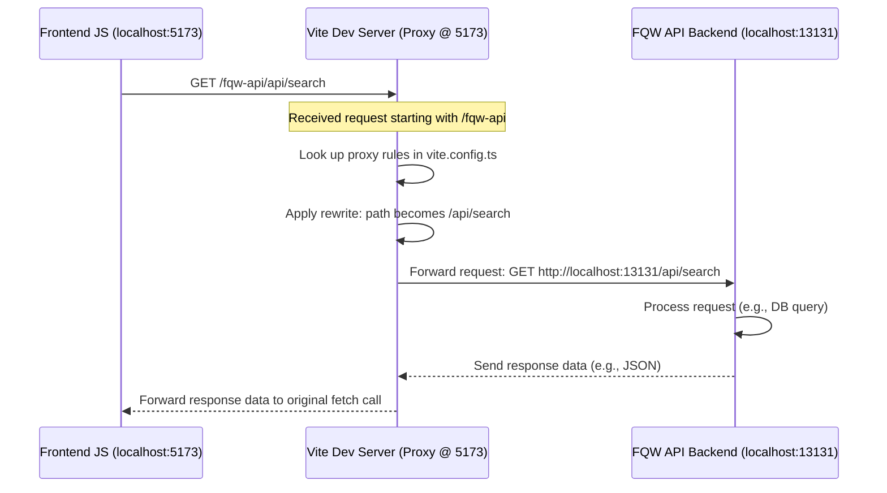

# Chapter 8: API Communication & Proxying

Welcome to the final chapter of our tutorial! In previous chapters, especially [Chapter 7: Support Form Handling](07_support_form_handling_.md), we saw our frontend code making calls like `fetch("/support-api/api/support/message", ...)` to send data to a backend service. But wait a minute...

Our application isn't just one big program. It's made of *microservices*: a frontend running in your browser and several separate backend services (`fqw-api`, `protocol-api`, `support-api`, etc.), each potentially running on a different address and port number on the server (or even on different servers!).

How does the simple `fetch` call from our frontend know how to reach the *correct* backend service? And how does this work without running into security issues in the browser? That's what this chapter is all about!

## What Problem Are We Solving? Talking to Multiple Backends

Imagine our frontend application (the user interface you see and interact with) is like an office building lobby, running at address `http://localhost:5173` during development. The actual work happens in different departments (our backend microservices) located at different addresses:

*   FQW Department (`fqw-api`): `http://localhost:13131`
*   Protocol Department (`protocol-api`): `http://localhost:13134`
*   Support Department (`support-api`): `http://localhost:13133`
*   ...and so on.

When someone in the lobby (your frontend code) needs information from the FQW Department, how do they make the call?

If the frontend code tries to directly call `fetch('http://localhost:13131/api/search')`, the web browser often steps in and says "Hold on! For security reasons, I can't let code from `localhost:5173` make requests directly to a different address like `localhost:13131`." This security rule is called the **Same-Origin Policy**.

So, how can our lobby (frontend) communicate with all the different departments (backends) without the browser blocking the calls? We need a **proxy**!

## Key Concepts: The Switchboard Operator (Proxy)

1.  **Microservices Recap:** Our system is split into smaller, independent backend services (like `fqw-api`, `support-api`) each focused on a specific job. This makes the system easier to develop and manage.
2.  **API Calls (`fetch`):** Our frontend JavaScript uses the built-in `fetch` function to send HTTP requests (like asking for data or sending data) to a server URL and receive responses.
3.  **Same-Origin Policy (SOP):** A security feature in web browsers that prevents scripts loaded from one website (or "origin", like `http://localhost:5173`) from making requests to a completely different origin (like `http://localhost:13131`). This stops malicious websites from stealing your data from other sites you might be logged into. In development, even different *ports* on `localhost` are usually considered different origins.
4.  **Proxy Server (The Switchboard):** A proxy is a middleman server. In our development setup, the Vite development server (the one serving our frontend code at `http://localhost:5173`) acts as this middleman.
    *   The frontend code sends *all* its API requests to the Vite server itself, using special paths like `/fqw-api/...` or `/support-api/...`.
    *   The Vite server looks at the beginning of the path (e.g., `/fqw-api`).
    *   Based on rules we define, it **forwards** the request to the *actual* backend service address (e.g., `http://localhost:13131`).
    *   When the backend service responds, Vite sends the response back to the frontend.

**Analogy:** Imagine the Vite dev server is a **switchboard operator** in the office building lobby (`localhost:5173`).
*   You (frontend code) don't have the direct phone numbers for the different departments.
*   You just tell the operator, "Connect me to the FQW department at extension `/api/search`". (You make a request like `fetch('/fqw-api/api/search')`).
*   The operator knows the FQW department is actually at `http://localhost:13131`.
*   The operator connects your call to the right department (`http://localhost:13131/api/search`).
*   The operator relays the conversation back and forth.

From the frontend's perspective, it only ever talked to the operator (its own Vite server), so the browser's Same-Origin Policy is happy!

## How It Works: The Vite Proxy Configuration

The magic happens in the `vite.config.ts` file in our `frontend` project folder. This file tells the Vite development server how to behave.

```typescript
// frontend/vite.config.ts (Proxy Section Only)
import { defineConfig } from 'vite';
import react from '@vitejs/plugin-react';

export default defineConfig({
  server: {
    // This 'proxy' object contains the rules for our switchboard operator
    proxy: {
      // Rule 1: Requests starting with /fqw-api
      "/fqw-api": {
        // Forward these requests to the fqw-api backend service
        target: "http://localhost:13131",
        // Needed for the backend server to accept the request
        changeOrigin: true,
        // Remove the '/fqw-api' prefix before forwarding
        rewrite: (path) => path.replace(/^\/fqw-api/, ''),
      },
      // Rule 2: Requests starting with /support-api
      "/support-api": {
        target: "http://localhost:13133",
        changeOrigin: true,
        rewrite: (path) => path.replace(/^\/support-api/, ''),
      },
      // Rule 3: Requests starting with /protocol-api
      "/protocol-api": {
        target: "http://localhost:13134",
        changeOrigin: true,
        rewrite: (path) => path.replace(/^\/protocol-api/, ''),
      },
      // ... other rules for email-api, auth-api, hub-api ...
    },
  },
  plugins: [react()],
});
```

*Explanation:*
*   Inside `server.proxy`, we define rules for different URL paths.
*   **Rule Key (e.g., `"/fqw-api"`):** If a request made *to the Vite server* starts with this path...
*   **`target`:** ...forward the request to this backend address (`http://localhost:13131`).
*   **`changeOrigin: true`:** This tells Vite to change the "Origin" header of the request to match the `target`. This is often needed for the backend server to accept the proxied request.
*   **`rewrite`:** This is important! It removes the prefix (`/fqw-api`) from the path before sending it to the backend. So, a frontend request to `/fqw-api/api/v1/search` becomes a request to `/api/v1/search` when it reaches the actual `fqw-api` backend. The backend service doesn't need to know about the `/fqw-api` prefix.

## Making API Calls in Frontend Code (Thanks to the Proxy)

Now, let's look back at the `fetch` calls we saw in previous chapters. They make perfect sense now!

*   **From [Chapter 3: FQW Search & Display Logic](03_fqw_search___display_logic_.md) or [Chapter 4: Search Form State Management (Context)](04_search_form_state_management__context__.md):**

    ```javascript
    // frontend/src/api/getData.tsx (Simplified)
    fetch('/fqw-api/api/v1/receive-by-params', {
      method: 'POST',
      // ... other options ...
    });
    ```
    *Explanation:* The frontend sends this request to the Vite dev server. Vite sees `/fqw-api`, applies the rule, and forwards the request (as `/api/v1/receive-by-params`) to `http://localhost:13131`.

*   **From [Chapter 6: Protocol Document Handling](06_protocol_document_handling_.md):**

    ```javascript
    // frontend/src/Functions/ProtocolDocs/Hash.tsx (Simplified)
    fetch('/protocol-api/api/protocol/upload_file', {
      method: 'POST',
      // ... other options ...
    });
    ```
    *Explanation:* The frontend sends this request to the Vite dev server. Vite sees `/protocol-api`, applies the rule, and forwards the request (as `/api/protocol/upload_file`) to `http://localhost:13134`.

*   **From [Chapter 7: Support Form Handling](07_support_form_handling_.md):**

    ```javascript
    // frontend/src/api/Send.tsx (Simplified)
    fetch("/support-api/api/support/message", {
        method: "POST",
        // ... other options ...
    });
    ```
    *Explanation:* The frontend sends this request to the Vite dev server. Vite sees `/support-api`, applies the rule, and forwards the request (as `/api/support/message`) to `http://localhost:13133`.

In all these cases, the frontend code uses simple, relative-looking paths starting with the service identifier (`/fqw-api`, `/protocol-api`, etc.). The Vite proxy configuration handles the complexity of routing these requests to the correct backend microservice during development, neatly bypassing the browser's Same-Origin Policy limitations.

## Internal Implementation Walkthrough

Let's trace a request for FQW data:

1.  **Frontend Code:** Your React component calls `fetch('/fqw-api/api/search')`.
2.  **Browser:** The browser sees the relative path and sends the request to the server it loaded the page from, which is the Vite dev server (e.g., `http://localhost:5173/fqw-api/api/search`).
3.  **Vite Dev Server (Proxy):** Vite receives the request. It checks its `server.proxy` rules in `vite.config.ts`.
4.  **Rule Match:** It finds the rule for `"/fqw-api"`.
5.  **Rewrite & Forward:** Vite applies the `rewrite` rule, changing the path to `/api/search`. It then forwards this modified request to the `target`: `http://localhost:13131/api/search`. It also sets the `Origin` header correctly because of `changeOrigin: true`.
6.  **FQW API Backend:** The `fqw-api` service running at `http://localhost:13131` receives the request for `/api/search`. It processes the request (e.g., queries the database).
7.  **Backend Response:** The `fqw-api` sends its response (e.g., JSON data) back to the Vite dev server.
8.  **Vite Forwards Response:** Vite receives the response from the backend and sends it back to the browser/frontend code that made the original `fetch` call.
9.  **Frontend Receives Data:** The `fetch` call in your React component receives the response data, as if it had talked directly to `/fqw-api/api/search`.

Here's a diagram showing the flow:



## Conclusion

Congratulations on reaching the end of the tutorial! In this chapter, we demystified how our frontend application, running in the browser, communicates with our various backend microservices during development.

We learned:
*   About the browser's **Same-Origin Policy** that restricts direct cross-origin requests.
*   How a **Proxy Server** acts as a middleman or "switchboard operator".
*   How the **Vite development server** uses the `server.proxy` configuration in `vite.config.ts` to forward requests based on URL prefixes (like `/fqw-api`, `/support-api`).
*   That the `rewrite` option cleans up the URL path before it reaches the actual backend service.

This proxy mechanism allows our frontend code to make simple `fetch` calls using consistent prefixes, making development much smoother when working with a microservices architecture. While this Vite proxy is fantastic for development, remember that deploying the application to production often involves different proxy solutions like Nginx or dedicated API Gateways to handle routing, security, and load balancing.

We hope this tutorial has given you a solid foundation for understanding and working with the `microservices` project!

---

Generated by [AI Codebase Knowledge Builder](https://github.com/The-Pocket/Tutorial-Codebase-Knowledge)