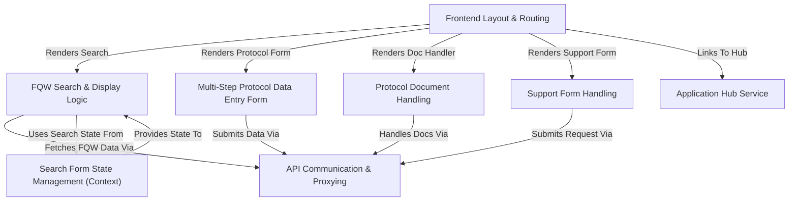

# Tutorial: microservices

This project is a web application, likely for a university, providing several **microservices**.
It features a main *frontend* application built with React that allows users to:
- Search and view information about **Final Qualification Works (FQW)** using various filters.
- Enter detailed **Protocol information** through a multi-step form.
- Upload and download **protocol-related documents**.
- Submit **support requests**.
There is also a separate *Application Hub* service acting as a central portal to discover and link to these different application parts. The frontend communicates with various backend APIs using a **proxy** setup.

**Source Repository:** [https://github.com/EmirenRU/FQWorkstation/tree/microservices](https://github.com/EmirenRU/FQWorkstation/tree/microservices)

## Chapters

1. [Application Hub Service
](01_application_hub_service_.md)
2. [Frontend Layout & Routing
](02_frontend_layout___routing_.md)
3. [FQW Search & Display Logic
](03_fqw_search___display_logic_.md)
4. [Search Form State Management (Context)
](04_search_form_state_management__context__.md)
5. [Multi-Step Protocol Data Entry Form
](05_multi_step_protocol_data_entry_form_.md)
6. [Protocol Document Handling
](06_protocol_document_handling_.md)
7. [Support Form Handling
](07_support_form_handling_.md)
8. [API Communication & Proxying
](08_api_communication___proxying_.md)

---

Generated by [AI Codebase Knowledge Builder](https://github.com/The-Pocket/Tutorial-Codebase-Knowledge)